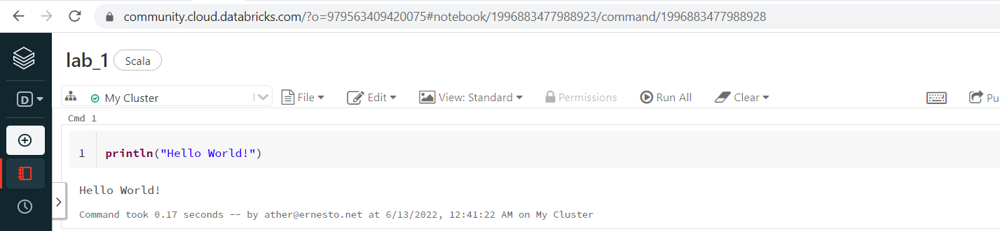
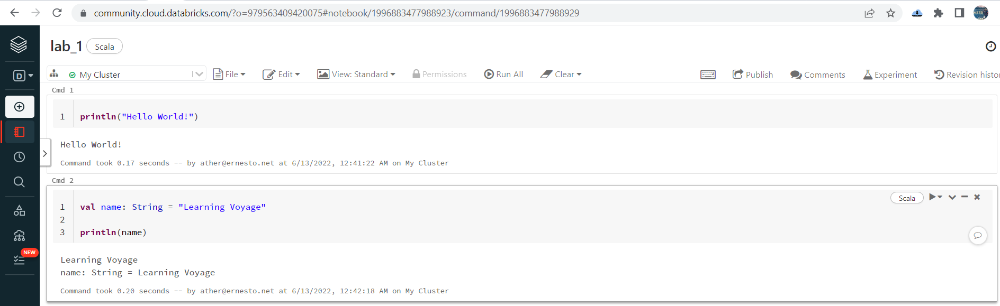
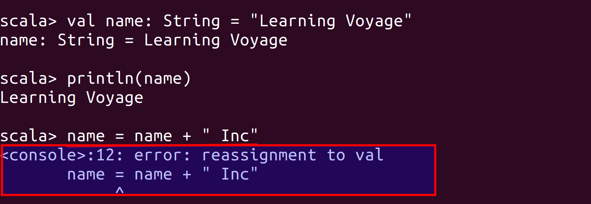
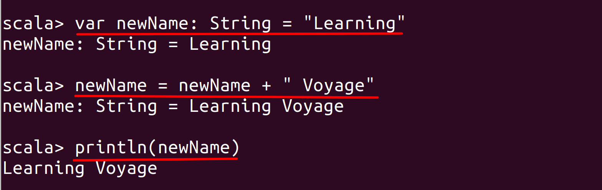
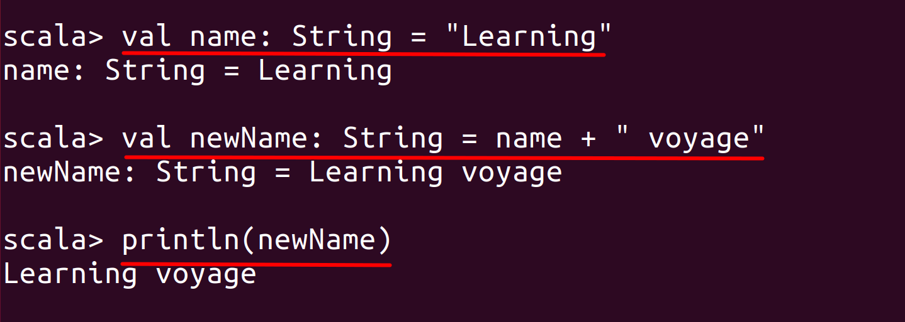

# Lab : Apache Spark Scala Basics

#### Pre-reqs:
- Google Chrome (Recommended)

#### Lab Environment
All packages have been installed. There is no requirement for any setup.

**Note:** Labs will be accessible at the port given to you by your instructor. Password for jupyterLab : `1234`

Lab instructions and scala examples are present in `~/work/ernesto-spark` folder. To copy and paste: use **Control-C** and to paste inside of a terminal, use **Control-V**

There should be terminal(s) opened already. You can also open New terminal by Clicking `File` > `New` > `Terminal` from the top menu.

Now, move in the directory which contains the scala source code by running following command in the terminal.

`cd ~/work/ernesto-spark`

You can access jupyter lab at `<host-ip>:<port>/lab/workspaces/lab1`


## What is Scala?

Scala is short for Scalable Language. It is called scalable language because it is scalable as per the user requirement. Scala is a Functional as well as Object Oriented Open Source Programming language which runs on top of a `Java Virtual Machine (JVM)`. Scala is, as said above, the most preferred programming language for Spark, as `Spark` itself is built with Scala. Since Scala runs on top of a JVM, we can access Java libraries within the Scala code and utilize the functionalities of Java without being limited by Scala itself.

The compiler used to compile the Scala code is scalac. The Scala compiler compiles the Scala code to a byte code which is understood by a `JVM` to process the code. This is similar to how Java compiles its Java code using javac compiler to a byte code to process it on a JVM.  

## Introduction

The aim of the following lab exercises is to install Scala, and perform various exercises by writing Scala code so that we can get our hands on Scala.
We will cover following topics in this scenario.

- Downloading and Installing JDK
- Downloading and Installing Scala
- Getting started with Scala basics

We need following packages to perform the lab exercise: 
- Java Development Kit
- Scala

## Download and Install JDK

**Note:** Java is already installed. It is not required to run following commands to install.

**Step 1:** From the terminal, run the following commands to install JDK (Java Development Kit).

`sudo apt-get update` 

**Step 2:** Once you run the above command, run the following command to actually download and install JDK.

`sudo apt-get --assume-yes install default-jdk` 


Verify the installation with: `java -version` 

You'll see the following output:

```
java version "1.8.0_201"
Java(TM) SE Runtime Environment (build 1.8.0_201-b09)
Java HotSpot(TM) 64-Bit Server VM (build 25.201-b09, mixed mode)
```

## Download and Install Scala

Now that we have installed Java, we are ready to install Scala and start writing some Scala code!

**Step 1:** Run the following commands from the terminal to install Scala.

`wget www.scala-lang.org/files/archive/scala-2.12.8.deb`

`sudo dpkg -i scala-2.12.8.deb`


**Step 2:** Verify your Scala installation version by running the following command.
 
`scala -version`

You will get following output.

```
Scala code runner version 2.12.8 -- Copyright 2002-2018, LAMP/EPFL and Lightbend, Inc.
```

## REPL

After the installation is completed successfully, type scala in your terminal and you will be prompted with a Scala prompt.

`scala`

The scala prompt is the interactive shell where you can write and run Scala code. This interactive shell is also known as `REPL`.

**Step 4:** You can now start writing Scala code! Let's start by printing the classic "Hello world!" from the shell. To do this simply type the following code and hit enter on your keyboard.

`println("Hello World!")`


As you can see from the screenshot, the output is shown below immediately as soon as you hit enter.



**Step 5:** To quit the Scala REPL, you use the following command.

`:q`


You are now back to the terminal prompt.

Task is complete!

## Scala Basics

Let us now get familiar and start writing some Scala code to get acquainted with Scala syntax and basic programming constructs.

**Step 1:** Go into the Scala console by running `scala`. 

Once you see the scala prompt, enter the following piece of code.

`val name: String = "Learning Voyage"` 

The above line of code is used to declare an immutable variable named name of type String which has a value of Learning Voyage. The keyword val is used to declare a variable which is immutable. When val is used, the created variable can no longer be changed or modified. Scala encourages to use immutability whenever possible. This will help you track your code easily and the values do not get modified accidentally when referring them programmatically. Unlike other languages, the name of the variable is declared first and then the data type is declared separated by a colon (:) in Scala. 



You can now use the variable name and use it inside the println function as shown below. This will print the value (String) associated with the variable (which is Learning Voyage in this case) to the console.

`println(name)` 

## Immutable variable

You can check if the declared variable is immutable by trying to append a new String to the name variable which we created previously as shown below.
 

`name = name + " Inc"` 



As you can see from the screenshot above, it throws an error saying reassignment to val, which means you cannot reassign or modify an immutable variable.

## Variables

**Step 2:** There might be scenarios where you would want to modify a variable. For that you can create a variable using var keyword instead of the val keyword as shown below.

`var newName: String = "Learning"` 

`newName = newName + " Voyage"` 

`println(newName)` 



As you can see in the screenshot, we have concatenated a new string to the same variable and printed out the new string to the console using mutability. Mutability should be only used when it is absolutely required for your application.

**Step 3:** We can apply a workaround to use transformations on immutable objects to create new immutable objects and achieve the same result as we got using the mutable objects. 

`val name: String = "Learning"` 

`val newName: String = name + " Voyage"` 

`println(newName)` 



As you can see from the screenshot above, we have applied the transformations on the immutable objects and achieve the same result as using the mutable objects.

## Scala Monadic Collections

Let us discuss the Monadic Collections in Scala which are used for error handling.

There are `three` Monadic collections in Scala which are used in error handling in functional programming, similar to try catch blocks in Java exception handling. However, in functional programming, we have to return something while try catch blocks in Java do not return anything. So, Monadic collections help you follow the rules of functional programming while implementing error handling.

Unlike the traditional collections such as List, Map, Set etc which can contain multiple objects, Monadic collections only contain two objects and can only return one object at a time. Let us look at these collections in detail.


#### Option Monadic Collection
The Option Monadic Collection helps us deal with the NullPointerException. As explained earler, Option Monadic Collection also contains two objects called Some and None. Let us create a case class which stores employee information.

`val welcome: Option[String] = Some("Welcome to Learning Voyage")`

You can now retrieve the value using the get method as String is wrapped into an option.

`welcome.get`

Similarly, you can also set the None object to the variable as shown below.

`val welcome: Option[String] = None`

Since there is no value set for our variable, we can use getOrElse method to set a value on the fly as shown below.

`welcome.getOrElse("Ernesto Lee Website")`

This is a very basic example of using Option collection. You can use them in variety of cases like pattern matching, case class etc.


**Either Monadic Collection**

The Either collection contains two objects called Left and Right object. The way how it works is, we can implement a condition in Either and return Left object in case of errors if the condition in Either is not satisfied and return Right object in case of the condition in Either is satisfied. Left for errors and Right for no errors is just a convention. You can use vice-versa as well.

**Try Monadic Collection**

The Try Monadic Collection is similar to that of Either which contains two objects namely Success and Failure objects. As the name suggests, the Success object returns the value if the condition in Try succeeds else the Failure object is returned with the exception.

#### Next
In the next lab, we will look into advanced scala concepts.
