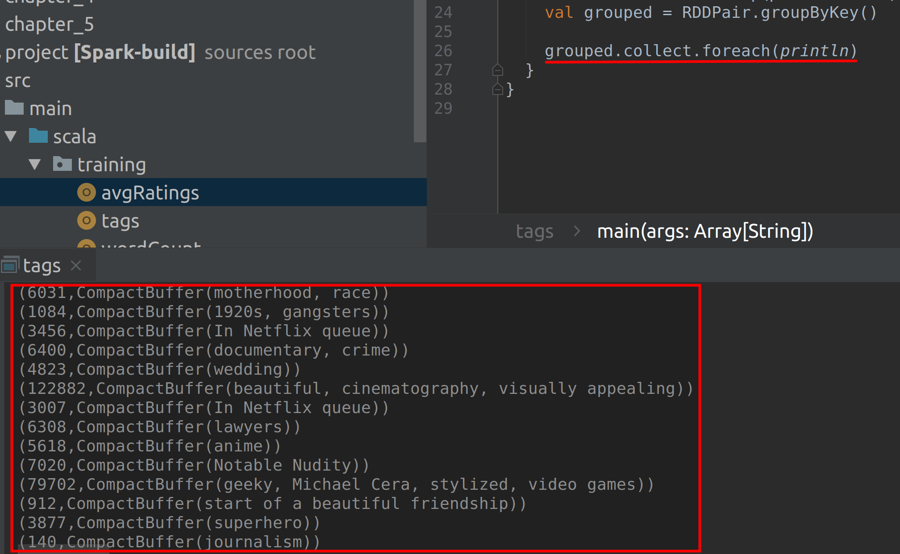
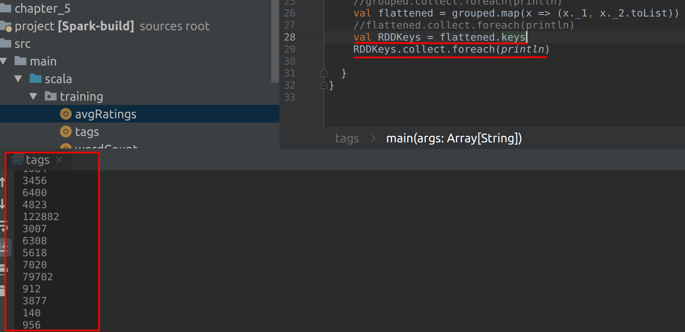
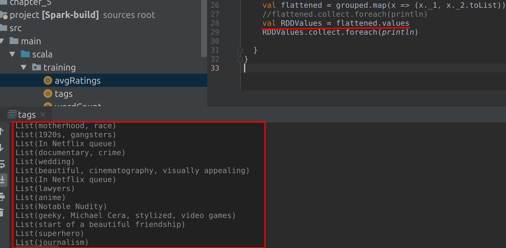

# Lab : Apache Spark Paired RDD Advanced

#### Pre-reqs:
- Google Chrome (Recommended)

#### Lab Environment
All packages have been installed. There is no requirement for any setup.

**Note:** Labs will be accessible at the port given to you by your instructor. Password for jupyterLab : `1234`

Lab instructions and scala examples are present in `~/work/ernesto-spark` folder. To copy and paste: use **Control-C** and to paste inside of a terminal, use **Control-V**

There should be terminal(s) opened already. You can also open New terminal by Clicking `File` > `New` > `Terminal` from the top menu.

Now, move in the directory which contains the scala source code by running following command in the terminal.

`cd ~/work/ernesto-spark`

You can access jupyter lab at `<host-ip>:<port>/lab/workspaces/lab10`


**Note:**
- The supplied commands in the next steps MUST be run from your `~/work/ernesto-spark` directory. 
- Final code was already cloned from github for this scenario. You can just understand the application code in the next steps and run it using the instructions.
- Click **File Browser** tab on the top left and open `~/work/ernesto-spark/src/main/scala/training/tags.scala` to view scala file.


The aim of the following lab exercises is to start writing Spark code in **vscode** editor to learn about Paired RDDs.
We will cover following topics in this scenario.
- Creating a Paired RDD
- Performing Operations on Paired RDD

## Prerequisites

We need following packages to perform the lab exercise: 
- Java Development Kit
- SBT


#### JAVA
Verify the installation with: `java -version` 

You'll see the following output:

```
java version "1.8.0_201"
Java(TM) SE Runtime Environment (build 1.8.0_201-b09)
Java HotSpot(TM) 64-Bit Server VM (build 25.201-b09, mixed mode)
```


#### SBT
Verify your sbt installation version by running the following command.	

`sbt sbtVersion`	

You will get following output. If you get an error first time, please run the command again.

```	
[info] Loading project definition from /home/jovyan/work/ernesto-spark/project	
[info] Loading settings for project apache-spark from build.sbt ...	
[info] Set current project to Spark (in build file:/home/jovyan/work/ernesto-spark/)	
[info] 1.3.2
```
## Paired RDD

Let us now look at advance operations that we can perform on Paired RDDs.

**Step 1:** Download the tags.csv file from the URL below. This file contains four columns: userId, movieID, tag and timestamp.

tags.csv - http://bit.ly/2YTVGFk

**Note:** We already have cloned a github repository which contains a required file. Open `~/work/ernesto-spark/Files/chapter_5` to view file.

**Step 2:** Click **File Browser** tab on the top left and open `~/work/ernesto-spark/src/main/scala/training/tags.scala` to view scala file.

```
import org.apache.spark._
import org.apache.spark.SparkContext._
import org.apache.log4j._
```

**Step 3:** Write the recordsParser function as in the previous task. For this task, let us extract the movieID and tag fields. The recordsParser function is as shown below.

```
def parseRecords (rows: String): (Int, String)={
val records = rows.split(",")
val movieID = records(1).toInt
val tags = records(2).toString
(movieID, tags)
}
```


**Step 4:** Create a paired RDD as in Task 2 by writing the main function, setting error log level (optional), creating a SparkContext object and loading the file using the textFile API.

```
def main(args: Array[String]): Unit = {

  Logger.getLogger("Org").setLevel(Level.ERROR)

val sc = new SparkContext("local[*]", "Paired RDD Operations")

val data = sc.textFile("chapter_5/tags.csv")
```

Now create an RDD pair by parsing the data RDD using the recordsParser function.

```
val RDDPair = data.map(parseRecords)
```

We now have our paired RDD. Let us use some operations in the next step on our paired RDD in the next step.

**Step 5:** Now that we have our paired RDD, let us group all the tags by movieID using the groupByKey function.

```
val grouped = RDDPair.groupByKey()
```
 

Let us now print out the result of grouped RDD to the console.

```
grouped.collect.foreach(println)
```

The output is as shown in the screenshot below with all the tags for a movie are grouped together.



**Step 5:** To run this program from the terminal, simply run the following command. The program will the then be compiled and executed.

`rm -rf ~/work/ernesto-spark/src/main/scala/training/.ipynb_checkpoints/ && sbt "runMain training.tags"` 
 

You may optionally convert the values from compactBuffer to a list by simply mapping the output and converting them to a List as shown below.

**Step 6:** We can also extract the keys and values to separate RDDs as shown below.

```
val RDDKeys = flattened.keys

RDDKeys.collect.foreach(println)
```



Similarly, we can extract the values using the code below.

```
val RDDValues = flattened.values

RDDValues.collect.foreach(println)
```

**Important:** You need to uncomment above line in `tags.scala` using **vscode** editor before running program again.




`rm -rf ~/work/ernesto-spark/src/main/scala/training/.ipynb_checkpoints/ && sbt "runMain training.tags"` 

Task is complete!

