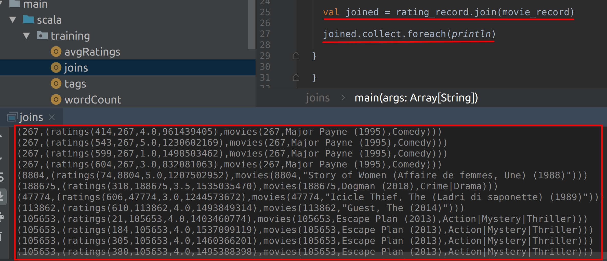

# Lab : Apache Spark Paired RDD Joins & Actions

#### Pre-reqs:
- Google Chrome (Recommended)

#### Lab Environment
All packages have been installed. There is no requirement for any setup.

**Note:** Labs will be accessible at the port given to you by your instructor. Password for jupyterLab : `1234`

Lab instructions and scala examples are present in `~/work/ernesto-spark` folder. To copy and paste: use **Control-C** and to paste inside of a terminal, use **Control-V**

There should be terminal(s) opened already. You can also open New terminal by Clicking `File` > `New` > `Terminal` from the top menu.

Now, move in the directory which contains the scala source code by running following command in the terminal.

`cd ~/work/ernesto-spark`

You can access jupyter lab at `<host-ip>:<port>/lab/workspaces/lab11`


**Note:**
- The supplied commands in the next steps MUST be run from your `~/work/ernesto-spark` directory. 
- Final code was already cloned from github for this scenario. You can just understand the application code in the next steps and run it using the instructions.
- Click **File Browser** tab on the top left and open `~/work/ernesto-spark/src/main/scala/training/joins.scala` to view scala file.


The aim of the following lab exercises is to start writing Spark code in **vscode** editor to learn about Paired RDDs.
We will cover following topics in this scenario.
- Performing Joins on Paired RDD
- Performing Actions on Paired RDD

## Prerequisites

We need following packages to perform the lab exercise: 
- Java Development Kit
- SBT


#### JAVA
Verify the installation with: `java -version` 

You'll see the following output:

```
java version "1.8.0_201"
Java(TM) SE Runtime Environment (build 1.8.0_201-b09)
Java HotSpot(TM) 64-Bit Server VM (build 25.201-b09, mixed mode)
```


#### SBT
Verify your sbt installation version by running the following command.	

`sbt sbtVersion`	

You will get following output. If you get an error first time, please run the command again.

```	
[info] Loading project definition from /home/jovyan/work/ernesto-spark/project	
[info] Loading settings for project apache-spark from build.sbt ...	
[info] Set current project to Spark (in build file:/home/jovyan/work/ernesto-spark/)	
[info] 1.3.2
```

## Task: Performing Joins on Paired RDDs

So far we have been working on single paired RDDs. In this task let us look at two paired RDDs by performing joins.

**Step 1:** Download the ratings.csv file from the URL below. This file contains four columns: userId, movieID, rating and timestamp.

ratings.csv - http://bit.ly/2QmnAH9

**Note:** We already have cloned a github repository which contains a required file. Open `~/work/ernesto-spark/Files/chapter_5` to view file.

**Step 2:** Download the movies.csv file from the URL below. This file contains three columns: movieID, movieName and genre.

movies.csv - http://bit.ly/2EJj0Os

**Note:** We already have cloned a github repository which contains a required file. Open `~/work/ernesto-spark/Files/chapter_5` to view file.

We shall join these datasets based on the movieID.


**Step 3:** Click **File Browser** tab on the top left and open `~/work/ernesto-spark/src/main/scala/training/joins.scala` to view scala file.

```
import org.apache.spark._
import org.apache.log4j._

object joins {

case class ratings(userId: Int, movieID: Int, rating: Float, timestamp: String)

case class movies(movieID: Int, movieName: String, genre:String)
```

 
**Step 4:** Now let us load both the files using textFile API and also split the fields by comma delimiter. We shall be using the map function to split the fields for every record in the RDDs.

```
def main(args: Array[String]): Unit = {

  Logger.getLogger("Org").setLevel(Level.ERROR)

val sc = new SparkContext("local[*]", "Joins")

val rating = sc.textFile("chapter_5/ratings.csv").map(x => x.split(','))
val movie = sc.textFile("chapter_5/movies.csv").map(x => x.split(','))
```

By splitting the fields, we can refer them individually while creating a paired RDD.

 

**Step 5:** Now that we have both the datasets loaded and splitted by comma delimiter, let us create a tuple of two elements (Paired RDD) so that we can perform a join on both the RDDs based on key. The key here will be the movieID.

To create a tuple, we use the map function with the first element (key) of the tuple as movieID which is second field in the rating RDD and first field in movie RDD. The second element (value) of the tuple will be the entire records from both the RDDs.

```
val rating_record = rating.map(x => (x(1).toInt, ratings(x(0).toInt, x(1).toInt, x(2).toFloat, x(3).toString)))

val movie_record = movie.map(x => (x(0).toInt, movies(x(0).toInt, x(1).toString, x(2).toString)))
```

**Step 6:** The next step is to simply perform the join as shown below.

```
val joined = rating_record.join(movie_record)
```

Now we can simply collect the results and print them to the console.

```
joined.collect.foreach(println)
```

The output with the joined results can be seen as shown in the screenshot below.



You can then similarly perform the rest of the joins such as left outer join and right outer join.

It is recommended to perform joins using dataframes rather than RDDs as it can have the benefit of catalyst optimizer when performed using dataframes. We shall look at dataframes in our upcoming scenarios.

Task is complete!

Let us now perform actions on the paired RDDs and also look at caching and persisting RDDs. Also, let us continue the program from previous task and apply actions over them.

 
**Step 1:** We shall be using the joined RDD for all the actions we perform in this task. Since we shall be using this RDD more than once, let us persist it before performing these actions so that the application does not process all the transformations over and over again whenever an action is called.

```
joined.persist(StorageLevel.MEMORY_AND_DISK_SER)
```

You might see an error about the missing import. If so, please add the following import to the list of imports.

```
import org.apache.spark.storage.StorageLevel
```

You may use your desired level of persist storage level above.


**Step 2:** Let us first use the countByKey function to check the number of ratings per movie on our joined RDD.

```
val count = joined.countByKey()
```

Let us print the count to the console using the println function and run the program. You should see the result as shown below with count of reviews for each movie is shown as a Map collection.

```
println(count)
```

**Step 3:** Let us now use the collectAsMap function on the joined RDD.

```
val mappedCol = joined.collectAsMap()
println(mappedCol)
```

The result is returned as a Map collection with all the duplicate keys removed.

 

**Step 4:** Finally, let us use the lookup(key) function to lookup value for a key in our joined RDD.


```
val look = joined.lookup(25)
println(mappedCol)
```

#### Compile and Run
To run this program from the terminal, simply run the following command. The program will the then be compiled and executed.
`rm -rf ~/work/ernesto-spark/src/main/scala/training/.ipynb_checkpoints/ && sbt "runMain training.joins"` 

The result is shown as an ArrayBuffer for all the values of the key.

Task is complete!


