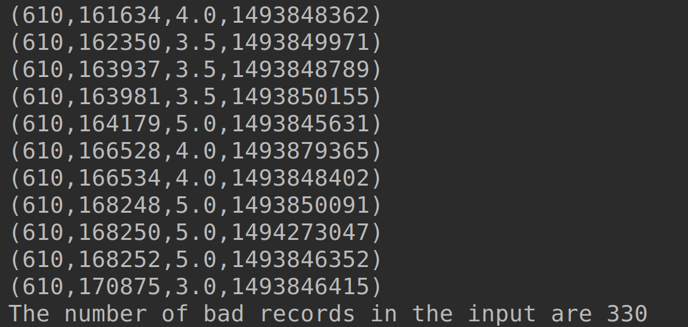

# Lab : Apache Spark Accumulators V1

#### Pre-reqs:
- Google Chrome (Recommended)

#### Lab Environment
All packages have been installed. There is no requirement for any setup.

**Note:** Labs will be accessible at the port given to you by your instructor. Password for jupyterLab : `1234`

Lab instructions and scala examples are present in `~/work/ernesto-spark` folder. To copy and paste: use **Control-C** and to paste inside of a terminal, use **Control-V**

There should be terminal(s) opened already. You can also open New terminal by Clicking `File` > `New` > `Terminal` from the top menu.

Now, move in the directory which contains the scala source code by running following command in the terminal.

`cd ~/work/ernesto-spark`

You can access jupyter lab at `<host-ip>:<port>/lab/workspaces/lab12`

**Note:**
- The supplied commands in the next steps MUST be run from your `~/work/ernesto-spark` directory. 
- Final code was already cloned from github for this scenario. You can just understand the application code in the next steps and run it using the instructions.
- Click **File Browser** tab on the top left and open `~/work/ernesto-spark/src/main/scala/training/counters.scala` to view scala file.


We will cover following topics in this scenario.
- Using Accumulator Method
- Implementing Record Parser
- Implementing Counters

We need the following packages to perform the lab exercise: 
- Java Development Kit
- Scala
- Spark

## Prerequisites

We need following packages to perform the lab exercise: 
- Java Development Kit
- SBT


#### JAVA
Verify the installation with: `java -version` 

You'll see the following output:

```
java version "1.8.0_201"
Java(TM) SE Runtime Environment (build 1.8.0_201-b09)
Java HotSpot(TM) 64-Bit Server VM (build 25.201-b09, mixed mode)
```


#### SBT
Verify your sbt installation version by running the following command.	

`sbt sbtVersion`	

You will get following output. If you get an error first time, please run the command again.

```	
[info] Loading project definition from /home/jovyan/work/ernesto-spark/project	
[info] Loading settings for project apache-spark from build.sbt ...	
[info] Set current project to Spark (in build file:/home/jovyan/work/ernesto-spark/)	
[info] 1.3.2
```

## Task: Using Accumulator method

Let us start this exercise by looking at Accumulators.

In this task and the next two, we shall be looking at Accumulators API in Spark 1.x to count the number of malformed records and separate the malformed records from the good records.

**Step 1:** Download the ratings-malformed.csv file from the URL below. This file contains four columns: userId, movieID, rating and timestamp.

Ratings-malformed.csv - http://bit.ly/2WuTese

**Note:** We already have cloned a github repository which contains a required file. Open `~/work/ernesto-spark/Files/chapter_6` to view file.

Please note that this file has malformed records.

## Using Accumulator method...

**Step 2:** Click **File Browser** tab on the top left and open `~/work/ernesto-spark/src/main/scala/training/counters.scala` to view scala file.

```
import org.apache.spark._
import org.apache.spark.SparkContext._
import org.apache.log4j._
```

**Step 3:** Now write the main function along with the error log level setting as always.

 
```
def main(args: Array[String]): Unit = {

  Logger.getLogger("Org").setLevel(Level.ERROR)
```

Also, create a SparkContext object and enter the master  as local to use all the cores and the name of the app as Counters.

```
val sc = new SparkContext("local[*]", "Counters")

Your code so far should look like the one in screenshot below.
```

**Step 4:** Now that we have the SparkContext object created, let us load our file using the textFile API.

```
val data = sc.textFile("chapter_6/ratings-malformed.csv")
```
 
The aim of this task is to count the number of malformed records. But how do we decide which records are good and which are malformed? We need to have a look at our input file to answer this question. Open the file which you have downloaded in the step 1 for this task.

You will be able to see that the file contains four fields as explained in step 1. However, there are a bunch of records which are missing some fields as shown in the screenshot below.


In order to count and separate the good records with bad records we make use of Accumulators.

**Step 5:** The next step is to use the accumulator method in the SparkContext object and pass its arguments. The arguments are the initial value of zero (0) and the name of our accumulator as bad records.

```
val badRecords = sc.accumulator(0, "bad records")
```

You will see a warning "Symbol Accumulator is deprecated". You may ignore this warning as this is older Accumulator API for Spark 1.x.

With this we have successfully set the initial value for accumulator and named the counter as bad records. We now have to write a logic on how to determine good and bad records. We can achieve this by writing a recordParser object and defining a parse method within the object. Let us see that in the next task.

 

We shall come back to this program in Task 3, once we have figured out how to separate bad records with good records so that we can count the number of bad records.

Task is complete!

## Task: Implementing Record Parser

**Step 1:** To implement a record parser, we shall create yet another Scala object and name it recordParser. Please follow the steps associated with creating a new Scala object. No imports are required for this object.

You should end up with the object as shown below.
 


**Step 2:** Let us first create a case class to store all our good records as shown below.

```
case class records(userId: Int, movieId: Int, rating: Double, timeStamp: String)
```

**Step 3:** Let us now define a parse function which takes input record of type String as argument. The return type is an Either monadic collection which will either return String as Left object or a records case class as Right object.

Do not worry if you do not understand this as of now. All this makes sense when you look at the rest of the code.

```
def parse(record:String):Either[String, records]= {
```

Next, let us declare an array variable of type String and name it fields, so that we can split the incoming records based on a comma. This way, we can access each field indivudually and also we can know the number if fields each record has.

```
val fields: Array[String] = record.split(",")
```

 **Step 4:** This is the step where we perform the error handling by using an if loop. The condition for if  will check if a record has 4 fields by using the length method.

If there are 4 fields in a record, we simply access each field based on its index and store it in the case class records using the Right object.. If there are less than 4 fields, we pass the record as is using the Left object.


```
if (fields.length == 4)
     {
      val UserId: Int = fields(0).toInt
      val movieId: Int = fields(1).toInt
      val rating: Double = fields(2).toDouble
      val timeStamp: String = fields(3)

	Right (records(userId: Int, movieId: Int, rating: Double, timeStamp: String))
    }
    else{
     	Left(record)
    }
  }
}
```

Please make sure you correctly enter all the opening and closing flower brackets if you encounter an error.

Let us now go back to the previous program counters and refer this object there.

Task is complete!

## Task: Implementing Counters

**Step 1:** Navigate back to the counters object in IDE and continue from where we left in Task 1.

**Step 2:** Let us now write a foreach action which parses each row through our recordParser object, which we have implemented in the previous task.

```
data.foreach(row => {
  val parsedRecords = recordParser.parse(row)
  if(parsedRecords.isLeft){
    badRecords += 1
  }
})
```

We then write a if condition to check if the record is a left object i.e., a bad record. If it is, we simply increment the value of badRecords variable which we declared in task 1 by 1.

We can use the isLeft method to check if it is a Left object and isRight method for Right object.


Please see that we are using foreach function, which is a action and not a transformation. As learned in the theory section, Accumulators should always be specified in the action part and not in the transformations. This way we can be sure that our accumulator is only processed once and the value is accurate.

At this point, we have successfully implemented counters based on our requirement. All we need to do now is to simply get the final accumulated value.

## Implementing Counters...


**Step 3:** Let us use the println function to print the number of bad records in our input dataset.

```
println("The number of bad records in the input are  " + badRecords.value)
  }

}
```

To retrieve the value from our accumulator which is badRecords, we use the value  method. You cannot directly retrieve the value just by using the badRecords variable when it comes to Accumulators.

 

**Step 4:** Finally, let us run our code and check the output. You should see the number of bad records as shown in the screenshot below.

To run this program from the terminal, simply run the following command. The program will the then be compiled and executed.
`rm -rf ~/work/ernesto-spark/src/main/scala/training/.ipynb_checkpoints/ && sbt "runMain training.counters"` 

 
With this we have successfully impemented Accumulators using Spark 1.x API.

## Compile and Run


**Step 5:** Remember, we have also wrapped all the good records in the Right object. We can use it in our if condition with else object here as well.

```
else {
  val goodRecords = parsedRecords.right.map(x => (x.userId, x.movieId, x.rating, x.timeStamp))
  goodRecords.foreach(println)
}
```

We are declaring a new variable called goodRecords and simply extracting (map) the fields from the Right object using the right method. Finally, we can print them out to the console in the next line.

 
**Step 6:** Let us now run it and see the good records as shown in the screenshot below.
`rm -rf ~/work/ernesto-spark/src/main/scala/training/.ipynb_checkpoints/ && sbt "runMain training.counters"` 



We have successfully implemented Accumulators and also separated good records with bad records.

Task is complete!

