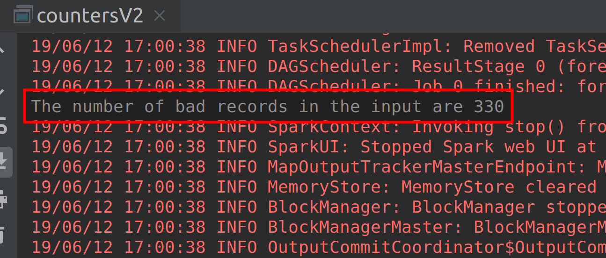

# Lab : Apache Spark Accumulators V2

#### Pre-reqs:
- Google Chrome (Recommended)

#### Lab Environment
All packages have been installed. There is no requirement for any setup.

**Note:** Labs will be accessible at the port given to you by your instructor. Password for jupyterLab : `1234`

Lab instructions and scala examples are present in `~/work/ernesto-spark` folder. To copy and paste: use **Control-C** and to paste inside of a terminal, use **Control-V**

There should be terminal(s) opened already. You can also open New terminal by Clicking `File` > `New` > `Terminal` from the top menu.

Now, move in the directory which contains the scala source code by running following command in the terminal.

`cd ~/work/ernesto-spark`

You can access jupyter lab at `<host-ip>:<port>/lab/workspaces/lab13`


**Note:**
- The supplied commands in the next steps MUST be run from your `~/work/ernesto-spark` directory. 
- Final code was already cloned from github for this scenario. You can just understand the application code in the next steps and run it using the instructions.
- Click **File Browser** tab on the top left and open `~/work/ernesto-spark/src/main/scala/training/countersV2.scala` to view scala file.


We will cover following topics in this scenario.
- Using Accumulator Method
- Implementing Record Parser
- Implementing Counters
- Implementing Accumulators V2
- Implementing Custom Accumulators
- Using Broadcast variables

We need the following packages to perform the lab exercise: 
- Java Development Kit
- Scala
- Spark

## Prerequisites

We need following packages to perform the lab exercise: 
- Java Development Kit
- SBT


#### JAVA
Verify the installation with: `java -version` 

You'll see the following output:

```
java version "1.8.0_201"
Java(TM) SE Runtime Environment (build 1.8.0_201-b09)
Java HotSpot(TM) 64-Bit Server VM (build 25.201-b09, mixed mode)
```


#### SBT
Verify your sbt installation version by running the following command.	

`sbt sbtVersion`	

You will get following output. If you get an error first time, please run the command again.

```	
[info] Loading project definition from /home/jovyan/work/ernesto-spark/project	
[info] Loading settings for project apache-spark from build.sbt ...	
[info] Set current project to Spark (in build file:/home/jovyan/work/ernesto-spark/)	
[info] 1.3.2
```

## Task: Implementing Accumulators V2

Please see that this is implementation of Accumulators in Spark 2.x. There will be some code related to dataframes, which we have not covered yet. But worry not. Just look at the implementation of Accumulators V2 and after we cover Dataframes, it all makes sense. 

**Step 1:** Download the ratings-malformed.csv file from the URL below. This file contains four columns: userId, movieID, rating and timestamp.

Ratings-malformed.csv - http://bit.ly/2WuTese

**Note:** We already have cloned a github repository which contains a required file. Open `~/work/ernesto-spark/Files/chapter_6` to view file.


**Step 2:** Click **File Browser** tab on the top left and open `~/work/ernesto-spark/src/main/scala/training/countersV2.scala` to view scala file.

```
import org.apache.spark.sql.SparkSession
```

Since we are working on Spark 2.x, we will have to import a SparkSession object instead if a SparkContext object. The SparkContext object is wrapped within the SparkSession object. The SparkSession objectwill be used to read the data.

 ## Implementing Accumulators V2...


**Step 3:** Let us now write our main method and create a SparkSession object so that we can access Spark functionality. Please note that we haven't covered this topic but just think this as if we are creating a SparkContext object.

```
def main(args: Array[String]) {

val sparkSession = SparkSession.builder
.master("local[*]")
.appName("Bad record counter V2")
.getOrCreate()
```

We have created a SparkSession object using the SparkSession.builder method, specified the execution environment as local using all the cores in our CPU and finally named our application as Bad record counter V2. The getOrCreate method gets an instance of SparkSession if it is already available or it creates one.

 

**Step 4:** Let us now declare our Accumulator object. The Accumulator object in Spark 2.x is a bit different from what we have seen in Spark 1.x. There are two types of Accumulators we can use in 2.x. They are the longAccumulator and doubleAccumulator. As their names suggest a longAccumulator is used for Long data type and doubleAccumulator for Double data type. 

We shall be using longAccumulator in our code as we only need the count of type Long. 

```
val badRecords = sparkSession.sparkContext.longAccumulator("Bad Records")
```

The longAccumulator object is wrapped in the sparkContext object which in turn is wrapped with the sparkSession object. The initial value for longAccumulator is set to zero (0) by default. We need not initiate it as we did in Spark 1.x API for Accumulator. All we need to do is set a name for our Accumulator. We have named it Bad Records. You are free to use any name as you like.

 

**Step 4:** Let us now declare our Accumulator object. The Accumulator object in Spark 2.x is a bit different from what we have seen in Spark 1.x. There are two types of Accumulators we can use in 2.x. They are the longAccumulator and doubleAccumulator. As their names suggest a longAccumulator is used for Long data type and doubleAccumulator for Double data type. 

We shall be using longAccumulator in our code as we only need the count of type Long. 

```
val badRecords = sparkSession.sparkContext.longAccumulator("Bad Records")
```

The longAccumulator object is wrapped in the sparkContext object which in turn is wrapped with the sparkSession object. The initial value for longAccumulator is set to zero (0) by default. We need not initiate it as we did in Spark 1.x API for Accumulator. All we need to do is set a name for our Accumulator. We have named it Bad Records. You are free to use any name as you like.

 

**Step 5:** Now let is write a foreach statement to take each record from the input data, split the records by a comma and test it against a condition. If the records do not contain four fields, we increment the badRecords variable by one using the add method as shown below.

Since we know that our records contain 4 fields and if there are less than four fields in a record, we treat it as a bad record.

```
data.foreach(record => {
  val fields = record.split(",")

  if (fields.size != 4)
	badRecords.add(1)
})
```

 

**Step 6:** Let us now write a print statement to print out the number of bad records in our input data.

```
println("The number of bad records in the input are  " + badRecords.value)
  }
}
```
 

With this we have successfully implementd Accumulators for Spark 2.x.

**Step 7:** Finally, let us run our code. You should see the results as shown in the screenshot below.



 To run this program from the terminal, simply run the following command. The program will the then be compiled and executed.
`rm -rf ~/work/ernesto-spark/src/main/scala/training/.ipynb_checkpoints/ && sbt "runMain training.countersV2"` 


Task is complete!


