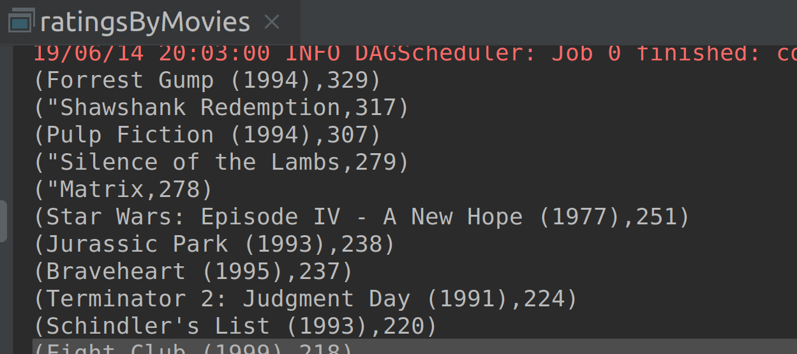

# Lab : Apache Spark Broadcast Variables

#### Pre-reqs:
- Google Chrome (Recommended)

#### Lab Environment
All packages have been installed. There is no requirement for any setup.

**Note:** Labs will be accessible at the port given to you by your instructor. Password for jupyterLab : `1234`

Lab instructions and scala examples are present in `~/work/ernesto-spark` folder. To copy and paste: use **Control-C** and to paste inside of a terminal, use **Control-V**

There should be terminal(s) opened already. You can also open New terminal by Clicking `File` > `New` > `Terminal` from the top menu.

Now, move in the directory which contains the scala source code by running following command in the terminal.

`cd ~/work/ernesto-spark`

You can access jupyter lab at `<host-ip>:<port>/lab/workspaces/lab15`


**Note:**
- The supplied commands in the next steps MUST be run from your `~/work/ernesto-spark` directory. 
- Final code was already cloned from github for this scenario. You can just understand the application code in the next steps and run it using the instructions.
- Click **File Browser** tab on the top left and open `~/work/ernesto-spark/src/main/scala/training/ratingsByMovies.scala` to view scala file.


We will cover following topics in this scenario.
- Using Broadcast variables

## Prerequisites

We need following packages to perform the lab exercise: 
- Java Development Kit
- SBT


#### JAVA
Verify the installation with: `java -version` 

You'll see the following output:

```
java version "1.8.0_201"
Java(TM) SE Runtime Environment (build 1.8.0_201-b09)
Java HotSpot(TM) 64-Bit Server VM (build 25.201-b09, mixed mode)
```


#### SBT
Verify your sbt installation version by running the following command.	

`sbt sbtVersion`	

You will get following output. If you get an error first time, please run the command again.

```	
[info] Loading project definition from /home/jovyan/work/ernesto-spark/project	
[info] Loading settings for project apache-spark from build.sbt ...	
[info] Set current project to Spark (in build file:/home/jovyan/work/ernesto-spark/)	
[info] 1.3.2
```

## Broadcast Variables


- Broadcast variables are the shared variables, which allow Spark to send large values efficiently in an immutable (read-only) state to all the worker nodes.
- These variables can be used one or more times during Spark operations. 
- The broadcast variables are sent to the worker nodes only once and are then cached to the worker nodes’ memory in deserialized form. 
- These variables are very useful when the Spark job consists of multiple stages and multiple tasks in those stages require the same variable. 
- Broadcast Variables overcome the inefficiency of shipping the variables every time to executors.

Using Broadcast Variables doesn’t mean that the data is not transmitted across the network. But unlike transmitting the data everytime the variable is referenced in the `regular` variables, the data is only transmitted once saving network bandwidth and executor resources.

#### Optimizing Broadcast Variables
It is important to optimize Broadcast Variables with compact and fast data serialization when large values are used to broadcast. Not doing so will result in network bottlenecks, if the value takes too muct time to serialize and transmit over the network. Using the correct serialization library will help improve the job performance in an efficient manner.

## Task: Using Broadcast Variables

Let us now look at another type of Distributed Shared Variable called the Broadcast variable. Let us use our movies dataset which we have been using throughout this course and find out the number of ratings for each movie. We shall be using the movies.csv file and ratings.csv file during this task. We shall broadcast the movies.csv file to look up with the movie Id in ratings.csv file.

**Step 1:** We will be needing two files for this lab exercise.

**Note:** We already have cloned a github repository which contains a required file. Open `~/work/ernesto-spark/Files/chapter_6` to view file.

ratings.csv - http://bit.ly/2QmnAH9

This file contains four columns: userId, movieID, rating and timestamp.

movies.csv - http://bit.ly/2EJj0Os

This file contains three columns: movieID, movieName and genre.

**Step 2:** Click **File Browser** tab on the top left and open `~/work/ernesto-spark/src/main/scala/training/ratingsByMovies.scala` to view scala file.


```
import org.apache.spark.SparkContext
import scala.io.Source
```

The first import is as we know to create the SparkContext object. The second is Scala specific import which helps us read the movies.csv file.
 
Let us now define a function which would load the movie names to a Map object.

```
def loadMovieNames(): Map[Int, String] = {

  var movieNames: Map[Int, String] = Map()

  val data = Source.fromFile("chapter_6/movies.csv").getLines()
  for (record <- data) {
    val fields = record.split(',')
    if (fields.length > 1) {
      movieNames += (fields(0).toInt -> fields(1))
    }
  }
  movieNames
}
```

We are defining a function called loadMovieNames which does not take any arguments and returns a Map object which maps Int to String. We then declare a movieNames variable of type Map which maps Int to String and initialize it as an empty map.

Next, we load the data from our file using Source.fromFile method and call getlines method to get each line based on /n character. Next, we iterate through each record in our input data using the for comprehension, and split each field based on comma as we know our fields are delimited by a comma. Next, we check if each record has two fields and finally map movie Id with the movie name, by adding the fields to movieNames Map object. Finally, return the Map object as required by our function.


**Step 3:** Let us now write our main function, create a SparkContext object and declare our broadcast variable.

```
def main(args: Array[String]): Unit = {


  val sc = new SparkContext("local[*]", "Ratings By movie ")

  val broadNames = sc.broadcast(loadMovieNames)
```

We can create a broadcast variable by simply calling the broadcast method on our SparkContext object. We then pass our loadMovieNames function as parameter to the broadcast method since loadMovieNames function returns a Map object, we will have the Map object broadcasted to all the nodes of the cluster.


**Step 4:** Let us now load our ratings.csv file and create an RDD. Next, we split the records based on comma and extract the movieId field. We then use the map function to create a pairedRDD of movie Id and its count by  1, so that we can count the number of times each movies is rated in the next step.

```
val data = sc.textFile("chapter_6/ratings.csv")
val records = data.map(x => (x.split(",")(1).toInt, 1))
```


**Step 5:** Now that we have a pairedRDD, we can use the reduceByKey function to count the number of of times each movie has been rated as shown below.

```
val count = records.reduceByKey((x,y) => x + y)
```

Let us now sort the count i.e., second field in desceinding order so that the highest number of rated movie will be on the top of our result.

```
val sorted = count.sortBy(-_._2)
```

 
**Step 6:** Finally, let us use our broadcast variable to look up the name of movie based on its movie Id. We use the '-' symbol to sort in descending order.

```
val sortedMoviesWithNames = sorted.map(x => (broadNames.value(x._1), x._2))
```

We are using the map higher order function to look up the value of the second field from the broadcast variable, which is the movie name and the second field in our sorted RDD, which is the count. We use the value method to get the value in the broadcast variable. The compiler will look up the movie Id with it's movie name and provides us with the name of the movie as first field in the result and count as second field.
 

Let us print out the result to the console.

```
sortedMoviesWithNames.collect.foreach(println)
```

**Step 7:** Let is now run our program and check the results. You should see the output as shown below.



To run this program from the terminal, simply run the following command. The program will the then be compiled and executed.
`rm -rf ~/work/ernesto-spark/src/main/scala/training/.ipynb_checkpoints/ && sbt "runMain training.ratingsByMovies"` 

Task is complete!


