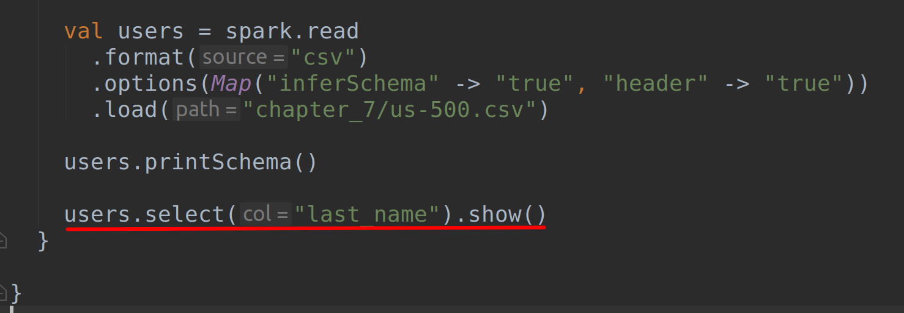
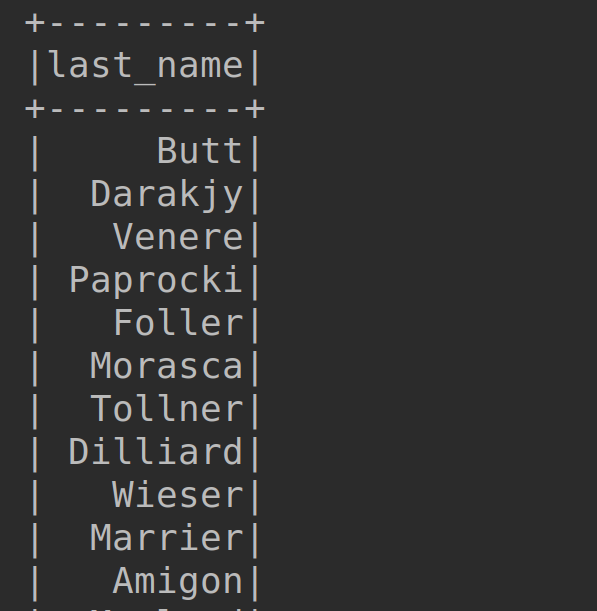
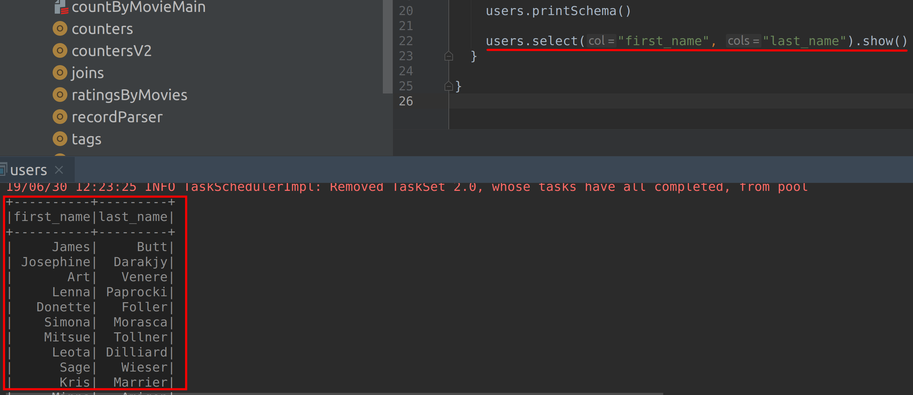

# Lab : Apache Spark - Creating Data Frame using Data Source API

#### Pre-reqs:
- Google Chrome (Recommended)

#### Lab Environment
All packages have been installed. There is no requirement for any setup.


#### Lab Solution
Open https://github.com/fenago/ernesto-spark-databricks/tree/master/src/main/scala/training/users.scala to view scala file.


The aim of the following lab exercises is to start writing Spark SQL code in editor to learn about Data Frames.
We will cover following topics in this scenario.
- Creating Data Frame using DataSource API


## Task: Creating Data Frame using Data Source API

Let us start this exercise by loading a file using Data Source API.

**Step 1:** Download the us-500.csv file from the URL below. This file contains twelve columns: first_name, last_name, company_name, address, city, county, state, zip, phone1, phone2, email and web.

us-500.csv - http://bit.ly/2LmgDW2

**Note:** We already have cloned a github repository which contains a required file. Open `~/work/ernesto-spark/Files/chapter_7` to view file.

**Step 2:** Click **File Browser** tab on the top left and open `~/work/ernesto-spark/src/main/scala/training/users.scala to view scala file.


```
import org.apache.spark.sql.SparkSession
```

Since we are using SparkSession object to start our Spark Session, we need not import the SparkContext object as we did in the previous exercises. The SparkContext object is wrapped with in the SparkSession object in Spark 2.x version.


**Step 3:** Let us now write our program and create a SparkSession object as shown below.

```
  val spark = SparkSession
    .builder()
    .appName("Users")
    .master("local[*]")
    .getOrCreate()
```

We are calling the builder method on Sparksession object to build a Spark Session. Next, the appName and master methods are used to specify the name of our app and mode of execution (local or cluster), as we used to while creating a SparkContext object. Finally, we use the getOrCreate method to get a SparkSession if there is one already or create a new SparkSession if it does not exist.


**Step 4:** Let us now load our file using the code as shown below.

```
val users = spark.read
  .format("csv")
  .options(Map("inferSchema" -> "true", "header" -> "true"))
  .load("chapter_7/us-500.csv")
```

We call the read method on our SparkSession object spark, which we created in the previous step and specify the csv as format for our file using the format method. Next, we use a Map object to specify that our input file contains a header and also ask Spark SQL to infer schema. Since Map contains key value pairs, the keys are to specify properties and the values are true for both. Finally, we specify the path of our file using the load method. Please see that we use options method (plural) to specify more than one option using a Map object. If you only want to specify one option, you should use option method (singular). 


**Step 5:** We now have successfully created a dataFrame named users. Let us now print it to console along with the schema.

```
   users.printSchema()

   users.show()
 }

}
```

We call printSchema method to display the inferred schema and show method to display our dataFrame. Please note that when you use show method, only first 20 records in the dataFrame are shown. You can pass an integer for number of records in the show method. For example, to show 40 records you can use something like this users.show(40)

 

The show method is an action and so this the point where the DAG is actually executed. 

**Step 6:** Let us run this program and check the output. You should see the schema as shown below.

To run this program from the terminal, simply run the following command. The program will the then be compiled and executed.
`rm -rf ~/work/ernesto-spark/src/main/scala/training/.ipynb_checkpoints/ && sbt "runMain training.users"` 
 
As you can see, the schema been correctly discovered by Spark for each and every column in the dataFrame. Please note that if a column has values of more than one data type, Spark will infer it as String.
The output of dataFrame users is as shown below.

 
As you can see from the screenshot above, the header is displayed correctly along with the records.

**Step 7:** We can also select only one column or more than one column from the dataFrame and have it shown using the code below.

```
users.select("last_name").show()
```



**Important:** You need to uncomment above line in `users.scala` using editor before running program again.

`rm -rf ~/work/ernesto-spark/src/main/scala/training/.ipynb_checkpoints/ && sbt "runMain training.users"` 

The output is as shown in the screenshot below.



## Selecting multiple columns…

We can select multiple columns using following code:

```
users.select("first_name", "last_name").show()
```

**Important:** You need to uncomment above line in `users.scala` using editor before running program again.

We simply call the select method on users dataFrame and pass the required columns as arguments. Then we call the show method as usual.

`rm -rf ~/work/ernesto-spark/src/main/scala/training/.ipynb_checkpoints/ && sbt "runMain training.users"` 



Task is complete!


 


