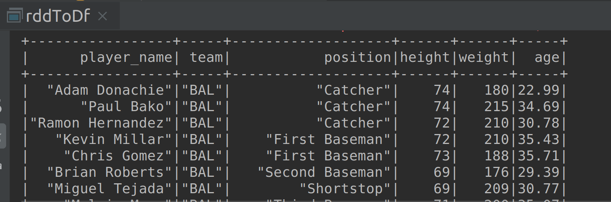

# Lab : Apache Spark - Creating Data Frame from an RDD and StructType

#### Pre-reqs:
- Google Chrome (Recommended)

#### Lab Environment
All packages have been installed. There is no requirement for any setup.


#### Lab Solution
Open https://github.com/fenago/ernesto-spark-databricks/tree/master/src/main/scala/training/rddToDf.scala to view scala file.


The aim of the following lab exercises is to start writing Spark SQL code in editor to learn about Data Frames.
We will cover following topics in this scenario.
- Creating Data Frame from an RDD
- Creating Data Frame using StructType


## Creating Data Frame from an RDD

We can also create a Data Frame from an RDD. Let us see how to achieve this.

**Step 1:** Download the mlb_players.csv file from the URL below. This file contains six columns: name, team, position, height, weight, age.

mlb_players.csv - http://bit.ly/2JhzVJj

**Note:** We already have cloned a github repository which contains a required file. Open `~/work/ernesto-spark/Files/chapter_7` to view file.

**Step 2:** Click **File Browser** tab on the top left and open `~/work/ernesto-spark/src/main/scala/training/rddToDf.scala to view scala file.


```
import org.apache.spark.sql.SparkSession
```


 
**Step 3:** Let us now create a case class so that we can define schema to our dataFrame. The names which we specify for attributes of case class object will get mapped as column names for our dataFrame. This will make sense when we run the program.

```
case class Players(player_name: String, team: String, position: String, height: Int, weight: Int, age: Double)
```

**Step 4:** Let us now write our program and create a SparkSession object as shown below.

```
  val spark = SparkSession
    .builder()
    .appName("RDD to DataFrame")
    .master("local[*]")
    .getOrCreate()
```


**Step 5:** Since our aim is to convert an RDD to a DataFrame, we must use the textFile API in the SparkContext object to read the file and create an RDD.

```
val input = ss.sparkContext.textFile("chapter_7/mlb_players.csv")
```

We now have an RDD created. But the file contains a header with column names. We must first remove the header. We can achieve that by calling the first method on our RDD and then remove it using the filter method as shown below.

```
val header = input.first()
val records = input.filter(x => x != header)
```

The first line of code takes the first record from the RDD, which in our case is the header or column names and then we simply filter out the header from input RDD. Now, we just have the records RDD without the column names.


**Step 6:** The next step is to split the fields based on a comma so that we can assign each indivudual field to its appropriate case class field.

```
val fields = records.map(record => record.split(","))
```

Now that we can access indivudual fields by their position, let us assign them to the case class Players, using the map function as shown below.

```
val structRecords = fields.map(field => Players(field(0).trim, field(1).trim, field(2).trim, field(3).trim.toInt, field(4).trim.toInt, field(5).trim.toDouble))
```

We call trim method on all the fields to remove leading and trailing white spaces, and also cast height, weight and age fields to Int, Int and Double respectively.


 

**Step 7:** We now have our data in structured columns with named records. We can now simply convert it to a dataFrame using toDF method. 

But before we can use the toDF method, we need to import the implicits as shown below.

```
import ss.implicits._

val recordsDf = structRecords.toDF()
```

We now have our dataFrame recordsDf created from RDD.

 


**Step 8:** Let us now call the show method on our dataFrame and run the program.

```
recordsDf.show()

  }

}
```

The output is as shown in the screenshot below.



To run this program, run the following scala file code in the databricks notebook. The program will the then be compiled and executed.
`rddToDf.scala` 

Task is complete!

## Creating Data Frame using StructType

In the previous task, we have created a dataFrame from an RDD. We have used a case class and toDF method to achieve the same. However, there are some limitations using case class method. The case class cannot have more than 22 arguments. If our data has more than 22 fields, it becomes hard to crearte a dataFrame from RDD using case class and toDF method.

To overcome this limitation, we have a createDataFrame method, which takes an RDD and schema as parameters to create a dataFrame. Let us create a dataFrame using createDataFrame method.

We shall be using the same input file `mlb_players.csv` for this task as well. 

**Step 1:** Click **File Browser** tab on the top left and open `~/work/ernesto-spark/src/main/scala/training/createDf.scala to view scala file.

import org.apache.spark.sql.SparkSession
import org.apache.spark.sql.Row
import org.apache.spark.sql.types.{DoubleType, IntegerType, StringType, StructField, StructType}


**Step 2:** Let us now write the main function and create SparkSession as created in previous tasks.

```
  val ss = SparkSession
    .builder()
    .appName("Rdd to DataFrame")
    .master("local[*]")
    .getOrCreate()
```
 

**Step 3:** The next step is similar to what we have done in the previous task. We load the input file using the textFile API, extract the header and filter it out using the filter method. Next, we split the fields based on comma delimiter.

```
val input = ss.sparkContext.textFile("chapter_7/mlb_players.csv")
val header = input.first()
val records = input.filter(x => x != header)
val fields = records.map(record => record.split(","))
```

 
**Step 4:** Now, instead of mapping the fields to a case class as in previous task, we map the fields to a Row object. This Row object is an ordered collection of fields, which can be accessed by index or position. It is similar to a row in a table.

```
val structRecords = fields.map(field => Row(field(0).trim, field(1).trim, field(2).trim, field(3).trim.toInt, field(4).trim.toInt, field(5).trim.toDouble))
```

We now have our fields as rows. All the fields are assigned and casted as we have in the previous task.

**Step 5:** Now that we have rows, let us create a schema. We can create schema using the instance of StructType object. The StructType object contains StructField objects which takes parameters as name of the column, type of the column and an optional boolean specifying if the column contains null values. Also, the data type must be defined as StringType, IntegerType, DoubleType etc.

```
val schema = StructType(List(
  StructField("player_name", StringType, false),
  StructField("team", StringType, false),
  StructField("position", StringType, false),
  StructField("height", IntegerType, false),
  StructField("weight", IntegerType, false),
  StructField("age", DoubleType, false)
))
```

We have specified the StructFields as a List inside the StructType object.


**Step 6:** Finally, we can use our RDD which is structRecords and schema as parameters for createDataFrame method to create a dataFrame.

```
val recordsDf = ss.sqlContext.createDataFrame(structRecords, schema)
```

Since `createDataFrame` is a method of sqlContext object we call sqlContect on our SparkSession object and then call createDataFrame method.

Let us use the show method to check the created dataFrame using createDataFrame method.

```
recordsDf.show()

  }

}
```

**Step 7:** Let us finally run our program and check the output. The output is as shown in the screenshot below.

To run this program, run the following scala file code in the databricks notebook. The program will the then be compiled and executed.
`createDf.scala` 

We have successfully created our dataFrame using the createDataFrame method.

Task is complete!

 


