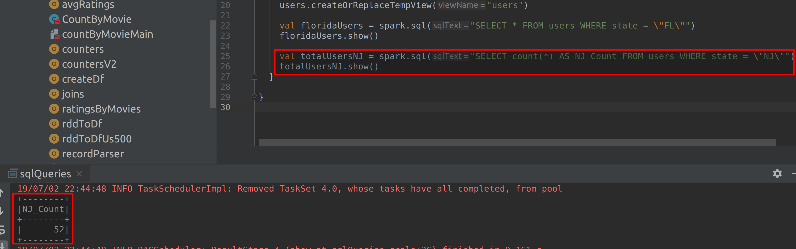
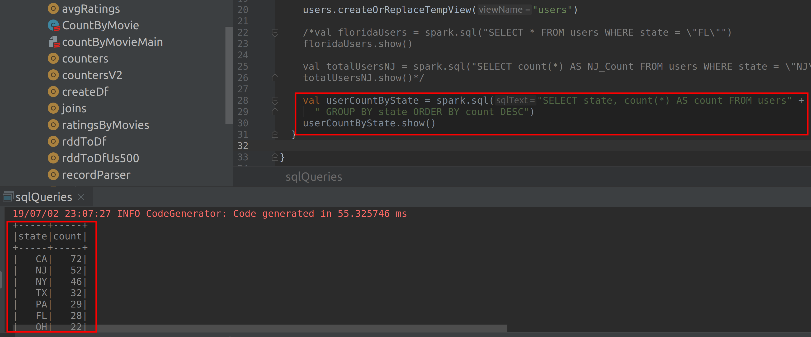
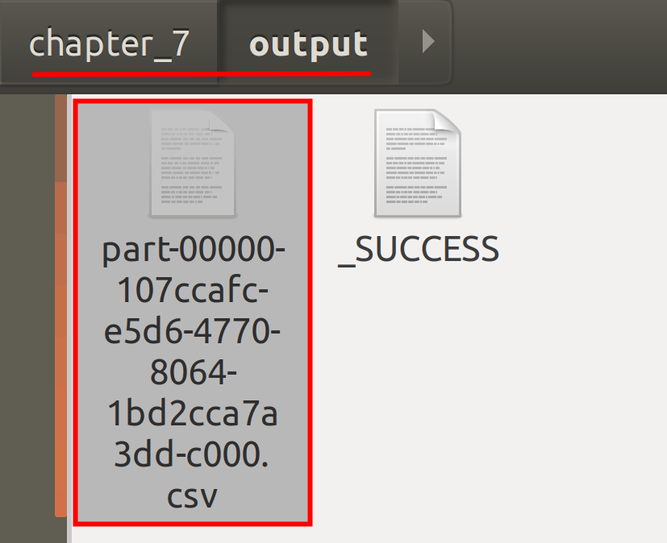

# Lab : Apache Spark - Querying data using Spark SQL

#### Pre-reqs:
- Google Chrome (Recommended)

#### Lab Environment
All packages have been installed. There is no requirement for any setup.

**Note:** Labs will be accessible at the port given to you by your instructor. Password for jupyterLab : `1234`

Lab instructions and scala examples are present in `~/work/ernesto-spark` folder. To copy and paste: use **Control-C** and to paste inside of a terminal, use **Control-V**

There should be terminal(s) opened already. You can also open New terminal by Clicking `File` > `New` > `Terminal` from the top menu.

Now, move in the directory which contains the scala source code by running following command in the terminal.

`cd ~/work/ernesto-spark`

You can access jupyter lab at `<host-ip>:<port>/lab/workspaces/lab18`

**Note:**
- The supplied commands in the next steps MUST be run from your `~/work/ernesto-spark` directory. 
- Final code was already cloned from github for this scenario. You can just understand the application code in the next steps and run it using the instructions.
- Click **File Browser** tab on the top left and open `~/work/ernesto-spark/src/main/scala/training/sqlQueries.scala` to view scala file.


The aim of the following lab exercises is to start writing Spark SQL code in **vscode** editor to learn about Data Frames.
We will cover following topics in this scenario.
- Querying data using Spark SQL

## What is Spark SQL?

Spark SQL is a library or module of Spark, which provides SQL style programming to process structured data. Spark SQL runs on top of Spark by wrapping all the Spark core APIs into a high level abstraction. Spark SQL also provides optimizations to run the jobs faster which lacks in Spark core making Spark even more efficient. Since Spark SQL is syntactically similar to SQL, it is easier for developers, who already work on SQL to become productive faster with less efforts. Spark SQL was implemented to overcome the disadvantages of running Apache Hive on top of Spark.


##### Why Spark SQL?

The following are the advantages of using Spark SQL.

- Spark SQL is popular because, it provides developers with an easy to use APIs with support to various data sources. Spark SQL provides interfaces for programming languages and query languages which include SQL and HiveQL, helping developers to get productive in no time.

- A wide variety of file formats such as csv, Avro, Json, Parquet, ORC etc are supported by Spark SQL. It also supports almost all the relational databases with JDBC connectivity, which include MySQL, Postgress, Oracle to name a few. NoSQL datastores such as Hbase, Cassandra, EasticSearch are also supported with Spark SQL.

- Spark SQL can also be easily integrated to other Spark libraries, which include Spark ML, graphX and Spark Streaming.

- Spark SQL efficiently processes structured data by advanced optimization techniques such as cost based optimizer, in-memory columnar caching, code generation and reduced disk IO. 
In view of all these features, it is recommended to use Spark SQL (Data Frames) over RDDs whenever possible.

## Spark SQL Architecture

The Spark SQL Architecture consists of the following components.

Component | Description
--- | ---
`DataSource API` | 	The Data Source API is the universalAPI to load and store structured data. This is similar to the textFile, binaryFile, Sequence File APIs in Spark core (RDD). Instead of so many different APIs for different formats of data, we have Data Source API which can load and store structured data. Data Source API has has built-in support for JDBC, Hive, Avro, JSON, Parquet, etc. Data Source API can automatically infer schema without the user explicitly mentioning the schema. We can also specify the schema using Data Source API
`Data Frames` | Data Frames are like advanced version of RDDs. Data Frames are distributed collection of data represented in the form of rows and named columns. All the features of RDDs also apply to Data Frames. They are distributed, lazy, can be cached and are immutable. In other words, Data Frames are similar to that of tables in RDBMS but with more advanced capabilities. Since Data Frames are similar to that of RDBMS tables, we can simply run SQL like queries on our Data Frames, and have the data processed on our Spark cluster in distributed manner. 
`SQL Interpreter & Optimizer` | The queries on Data Frames are run in SQL which is a high level language. So, we need a SQL Interpreter or a SQL Parser which will interpret or parse our SQL queries.  The Optimizer in Spark SQL is called Catalyst. The Catalyst optimizer works on the SQL Data Structure trees and transforms the logical plan to an optimized plan, which inturn will be transformed to a physical plan. In simple terms, this component helps us processes our big data in an efficient and optimized way.
`Spark SQL Thrift Server` | The Spark SQL Thrift server is used as an abstraction layer to connect Spark SQL with various Business Intelligence (BI) tools. The Spark Thrift Server is similar to that of Hive Thrift Server. So, instead of running queries from BI tools via Hive Thrift server as Map Reduce jobs, we can use the Spark Thrift Server and use Spark's features. Since Spark is faster than Hadoop Map Reduce, we can have our queries processes faster in an efficient manner. The BI tools can be connected with Spark using the JDBC or ODBC drivers. For example, Tableau can be connected to Spark SQL using the ODBC driver and then run the queries from Tableau on Spark.
`Tungsten` | Tungsten is a Spark SQL component which helps in memory tuning and optimization of Spark jobs. Tungsten's memory management is developed to address the drawbacks in JVM's memory management. With Catalyst and Tungsten the Spark SQL jobs are much faster and efficient when compared to RDDs.

## Querying data using Spark SQL

With Spark SQL, we can process data in two ways. The first way is to use the Spark SQL data manipulation language, which are essentially the traditional SQL queries we use in RDBMS. We can simply perform operations using SQL queries and obtain the result. The second way is to use the DataFrame API which is DataFrame Data Manipulation language. The DataFrame API is programmatical kind of language. 

You are free to use any way to process the data based on your level of comfortability. Both the APIs are optimized and are efficient. Let is first use SQL queries to process data in this task and look at few operations we can perform.


**Step 1:** We shall be using the file `us-500.csv`, for this task as input source. Please create a new object and name it sqlQueries. Perform all the steps you performed in Task 1 and come back here. Your program should look something like the screenshot shown below.


**Step 2:** Let us first assign a view for our dataFrame so that we can run queries against it. In simple words, we are just creating a table for our dataFrame so that we can reference it while we run SQL queries against it. 

```
users.createOrReplaceTempView("users")
```

We are using the createOrReplaceTempView method to create a temporary table named users if it doesn't exist, or replace a view if it already exist with the same name. This temporary table is available till the SparkSession is active. Once the session ends, the table will not be available anymore. Hence the name temp view. You can also persist the table using saveAsTable method.


**Step 1:** We shall be using the file `us-500.csv`, for this task as input source. Please create a new object and name it sqlQueries. Perform all the steps you performed in Task 1 and come back here. Your program should look something like the screenshot shown below.


**Step 2:** Let us first assign a view for our dataFrame so that we can run queries against it. In simple words, we are just creating a table for our dataFrame so that we can reference it while we run SQL queries against it. 

```
users.createOrReplaceTempView("users")
```

We are using the createOrReplaceTempView method to create a temporary table named users if it doesn't exist, or replace a view if it already exist with the same name. This temporary table is available till the SparkSession is active. Once the session ends, the table will not be available anymore. Hence the name temp view. You can also persist the table using saveAsTable method.


**Step 1:** We shall be using the file `us-500.csv`, for this task as input source. Please create a new object and name it sqlQueries. Perform all the steps you performed in Task 1 and come back here. Your program should look something like the screenshot shown below.


**Step 2:** Let us first assign a view for our dataFrame so that we can run queries against it. In simple words, we are just creating a table for our dataFrame so that we can reference it while we run SQL queries against it. 

```
users.createOrReplaceTempView("users")
```

We are using the createOrReplaceTempView method to create a temporary table named users if it doesn't exist, or replace a view if it already exist with the same name. This temporary table is available till the SparkSession is active. Once the session ends, the table will not be available anymore. Hence the name temp view. You can also persist the table using saveAsTable method.


**Step 4:** Let us now run a query to check the count of total users who belong to state "New Jersey".

```
val totalUsersNJ = spark.sql("SELECT count(*) AS NJ_Count FROM users WHERE state = \"NJ\"")
totalUsersNJ.show()
```

**Important:** You need to uncomment above line in `sqlQueries.scala` using **vscode** editor before running program again.

`rm -rf ~/work/ernesto-spark/src/main/scala/training/.ipynb_checkpoints/ && sbt "runMain training.sqlQueries"` 

In the query above, we are simply using count function with a WHERE clause to get the count of users who belong to NJ. We use the AS clause to name the column as shown in the screenshot below. Then, we use the show method to display the results.

The output should be as shown in the screenshot below.




**Step 5:** Let us now look at the count of users by state and also arrange them in descending order of their count.

```
val userCountByState = spark.sql("SELECT state, count(*) AS count FROM users GROUP BY state ORDER BY count DESC)
userCountByState.show()
```

**Important:** You need to uncomment above line in `sqlQueries.scala` using **vscode** editor before running program again.

`rm -rf ~/work/ernesto-spark/src/main/scala/training/.ipynb_checkpoints/ && sbt "runMain training.sqlQueries"` 

In the query above, we have used GROUP BY to to group by state and then ORDER BY to sort the count in descending order.

The result is as shown in the screenshot below.



## Save File

**Step 6:** Instead of using the show method, let us now look how we can save this file. You may comment out or remove the line with the show method from the previous step.

Before we save the file, there is one important thing we need to know about how SparkSQL creates tasks. For the second stage of DAG, the number of tasks created to process the data are 200 by default. But in Spark core, the number of tasks in second stage is always equal to number of tasks in first stage. For example, consider we have two stages stage 0 and stage 1. For stage 0, the number of tasks created will be equal to the number of input splits. Next, in Spark core, the number of tasks in stage 1 are equal to the number of tasks in stage 0. However, in SparkSQL, the number of tasks in stage 1 will be 200 by default.

The 200 tasks in SparkSQL is a good starting point if there is huge data to process. We can configure the number for optimization if required. However, our file is just a sample of small data and there is no requirement of 200 tasks to be created. So using the following property, we can set the total number of tasks as 1. If we run with the default value of 200 and save the file, there will be multiple partitions of output for small set of data. You are free to check how the output looks like without setting this property.
 
```
spark.conf.set("spark.sql.shuffle.partitions", "1")
```

Since this is a configuration, we are calling conf on our SparkSession object and setting the property to use only one task using the set method. This will only create one task and we will be left with only one output file. 

Let us now save the file using the code below.

```
 userCountByState.write
    .format("csv")
    .save("chapter_7/output")
```

Similar to reading the file using read and load methods, we use write and save methods to save the file to file system.

 

Now run the program as you did in the previous task and check the output directory. You should see two files: part-00000 and a _SUCCESS file. The output is saved in part-00000 file.
 
`rm -rf ~/work/ernesto-spark/src/main/scala/training/.ipynb_checkpoints/ && sbt "runMain training.sqlQueries"` 

#### Output Files

`ls ~/work/ernesto-spark/Files/chapter_7/output` 

`cat ~/ernesto-spark/Files/chapter_7/output/part-*` 

Open the `part-00000-<guid>` file and you should see the result.



This way you can perform any operations using the SQL data manipulation language. 

Task is complete!


