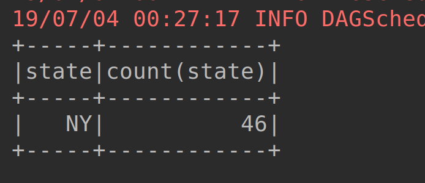
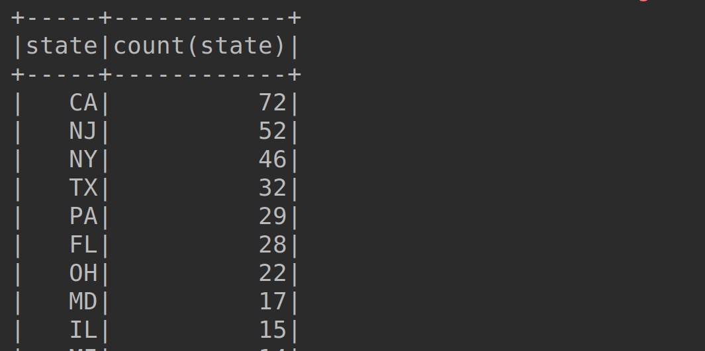

# Lab : Apache Spark - Joins using Spark SQL

#### Pre-reqs:
- Google Chrome (Recommended)

#### Lab Environment
All packages have been installed. There is no requirement for any setup.

**Note:** Labs will be accessible at the port given to you by your instructor. Password for jupyterLab : `1234`

Lab instructions and scala examples are present in `~/work/ernesto-spark` folder. To copy and paste: use **Control-C** and to paste inside of a terminal, use **Control-V**

There should be terminal(s) opened already. You can also open New terminal by Clicking `File` > `New` > `Terminal` from the top menu.

Now, move in the directory which contains the scala source code by running following command in the terminal.

`cd ~/work/ernesto-spark`

You can access jupyter lab at `<host-ip>:<port>/lab/workspaces/lab19`

**Note:**
- The supplied commands in the next steps MUST be run from your `~/work/ernesto-spark` directory. 
- Final code was already cloned from github for this scenario. You can just understand the application code in the next steps and run it using the instructions.
- Click **File Browser** tab on the top left and open `~/work/ernesto-spark/src/main/scala/training/sqlJoins.scala` to view scala file.


The aim of the following lab exercises is to start writing Spark SQL code in **vscode** editor to learn about Data Frames.
We will cover following topics in this scenario.
- Joins using Spark SQL
- Operations using DataFrame API


## Prerequisites

We need following packages to perform the lab exercise: 
- Java Development Kit
- SBT


#### JAVA
Verify the installation with: `java -version` 

You'll see the following output:

```
java version "1.8.0_201"
Java(TM) SE Runtime Environment (build 1.8.0_201-b09)
Java HotSpot(TM) 64-Bit Server VM (build 25.201-b09, mixed mode)
```


#### SBT
Verify your sbt installation version by running the following command.	

`sbt sbtVersion`	

You will get following output. If you get an error first time, please run the command again.

```	
[info] Loading project definition from /home/jovyan/work/ernesto-spark/project	
[info] Loading settings for project apache-spark from build.sbt ...	
[info] Set current project to Spark (in build file:/home/jovyan/work/ernesto-spark/)	
[info] 1.3.2
```

## Joins using Spark SQL

Let us now use Spark SQL to join two dataFrames.

**Step 1:** Download the ratings.csv file from the URL below. This file contains four columns: userId, movieID, rating and timestamp.

ratings-head.csv - http://bit.ly/2FPdhHE

**Note:** We already have cloned a github repository which contains a required file. Open `~/work/ernesto-spark/Files/chapter_7` to view file.

**Step 2:** Download the movies.csv file from the URL below. This file contains three columns: movieID, movieName and genre.

movies-head.csv - http://bit.ly/2RTg72N

**Note:** We already have cloned a github repository which contains a required file. Open `~/work/ernesto-spark/Files/chapter_7/` to view file.

We shall join these datasets based on the movieID.


**Step 3:** Click **File Browser** tab on the top left and open `~/work/ernesto-spark/src/main/scala/training/sqlJoins.scala` to view scala file.

```
import org.apache.spark.sql.SparkSession
```

Then write the main function for our program and create a SparkSession object as shown below.

```
def main(args: Array[String]): Unit = {

  val spark = SparkSession
    .builder()
    .appName("SQL Joins")
    .master("local[*]")
    .getOrCreate()
```

**Step 4:** Let us now read both the files as shown below.

```
val movies = spark.read
  .format("csv")
  .options(Map("inferSchema" -> "true", "header" -> "true"))
  .load("chapter_7/movies-head.csv")
val ratings = spark.read

  .format("csv")
  .options(Map("inferSchema" -> "true", "header" -> "true"))
  .load("chapter_7/ratings-head.csv")
```

We now have two dataFrames for each of our input file.


**Step 4:** Now that we have our dataFrames, let us create a temp view so that we can run our join query against them.

```
movies.createOrReplaceTempView("movies")
ratings.createOrReplaceTempView("ratings")
```

**Step 5:** We now have our views. All we need to do now is to perform the join. We can join this using the SQL query as shown below.

```
val joinedDf = spark.sql("SELECT * FROM movies JOIN ratings ON movies.movieId = ratings.movieId"
```

Finally, let us call the show method on our joinedDf dataFrame and run the program.

```
joinedDf.show()
```


To run this program from the terminal, simply run the following command. The program will the then be compiled and executed.
`rm -rf ~/work/ernesto-spark/src/main/scala/training/.ipynb_checkpoints/ && sbt "runMain training.sqlJoins"` 

You should see the joined table as shown in the screenshot below.

Task is complete!

## Operations using DataFrame API

**Step 1:** The initial few steps are similar to what we have done in the previous tasks. Create a new Scala object and name it dfOps. Specify the required imports and create a SparkSession object as in the previous tasks. Finally load the us-500.csv file.

Your program at this point of time should look like the one in the screenshot below.

 
**Step 2:** Now that we have the dataFrame created, let us perform an operation to select all the users from Florida using the DataFrame API.

```
val foridaUsers = users.select("*").where("state = \"FL\"")
```

This is similar to the SQL query which we have performed in the task earlier. We have methods here which look more like programming style. In the code above, we have used select method to select all the columns of out dataFrame and then where method to specify our condition.

Please see that we need not create a temp view as we did earlier. It is only required when we are working with SQL queries.

Let us now call the show method on our dataFrame to view the results on the console.

```
floridaUsers.show()
```

The output should look something like the table shown in the screenshot.


**Step 3:** Let us now run a query to check the count of total users who belong to state "New York".
 
```
val nyUserCount = users.groupBy("state")
    .agg(("state", "count"))
    .where("state = \"NY\"")
```

This is a bit different to what we have done in the SQL query. In the code above, we are first grouping by state and then applying the agg method. The agg method takes the column as first parameter and then the type of aggregation as second parameter. We specify the second parameter as count since we want to count the number of users from New York State. Then, we specify the condition using the where method.

Let us now call the show method on our dataFrame to view the results.

```
nyUserCount.show()
```

The output is as shown in the screenshot below.




**Step 4:** Let us now write some code to get the count for all the users for each state. We first need to import the implicits as shown below.

```
import spark.implicits._

val userCountByState = users.groupBy("state")
    .agg(("state", "count"))
    .orderBy($"count(state".desc)
```

As you can see in the query above, we use the orderBy method to order the result by the count of state in a descending order.

Let us call the show method.

```
userCountByState.show()
```

To run this program from the terminal, simply run the following command. The program will the then be compiled and executed.
`rm -rf ~/work/ernesto-spark/src/main/scala/training/.ipynb_checkpoints/ && sbt "runMain training.dfOps"` 

The output is as shown in the screenshot below.


 
Task is complete!
 


