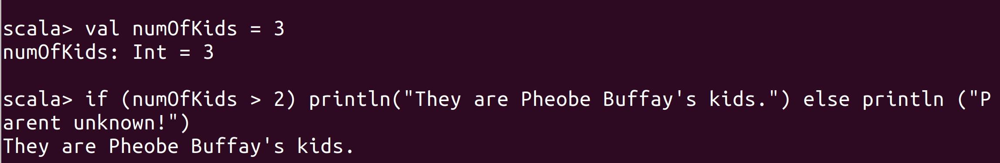

# Lab : apache-spark-scala-loops

#### Pre-reqs:
- Google Chrome (Recommended)

#### Lab Environment
All packages have been installed. There is no requirement for any setup.

**Note:** Labs will be accessible at the port given to you by your instructor. Password for jupyterLab : `1234`

Lab instructions and scala examples are present in `~/work/ernesto-spark` folder. To copy and paste: use **Control-C** and to paste inside of a terminal, use **Control-V**

There should be terminal(s) opened already. You can also open New terminal by Clicking `File` > `New` > `Terminal` from the top menu.

Now, move in the directory which contains the scala source code by running following command in the terminal.

`cd ~/work/ernesto-spark`

You can access jupyter lab at `<host-ip>:<port>/lab/workspaces/lab2`

## Install Scala

We need following packages to perform the lab exercise: 
- Java Development Kit
- Scala


#### JAVA
Verify the installation with: `java -version` 

You'll see the following output:

```
java version "1.8.0_201"
Java(TM) SE Runtime Environment (build 1.8.0_201-b09)
Java HotSpot(TM) 64-Bit Server VM (build 25.201-b09, mixed mode)
```


#### Install Scala

**Note:** Scala is already installed. It is not required to run following commands to install.

**Step 1:** Run the following commands from the terminal to install Scala.

`wget www.scala-lang.org/files/archive/scala-2.12.8.deb`

`dpkg -i scala-2.12.8.deb`


**Step 2:** Verify your Scala installation version by running the following command.
 
`scala -version`

You will get following output.

```
Scala code runner version 2.12.8 -- Copyright 2002-2018, LAMP/EPFL and Lightbend, Inc.
```

## Data Types in Scala

Like every other language, Scala also has data types and are very similar to that of Java. The following are the data types in Scala.

Data Type | Size
--- | ---
`Int` | 4 Bytes (32 bits)
`Long` | 8 Bytes
`Float` | 4 Bytes
`Double` | 8 Bytes
`Char` | 1 bit
`Boolean` | 1 bit
`String` | Dynamic

Type `scala` in your terminal and you will be prompted with a Scala prompt.

`scala`

**Step 1:** Let us now look into more data types as discussed in Data Types in Scala section and see how we can create them.

`val num: Int = 255`

The above piece of code creates an immutable variable num of type Integer with a value of 255. Similarly, we can create immutable variables of all the other data types as shown below.

`val longNum: Long = 89416414`

`val decimal: Double = 85.5545`

`val decimalf: Float = 54.24f`

`val letter: Char = 'f'`

Please note that there are only single quotes for Char type while there are double quotes for a String type.

`val lieDetector: Boolean = true`


Please note that the Data type name starts with a upper case letter unlike the other programming languages. 

However, you do not even have to specify the data type. Scala is smart enough to infer the type based on the value. You need not explicitly specify the data type while declaring a variable as shown below.

`val num = 256`


As you can see from the screenshot above, Scala has automatically inferred the type of the variable as Int.

You can also do this for a String or any other data type as shown below.

`val name = "Learning Voyage"`

`val decimal = 25.3545`


## Print on Console

**Step 2:** Let us now look at various ways we can print to the console. Using all the above variables we created in the previous step, let us concatenate them all in one string using '+' symbol as shown below.

`println("Printing to console using concatenation: " + name + num + longNum + decimal + decimalf + letter + lieDetector)`


It works but the output is not formatted correctly because we have not used spaces to separate the variables. We can add a white space as a string after each variable but it becomes a lengthy process if we have so many variables.


So, to overcome this we can substitute the variables within a string using an s prefix in the print statement before the double quotes as shown below. Each variable has a `prefix.

`println(s"Printing to console using variable substitution: $name $num $longNum $decimal $decimalf $letter $lieDetector")`

Not only can we substitute the variables but we can also substitute expressions within the print statements enclosed in curly braces.

`println(s"Four divided by two is ${4/2}")`

 
Scala also supports the printf statements similar to that of Java. All we have to do is use an f prefix in the printf statement. The example of the same is as shown below.

`printf(f"Printing the value of a double with 2 decimal places $decimal%.2f")`

 

Task is complete!

## Scala Loops

Loops are an essential part of any programming language and it is no different with Scala. Let us now look at the loops concept and write some code to get familiar with them.

**Step 1:** Let us start the loops concept with the if loop. Fire up the Scala console if you haven't already and type in the following code.

`val numOfKids = 3`

`if (numOfKids > 2) println ("They are Phoebe Buffay's kids.") else println ("Parent unknown!")`



As you can see from the screenshot, the console only prints out the statement which is true based on the condition.

You can also write the if loop in the REPL in multiple lines using the paste mode as shown below. From the Scala prompt enter the following command and hit enter.

`:paste`

This will take you to the paste mode with a prompt to enter your code as shown in the screenshot.


You can now enter Scala code in multiple lines. Once you are done with your code press Ctrl + D to come out of the paste mode and execute the code.

**Note:** After pasting following code in the scala terminal, Press  `Ctrl` + `D` to run code.

```
val  numOfKids = 3
if (numOfKids > 2) {
println("They are Phoebe Buffay's kids.")
} else {
println("Parent unknown!")
}
```

The code is executed as soon as you have exited from the paste mode and result is displayed.


If you do not want the last iteration to be included, you can use the keyword until instead of to. For example,

`:paste`


**Note:** After pasting following code in the scala terminal, Press  `Ctrl` + `D` to run code.

```
for ( i <- 1 until 5) {
	val sum = i + i
	println(sum)
}
```


 
We can also use an if statement within the for loop as shown below.

`:paste`

**Note:** After pasting following code in the scala terminal, Press  `Ctrl` + `D` to run code.

```
val  friends = List("Chandler", "Monica", "Rachel", "Ross", "Joey", "Phoebe")
for(friend <- friends if friend == "Chandler"){
println(s"The king of sarcasm is $friend")
}
```


In the above example, we are looping through the list of collection called friends, with an if condition. We filter out all the items except for one element and substitute the variable in the print statement. Please see that we are using double equals operator to compare two strings.

## While Loop

**Step 3:** Let us now look at while and do while loops. The while construct is similar to that of other programming languages. However, in functional programming, the use of while loops is discouraged. 

Enter into the paste mode and execute the following code.

`:paste`

**Note:** After pasting following code in the scala terminal, Press  `Ctrl` + `D` to run code.

```
var friends = 0
val names = List("Chandler", "Monica", "Rachel", "Phoebe", "Ross", "Joey")
println("The names of friends are:")

while (friends < 6){
println(s"${names(friends)}")
friends += 1
}
```


In the code above, we have first declared an Integer variable with a value of 6 and then a list of names of type String. Next, we print out a header so that the output makes sense and then write the While loop. The loop starts with a keyword while and then the condition inside the parentheses. The condition we set here is to continue the loop until value of friends is less than 6. Next, we use String interpolation to substitute the variables within the print statement. Please see that we have used curly braces, as we have substituted a variable named friends as a value to the variable  names. So that every time the loop runs, we are accessing each element of the list by its index starting from 0. Finally we increment the variable friends with 1.

The while loop runs every time the condition is satisfied and only comes out of the loop when the condition is false.

## Do While Loop

Now, enter into the paste mode again and execute the following code to perform a do while loop.

`:paste`

**Note:** After pasting following code in the scala terminal, Press  `Ctrl` + `D` to run code.

```
var i = 0
do{
i += 1
println(i)
} while (i < 5)
```


The difference between while and do while loops is that any expression within the do clause runs at least once irrespective of the condition in while clause.
