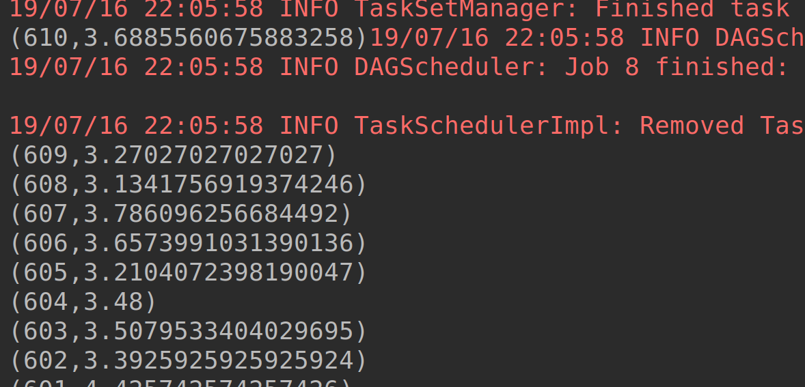

# Lab : Apache Spark - Creating Dataset using Data Source API

#### Pre-reqs:
- Google Chrome (Recommended)

#### Lab Environment
All packages have been installed. There is no requirement for any setup.

**Note:** Labs will be accessible at the port given to you by your instructor. Password for jupyterLab : `1234`

Lab instructions and scala examples are present in `~/work/ernesto-spark` folder. To copy and paste: use **Control-C** and to paste inside of a terminal, use **Control-V**

There should be terminal(s) opened already. You can also open New terminal by Clicking `File` > `New` > `Terminal` from the top menu.

Now, move in the directory which contains the scala source code by running following command in the terminal.

`cd ~/work/ernesto-spark`

You can access jupyter lab at `<host-ip>:<port>/lab/workspaces/lab20`

## What are Datasets?

Dataset is the most advanced API in Spark. Datasets are an extension of DataFrames, which overcome all the disadvantages of both RDDs and DataFrames. The Dataset API provides developers with type safe mechanism and functional style programming, while retaining the relational type of programming in DataFrames and performance optimizations. Hence it is called as an extension of DataFrames. Datasets were introduced in Spark from the 1.6 version.

Datasets use Encoders to serialize and deserialize the Spark SQL representation to JVM objects. The serialization and deserialization with encoders is significantly fast when compared to Java serialization. In simple words, datasets use encoders to convert the data between JVM objects and Spark SQL representation of tabular objects.


#### Why Datasets?

The following are the advantages of using datasets.

- Datasets are a combination of RDDs and DataFrames. Datasets help you code like you would with RDDs and process them through performance optimization engines.

-  Datasets have all the other features as RDD and DataFrames. They are lazy, immutable, distributed and can be cached.

- Datasets assures type safety similar to that of RDD. Any type errors are flagged at compile time rather than being notified at runtime.

- Data processing with datasets is optimized using the Catalyst optimizer and Tungsten similar to that of DataFrames. This ensures very fast and efficient processing of data.

- Dataset API provides the developers with a functionaly style of programming as well as relational style of programming.

- Datasets can process structured as well as unstructured data. Datasets can also automatically infer schema.

- Datasets can be converted from RDD and DataFrames. 


**Note:**
- The supplied commands in the next steps MUST be run from your `~/work/ernesto-spark` directory. 
- Final code was already cloned from github for this scenario. You can just understand the application code in the next steps and run it using the instructions.
- Click **File Browser** tab on the top left and open `~/work/ernesto-spark/src/main/scala/training/createDS.scala` to view scala file.


The aim of the following lab exercises is to start writing Spark SQL code in **vscode** editor to learn about Datasets and built-in functions.
We will cover following topics in this scenario.
- Creating Dataset using DataSource API

## Prerequisites

We need following packages to perform the lab exercise: 
- Java Development Kit
- SBT


#### JAVA
Verify the installation with: `java -version` 

You'll see the following output:

```
java version "1.8.0_201"
Java(TM) SE Runtime Environment (build 1.8.0_201-b09)
Java HotSpot(TM) 64-Bit Server VM (build 25.201-b09, mixed mode)
```


#### SBT
Verify your sbt installation version by running the following command.	

`sbt sbtVersion`	

You will get following output. If you get an error first time, please run the command again.

```	
[info] Loading project definition from /home/jovyan/work/ernesto-spark/project	
[info] Loading settings for project apache-spark from build.sbt ...	
[info] Set current project to Spark (in build file:/home/jovyan/work/ernesto-spark/)	
[info] 1.3.2
```

## Task: Creating Dataset using Data Source API

Creating a Dataset is similar to that of a DataFrame with some minor changes.

**Step 1:** Download the ratings.csv file from the URL below. This file contains four columns: userId, movieID, rating and timestamp.

ratings-head.csv - http://bit.ly/2FPdhHE

**Note:** We already have cloned a github repository which contains a required file. Open `~/work/ernesto-spark/Files/chapter_8` to view file.

## Creating Dataset using Data Source API...

**Step 2:** Click **File Browser** tab on the top left and open `~/work/ernesto-spark/src/main/scala/training/createDS.scala` to view scala file.


```
import org.apache.spark.sql.SparkSession
```

Next, we need to write a case class so that we can specify the schema for our fields. This case class is what it makes a Dataset and differentiates from DataFrame. While loading the file, we simply refer to this case class object to create a dataset.

```
private case class Movies(userId: Int, movieId: Int, rating: Double, timestamp: String)
```

We have created a case class and named it Movies by specifying the fields and its types.


If there is an error saying that the case class Movies is already defined, change the name of class case to anything else and refer to it accordingly throughout the program.

**Step 3:** Now, write the main function and create the SparkSession object as shown below.

```
def main(args: Array[String]): Unit = {

  val spark = SparkSession
    .builder()
    .appName("Creating a Dataset")
    .master("local[*]")
    .getOrCreate()
```


**Step 4:** Before, we load the file using the DataSource API, we neet to import the implicits. This import is required to create a Dataset.

```
import spark.implicits._
```

This import is available in our SparkSession object. Hence we refer it with the SparkSession object (spark) which we created in the previous step.


Now, we load the file as we usually do while creating the DataFrame except for the as method at the end. The as method refers to the case class object Movies creating a Dataset object.

```
val movies = spark
  .read
  .format("csv")
  .options(Map("header" -> "true", "inferSchema" -> "true"))
  .load("chapter_8/ratings-head.csv")
  .as[Movies]
  .cache()
```
 

We use the cache method to cache our Dataset in memory so that it does get created everytime an action is called. You now have your Dataset created.


**Step 5:** We can now use the show method as well as printSchema method to check the first 20 records in our Dataset and the schema associated with the Dataset.

```
movies.printSchema()

movies.show()
```
 
The following schema will be shown when we run the program.


**Step 6:** Let us now perform some operations with our dataset. The following code below is used to find the total count of each rating.

```
val ratingCount = movies.groupBy("rating").count()
```


We simply use the groupBy function to group all the ratings and then count the number of ratings using the count function. 

Next, let us call the show method to display the result on the console.

```
ratingCount.show()
```

Once the program is finished running, the following result should be shown as output.

 

But this was also achieved using DataFrames. How is Datasets special? Well, we can also write functional style programming with Datasets.


**Step 7:** Let us now write some functional style programming using our Dataset. First, we shall extract the two columns userId and rating from the movies dataset using the map function.

```
val users = movies.map(x => (x.userId, x.rating))
```

As you can see, we have used functional style programming the code above which we cannot use with DataFrames. Also, we are able to refer to the column by its name.
 
Next, let us convert our Dataset to RDD and write some code to find out average rating for each user.

```
val count = users.rdd.mapValues(x => (x,1))
  .reduceByKey((x,y) => (x._1 + y._1, x._2 + y._2))
  .mapValues(x => x._1/x._2)
  .sortByKey(false)
```

We have simply used the rdd method to convert our dataset to RDD. The rest of the code is the familiar functional programming style.

Let us now use the collect method as we used to in the previous exercises and print out the result to the console.

```
count.collect.foreach(println)
	}
}
```

## Compile and Run

The output should be shown as below.


 

To run this program from the terminal, simply run the following command. The program will the then be compiled and executed.
`rm -rf ~/work/ernesto-spark/src/main/scala/training/.ipynb_checkpoints/ && sbt "runMain training.createDS"` 
 

Task is complete!


