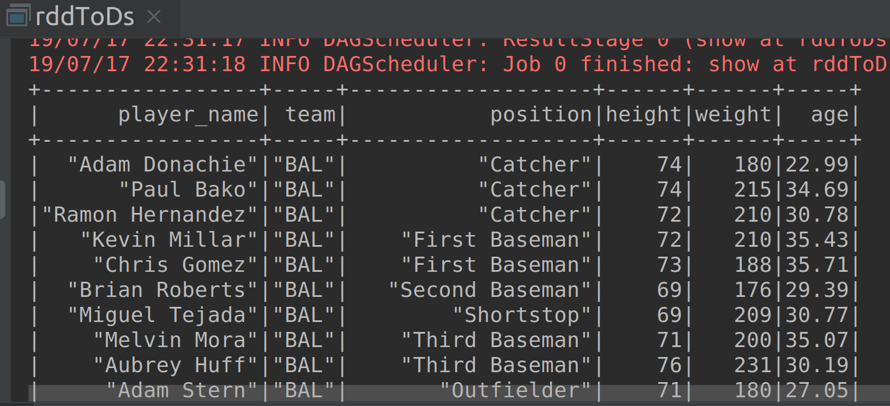

# Lab : Apache Spark - Creating Dataset from an RDD

#### Pre-reqs:
- Google Chrome (Recommended)

#### Lab Environment
All packages have been installed. There is no requirement for any setup.

**Note:** Labs will be accessible at the port given to you by your instructor. Password for jupyterLab : `1234`

Lab instructions and scala examples are present in `~/work/ernesto-spark` folder. To copy and paste: use **Control-C** and to paste inside of a terminal, use **Control-V**

There should be terminal(s) opened already. You can also open New terminal by Clicking `File` > `New` > `Terminal` from the top menu.

Now, move in the directory which contains the scala source code by running following command in the terminal.

`cd ~/work/ernesto-spark`

You can access jupyter lab at `<host-ip>:<port>/lab/workspaces/lab21`


**Note:**
- The supplied commands in the next steps MUST be run from your `~/work/ernesto-spark` directory. 
- Final code was already cloned from github for this scenario. You can just understand the application code in the next steps and run it using the instructions.
- Click **File Browser** tab on the top left and open `~/work/ernesto-spark/src/main/scala/training/rddToDs.scala` to view scala file.


The aim of the following lab exercises is to start writing Spark SQL code in **vscode** editor to learn about Datasets and built-in functions.
We will cover following topics in this scenario.
- Creating Dataset from an RDD

We need the following packages to perform the lab exercises: 
- Java Development Kit
- Scala
- Spark

## Prerequisites

We need following packages to perform the lab exercise: 
- Java Development Kit
- SBT


#### JAVA
Verify the installation with: `java -version` 

You'll see the following output:

```
java version "1.8.0_201"
Java(TM) SE Runtime Environment (build 1.8.0_201-b09)
Java HotSpot(TM) 64-Bit Server VM (build 25.201-b09, mixed mode)
```


#### SBT
Verify your sbt installation version by running the following command.	

`sbt sbtVersion`	

You will get following output. If you get an error first time, please run the command again.

```	
[info] Loading project definition from /home/jovyan/work/ernesto-spark/project	
[info] Loading settings for project apache-spark from build.sbt ...	
[info] Set current project to Spark (in build file:/home/jovyan/work/ernesto-spark/)	
[info] 1.3.2
```

## Task: Creating Dataset from an RDD

As we did in the previous scenario to create an DataFrame from an RDD, we shall also look at creating a Dataset from an RDD.

**Step 1:** Download the mlb_players.csv file from the URL below. This file contains six columns: name, team, position, height, weight, age.

mlb_players.csv - http://bit.ly/2JhzVJj

**Note:** We already have cloned a github repository which contains a required file. Open `~/work/ernesto-spark/Files/chapter_8` to view file.

## Creating Dataset from an RDD...

**Step 2:** Click **File Browser** tab on the top left and open `~/work/ernesto-spark/src/main/scala/training/rddToDs.scala` to view scala file.

```
import org.apache.spark.sql.SparkSession
```

**Step 3:** Let us now create a case class so that we can define schema to our dataset as we did with DataFrame in the previous exercise. The names which we specify for attributes of case class object will get mapped as column names for our dataset. 

```
case class Players(player_name: String, team: String, position: String, height: Int, weight: Int, age: Double)
```


**Step 4:** Let us now write the main function for our program and create a SparkSession object as shown below.

```
def main(args: Array[String]): Unit = {

  val spark = SparkSession
    .builder()
    .appName("RDD to Dataset")
    .master("local[*]")
    .getOrCreate()
```

**Step 5:** Since our aim is to convert an RDD to a Dataset, we must use the textFile API in the SparkContext object to read the file and create an RDD.

```
val input = ss.sparkContext.textFile("chapter_8/mlb_players.csv")
```

We now have an RDD created. But the file contains a header with column names. We must first remove the header. Instead of using the first method and then the filter method, let us remove the header using an efficient approach.

```
val removeHeader = input.mapPartitionsWithIndex((index, itr) => {
  if (index == 0) itr.drop(1) else itr
})
```

In the previous approach to remove the header, we were using filter method to filter out the first record from the RDD. This approach works well when there is small data. But, Spark isn't developed for small data. We will be using huge data in realtime environment.

Consider a scenario where we have a billion records in our RDD. When we use the filter function, the filter condition is tested for each and every record of RDD. Just to filter out one record, we end up testing the condition for all the billion records. To overcome this, we can use the mapPartitionWithIndex function. This higher order function provides us with an entire partition of RDD with index unlike map function which provides us with each record. We can then pass our logic which is to drop the first record in the partition if the partition index is 0, else return the partition as is. So, the condition inside if statement is only verified per partition basis instead of per record. This condition is only tested based on the number of partitions and not on the number of records making it efficient.
 


**Step 6:** The next step is similar to what we have done in the previous exercise while creating a DataFrame from RDD. We split the fields based on a comma so that we can assign each individual field to its appropriate case class field.

```
val fields = removeHeader.map(record => record.split(","))
```

Now that we can access individual fields by their position, let us assign them to the case class Players, using the map function as shown below.

```
val structRecords = fields.map(field => Players(field(0).trim, field(1).trim, field(2).trim, field(3).trim.toInt, field(4).trim.toInt, field(5).trim.toDouble))
```

We call trim method on all the fields to remove leading and trailing white spaces, and also cast height, weight and age fields to Int, Int and Double respectively.


**Step 7:** We now have our data in structured columns with named records. We can now simply convert it to a dataset using toDS method. 

But before we can use the toDS method, we need to import the implicits as shown below.

```
import ss.implicits._

val recordsDs = structRecords.toDS()
```

We now have our datacset recordsDs created from RDD.

**Step 8:** Let us now call the show method on our dataset and run the program.
 
```
recordsDs.show()
  }
}
```

## Compile & Run

To run this program from the terminal, simply run the following command. The program will the then be compiled and executed.
`rm -rf ~/work/ernesto-spark/src/main/scala/training/.ipynb_checkpoints/ && sbt "runMain training.rddToDs"`

The output is as shown in the screenshot below.


 
The only difference between creating a DataFrame and a Dataset is the method which we call at the end. We use the toDF method to create a DataFrame and toDS method to create a dataset.

We can also use the programatical schema to create a dataset as we did with the DataFrame in Task 3 of previous exercise. Please try it out and create a dataset by programatically creating a schema.

Task is complete!


 


