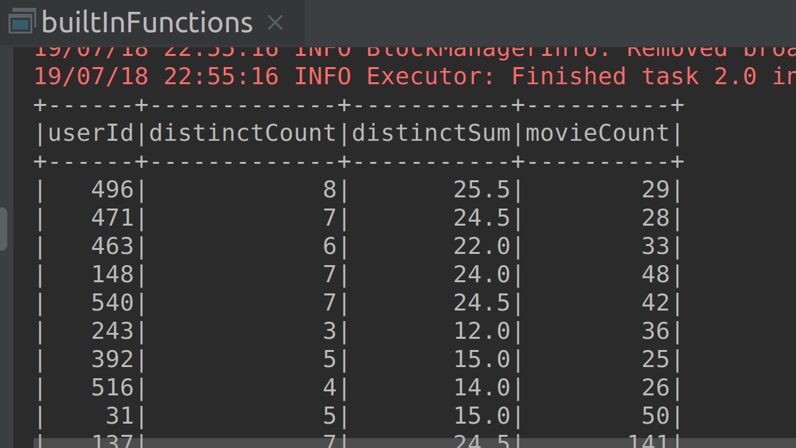

# Lab : Apache Spark - Aggregate and Collection Functions

#### Pre-reqs:
- Google Chrome (Recommended)

#### Lab Environment
All packages have been installed. There is no requirement for any setup.

**Note:** Labs will be accessible at the port given to you by your instructor. Password for jupyterLab : `1234`

Lab instructions and scala examples are present in `~/work/ernesto-spark` folder. To copy and paste: use **Control-C** and to paste inside of a terminal, use **Control-V**

There should be terminal(s) opened already. You can also open New terminal by Clicking `File` > `New` > `Terminal` from the top menu.

Now, move in the directory which contains the scala source code by running following command in the terminal.

`cd ~/work/ernesto-spark`

You can access jupyter lab at `<host-ip>:<port>/lab/workspaces/lab22`


**Note:**
- The supplied commands in the next steps MUST be run from your `~/work/ernesto-spark` directory. 
- Final code was already cloned from github for this scenario. You can just understand the application code in the next steps and run it using the instructions.
- Click **File Browser** tab on the top left and open `~/work/ernesto-spark/src/main/scala/training/builtInFunctions.scala` to view scala file.


The aim of the following lab exercises is to start writing Spark SQL code in **vscode** editor to learn about Datasets and built-in functions.
We will cover following topics in this scenario.
- Aggregate and Collection Functions

## Prerequisites

We need following packages to perform the lab exercise: 
- Java Development Kit
- SBT


#### JAVA
Verify the installation with: `java -version` 

You'll see the following output:

```
java version "1.8.0_201"
Java(TM) SE Runtime Environment (build 1.8.0_201-b09)
Java HotSpot(TM) 64-Bit Server VM (build 25.201-b09, mixed mode)
```


#### SBT
Verify your sbt installation version by running the following command.	

`sbt sbtVersion`	

You will get following output. If you get an error first time, please run the command again.

```	
[info] Loading project definition from /home/jovyan/work/ernesto-spark/project	
[info] Loading settings for project apache-spark from build.sbt ...	
[info] Set current project to Spark (in build file:/home/jovyan/work/ernesto-spark/)	
[info] 1.3.2
```

## Task: Aggregate and Collection Functions

Before we look at the user-defined functions, let us look at few of the built-in functions which are available in Spark in the next two tasks. 
Aggregate Functions

**Step 1:**  Click **File Browser** tab on the top left and open `~/work/ernesto-spark/src/main/scala/training/builtInFunctions.scala` to view scala file.
 


**Step 2:** Let us first use the built in aggregation functions. In the following piece of code, we are performing multiple aggreagations at once.

Before we use the functions we need to have the following import as shown below.

```
import org.apache.spark.sql.functions._
```

Next, we can simply use the select method and perform the multiple aggregations at once.

```
val agg = movies.select(
    avg("rating")
  , min("userId")
  , max("movieId")
  , sum("userId")
  , mean("rating")
)
```

We have used multiple aggregations such as avg, min, max etc on various columns. As the names of the functions suggest, avg computes the average, min and max compute the lowest and the highest values in the column, sum and mean computes the sum and mean of all the values in the columns respectively.
 

**Step 3:** Let us call the show method and run the program.

```
agg.show()
```

The following result should be shown.

**Step 4:** As we can see from the screenshot above, the column names are not so nice. We can assign our own column names using the as method.

```
val aggAlias = movies.select(
  avg("rating").as("avgRating")
  , min("userId").as("lowestUserId")
  , max("movieId").as("highestMovieId")
  , sum("userId").as("sumOfUserId")
  , mean("rating").as("meanRating")
)
```

All we are doing is assigning an alias (column name) to each and every field using the as method.


**Step 5:** Let us call the show method and run the program.

```
aggAlias.show()
```

The following result should be shown.



As you can see from the screenshot above, the column names appear as we have specified.

**Step 6:** Let us now use the groupBy method and perform the aggregations.

```
val byUser = movies.groupBy("userId")
  .agg(countDistinct("rating").as("distinctCount")
    , sumDistinct("rating").as("distinctSum")
    , count("movieId").as("movieCount"))
```

In the code above, we have used the groupBy method and performed the aggregations over the group. We have used the countDistinct function to count the number of distinct ratings for userId. Similarly, the sumDistinct function to sum to only sum the distinct ratings. Finally, count function as you know, is used to count all the movie ids.

 

**Step 7:** Let us call the show method and run the program.

```
byUser.show()
```


#### Compile and Run
To run this program from the terminal, simply run the following command. The program will the then be compiled and executed.
`rm -rf ~/work/ernesto-spark/src/main/scala/training/.ipynb_checkpoints/ && sbt "runMain training.builtInFunctions"` 

The following result should be shown.

## Collection Functions 

So far, We have been working with IDE and learned how to create objects and run the programs. However, for this task where we learn about collection functions, let us work with the Spark shell so that we can quickly check the output on the fly, instead of running the program everytime we use a function. You may choose to work with IDE and it is perfectly fine. You will then have to create the SparkSession object and specify the required imports.

**Step 1:**  Click **File Browser** tab on the top left and open `~/work/ernesto-spark/src/main/scala/training/collections.scala` to view scala file.

**Step 2:** We need to import the implicits and functions to be able to work with the functions.

```
import spark.implicits._
import org.apache.spark.sql.functions._
```

Let us now declare a Seq collection as shown below.

```
val num = Seq(Seq(1,2,3), Seq(4, 5, 6), Seq(7,8,9))
```


**Step 3:** Next, let us convert the collection to dataset using the toDS method and rename the column as numbers using the withColumnRenamed method. The default column name when you create a dataset is value. Hence we change the default column name to numbers.

```
val numDS = num.toDS().withColumnRenamed("value", "numbers").cache()
```

**Step 4:** now that we have our dataset, let us apply some of the collection functions. First, let us use the array_contains function to check if the collection contains the element we require.

```
val contains = numDS.where(array_contains($"numbers", 5))
```

We use the array_contains function inside the where method to check if the column numbers contains the number 5. This function takes the column name as the first argument and the element as second. We can also pass more than one element as second argument enclosed in a collection as shown in the example below.

```
val eg = numDS.where(array_contains($"numbers", Array(7,8))
```

Let us check the result using the show method.

```
contains.show()
```

The result is as shown in the screenshot below. Since we used the where method, we are only shown the collection which contains the number 5.

**Step 4:** Let us now use explode function. The explode function takes each element in the collection and generates a new row. 

```
val exploded = numDS.select($"numbers", explode($"numbers").as("exploded"))
```

In the code above, we have used the select method to select the numbers column, and then the result of using explode function on numbers column as second column. We have specified the second column name as exploded.

After running the show method, the following result is shown as in the screenshot.

```
exploded.show()
```

As you can see from the output, each element inside the collection is a new row.

Similarly, we also have posexplode function, which also provides us with the position of each row.

```
val posExploded = numDS.select(posexplode($"numbers"))
```

When posexplode function is used, two columns are created. One is the column with exploded values as seen above and the other is with the position of each exploded value.

After running the show method, the following result is shown as in the screenshot.

```
posExploded.show()
```

Since we haven't used the as method to specify the names of the columns, the default column names pos and col are created for us.


**Step 5:** Let us now use size function to check the size of each of the collections in our datasets. The size function simply returns the size of the collection similar to the length method.

```
val sizeDS = numDS.select($"numbers", size($"numbers").as("size"))
```

We have used the select method to select the numbers column as first column and size function on numbers column as second column. We have then used the as method to rename the column as size.

After running the show method, the following result is shown as in the screenshot.

```
sizeDS.show()
```

The size is shown as 3 since there are 3 elements in each collection.


**Step 6:** Let us now use the sort_array function to sort the collection in ascending or descending order.

```
val sorted = numDS.select($"numbers", sort_array($"numbers", false).as("sorted"))
```

The sort_array function takes the column on which we want to perform the sort on as first argument and boolean as second argument. We specify true if we want to sort in the ascending order or false, otherwise.

After running the show method, the following result is shown as in the screenshot.

```
sorted.show()
```
 
#### Compile and Run
To run this program from the terminal, simply run the following command. The program will the then be compiled and executed.
`rm -rf ~/work/ernesto-spark/src/main/scala/training/.ipynb_checkpoints/ && sbt "runMain training.collections"` 

Task is complete!

 


