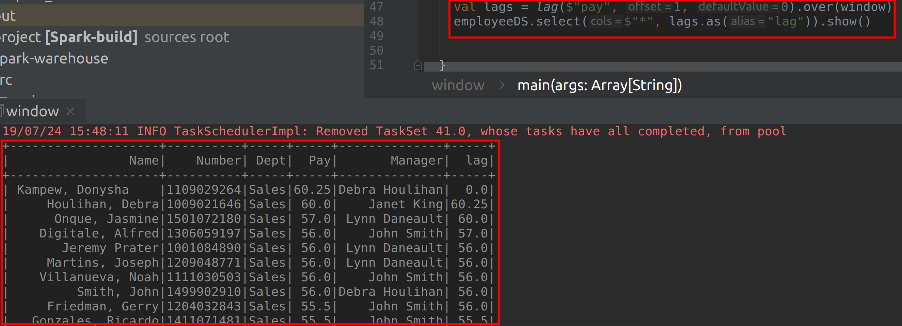

# Lab : Apache Spark Window Functions

#### Pre-reqs:
- Google Chrome (Recommended)

#### Lab Environment
All packages have been installed. There is no requirement for any setup.

**Note:** Labs will be accessible at the port given to you by your instructor. Password for jupyterLab : `1234`

Lab instructions and scala examples are present in `~/work/ernesto-spark` folder. To copy and paste: use **Control-C** and to paste inside of a terminal, use **Control-V**

There should be terminal(s) opened already. You can also open New terminal by Clicking `File` > `New` > `Terminal` from the top menu.

Now, move in the directory which contains the scala source code by running following command in the terminal.

`cd ~/work/ernesto-spark`

You can access jupyter lab at `<host-ip>:<port>/lab/workspaces/lab25`


**Note:**
- The supplied commands in the next steps MUST be run from your `~/work/ernesto-spark` directory. 
- Final code was already cloned from github for this scenario. You can just understand the application code in the next steps and run it using the instructions.
- Click **File Browser** tab on the top left and open `~/work/ernesto-spark/src/main/scala/training/window.scala` to view scala file.


The aim of the following lab exercises is to start writing Spark SQL code in **vscode** editor to learn about Datasets and built-in functions.
We will cover following topics in this scenario.
- Window Functions

We need the following packages to perform the lab exercises: 
- Java Development Kit
- Scala
- Spark

## Prerequisites

We need following packages to perform the lab exercise: 
- Java Development Kit
- SBT


#### JAVA
Verify the installation with: `java -version` 

You'll see the following output:

```
java version "1.8.0_201"
Java(TM) SE Runtime Environment (build 1.8.0_201-b09)
Java HotSpot(TM) 64-Bit Server VM (build 25.201-b09, mixed mode)
```

#### SBT
Verify your sbt installation version by running the following command.	

`sbt sbtVersion`	

You will get following output. If you get an error first time, please run the command again.

```	
[info] Loading project definition from /home/jovyan/work/ernesto-spark/project	
[info] Loading settings for project apache-spark from build.sbt ...	
[info] Set current project to Spark (in build file:/home/jovyan/work/ernesto-spark/)	
[info] 1.3.2
```

## Window Functions

Let us look at window functions. Window functions are little different when compared to other built in functions. These are the functions which are applied over a window i.e., a set of rows rather than each row. For example, we can find out the salary for each employee by department and rank them from high to low or vice versa.

Let us perform this task using vscode and sbt.

**Step 1:** Download the employee.csv file from the URL below. This file contains four columns: userId, movieID, rating and timestamp.

employee.csv - http://bit.ly/2Z3atOx

**Note:** We already have cloned a github repository which contains a required file. Open `~/work/ernesto-spark/Files/chapter_8` to view file.

**Step 2:** Click **File Browser** tab on the top left and open `~/work/ernesto-spark/src/main/scala/training/window.scala` to view scala file.

```
import org.apache.spark.sql.SparkSession
import org.apache.spark.sql.expressions.Window
import org.apache.spark.sql.functions._
```

Next, we need to write a case class so that we can specify the schema for our fields. 

```
case class Employee(name: String, number: Int, dept: String, pay: Double, manager: String)
```

We have created a case class and named it Employee by specifying the fields and its types.


**Step 3:** Now, write the main function and create the SparkSession object as shown below.

```
def main(args: Array[String]): Unit = {

  val spark = SparkSession
    .builder()
    .appName("Creating a Dataset")
    .master("local[*]")
    .getOrCreate()
```

Next import the implicits and load the file as shown below.

```
import spark.implicits._

val employeeDS = spark.read
  .format("csv")
  .options(Map("header" -> "true", "inferSchema" -> "true"))
  .load("chapter_8/employee.csv")
  .as[Employee]
```

Your program should like something like the one shown in screenshot.


**Step 4:** Now that we have loaded our file, let us first create a window. We shall create a window to partition by the department and order by pay in descending order.

```
val window = Window.partitionBy($"dept").orderBy($"pay".desc)
```

we have called the partitionBy and orderBy method on the Window object to create a window. The partitionBy method creates partitions for each department withing the window and orderBy method will order the rows by pay in descending order.

**Step 5:** Let us first use the rank  function to get the pay for each employee by department in desceinding order. 

```
val ranked = rank().over(window)
```

We have simply called the rank function over the window we created in the previous step using the over method. The rank function allocates increasing integer values to rows based on the column we specified in the orderBy method.

Let us now call the show method on our dataset and add the rank column using the select function.

```
employeeDS.select($"*", ranked.as("rank")).show()
```

You should have the following output when you run this program.


**Step 6:** Let us now find the third highest salary from each department.

```
val rankedDS =  employeeDS.select($"*", ranked.as("rank"))
val second = rankedDS.where("rank = 3")
```

Let us now call the show method on our dataset.

```
second.show()
``` 


As you can see we have obtained the third highest salary of employees from each department. Since Admin Offices department had two emplyees with the same pay, they both are ranked as three.


**Step 7:** Let us now look at dense_rank. Both these functions are similar and provide the increasing integer value based on the ordering of rows. However, there is a difference when it comes to dealing with duplicate values. If there are two duplicate values, the rank function allocates the same rank for both the rows and skips the next rank for next row and allocates next incremental rank for the next row instead. For example, if rank 1 as allocated to top two rows due to presence of duplicate values, rank 2 will be skipped and instead rank 3 will be allocated to the next row.

However, the dense_rank function doesn't skip the ranks when it encounters duplicate values. In the example above, the dense_rank will alocate same rank i.e., rank 1 for duplicate rows and then rank 2 for the next row. Let us look at this now.

```
val denseRanked = dense_rank().over(window)
```

Let us now call the show method on our dataset and add the rank column using the select function.

```
employeeDS.select($"*", denseRanked.as("dense_rank")).show()
```

The following output is shown when we run the program.


As a challenge, please find out the second highest salary from each department using the dense_rank function.

**Step 7:** Similarly, let us look at the row_number and percent_rank.

The row_number function as the name suggest provides a row number for each row starting from 1 irrespective of duplicates. The numbers are neither skipped nor are repeated.

```
val rowNumber = row_number().over(window)
employeeDS.select($"*", rowNumber.as("rowNumber")).show()
```

#### Compile and Run
To run this program from the terminal, simply run the following command. The program will the then be compiled and executed.
`rm -rf ~/work/ernesto-spark/src/main/scala/training/.ipynb_checkpoints/ && sbt "runMain training.window"` 

The following output is shown when we run the program.


The percent_rank calculates the percent rank of a given row based on the following formula. 

```
(rank - 1) / (the number of rows in the window or partition - 1)
```

For example, if the rank of a row is 11 and there are 101 rows in the partition, the rank will be 11-1/101-1 or 10/100 or 0.1. The percent rank ranges from `0` to `1`. The first row will always have a percent rank of 0.

```
val percentRank = percent_rank().over(window)
employeeDS.select($"*", percentRank.as("percentRank")).show()
```

The following output is shown when we run the program.


**Step 8:** Let us finally look at lead and lag functions. The lead and lag functions are used to find how much the value of next row is leading or lagging when compared to the current row.

```
val leads = lead($"pay", 1, 0).over(window)
employeeDS.select($"*", leads.as("lead")).show()
```

The lead function takes three arguments. The first is the column name, second is the offset value, which determines the number of rows preceding/succeeding the current row and the third is the default to specify the default value if the offset is outside the scope of the window.

The following output is shown when we run the program.


Similarly, there is lag function which calculates the lag.

```
val lags = lag($"pay", 1, 0).over(window)
employeeDS.select($"*", lags.as("lag")).show()
```

The following output is shown when we run the program.




#### Compile and Run
To run this program from the terminal, simply run the following command. The program will the then be compiled and executed.
`rm -rf ~/work/ernesto-spark/src/main/scala/training/.ipynb_checkpoints/ && sbt "runMain training.window"` 

Task is complete!


 


