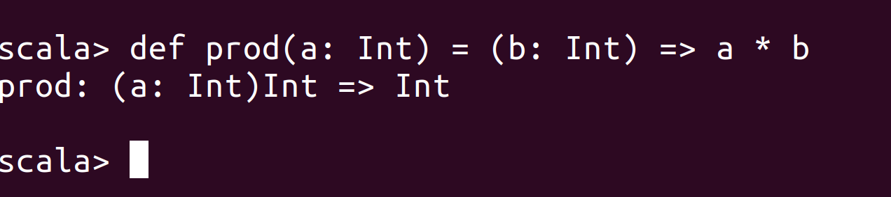
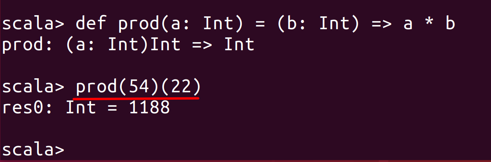
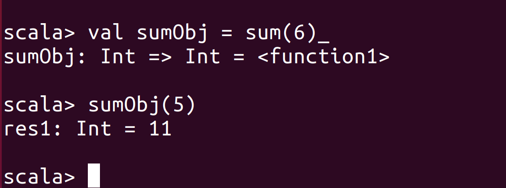
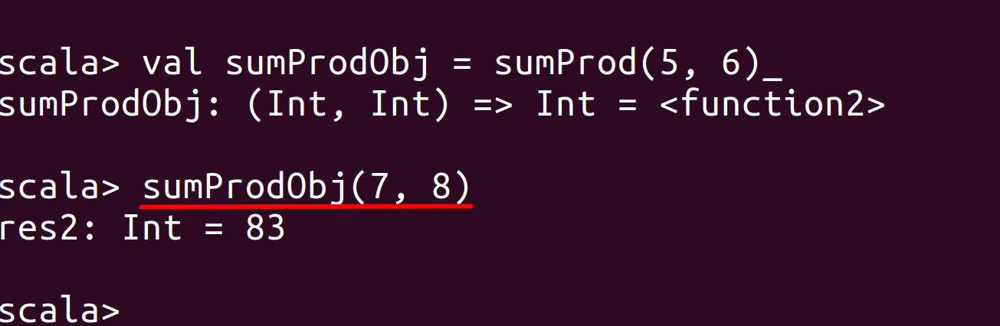

# Lab : Apache Spark Currying and Partially Applied Functions

#### Pre-reqs:
- Google Chrome (Recommended)

#### Lab Environment
All packages have been installed. There is no requirement for any setup.

**Note:** Labs will be accessible at the port given to you by your instructor. Password for jupyterLab : `1234`

Lab instructions and scala examples are present in `~/work/ernesto-spark` folder. To copy and paste: use **Control-C** and to paste inside of a terminal, use **Control-V**

There should be terminal(s) opened already. You can also open New terminal by Clicking `File` > `New` > `Terminal` from the top menu.

Now, move in the directory which contains the scala source code by running following command in the terminal.

`cd ~/work/ernesto-spark`

You can access jupyter lab at `<host-ip>:<port>/lab/workspaces/lab26`

## Prerequisites

We need following packages to perform the lab exercise: 
- Java Development Kit
- Scala

Java is already installed. Verify the installation with: `java -version` 

##### Install Scala

**Step 1:** Run the following commands from the terminal to install Scala.

`wget www.scala-lang.org/files/archive/scala-2.12.8.deb`

`dpkg -i scala-2.12.8.deb`


**Step 2:** Verify your Scala installation version by running the following command.
 
`scala -version`

You will get following output.

```
Scala code runner version 2.12.8 -- Copyright 2002-2018, LAMP/EPFL and Lightbend, Inc.
```

## Function currying in Scala

Function currying in Scala is used to create partially applied functions. The curried functions are declared with multiple parameter groups with each group enclosed in paranthesis.

For example,

```
def sum(a: Int) (b:Int): Int = {
> a + b
> }
```

There can also be multiple parameters in each parameter group. We can then use this curried function and create partially applied functions.

## Partially applied functions in Scala

The partially applied functions as the name suggests are applied partially by only passing some parameters while holding back other parameters. The partially applied functions are used when you do not want to pass all the parameters at once but instead, you can pass some parameters first and then the other parameters at later time.

For example, we can partially apply the function which we created above using currying.

`val part = sum(54)_`

This will return us a function object called part.

We can now pass the parameter which we held back as shown below.

`part(6)`

## Task 1: Defining Currying Functions


Let's have a look and currying functions. We shall be working in the Scala shell for this and the next task.

**Step 1:** Open the terminal and fire up the Scala shell by simply typing in Scala in the terminal. You should see the Scala prompt.

`scala`

 

**Step 2:** Let us now define a simple currying function with two parameter groups as shown below to understand the concept of curried functions.

```
def sum(x: Int) (y: Int): Int = {
| x + y
| }
```

 
We have defined a function called sum which adds two numbers. Instead of passing the parameters as one group, we have curried the parameters in two parameter groups. This will help us with partially applied functions.


**Step 3:** We can also define currying functions with multiple parameters inside each parameter group as shown below.

```
def sumProd(a: Int, x: Int) (b: Int, y: Int): Int = {
	| a * b + x * y
	| }
```
 

**Step 4:** We can also define a currying function in such a way that we can tranform a function which takes two or more parameters into a function that takes only one parameter.

`def prod(a: Int) = (b: Int) => a * b`

 

As you can see from the screenshot above, we have declared a prod function which only takes one parameter a and returns another function which in turn takes another parameter b and returns the result.


**Step 5:** We can simply pass the arguments with each argument inside a paranthesis as shown below.

`prod(54)(22)`

 
 

Task is complete!

## Task 2: Using partially applied functions

Let us now see how we can use the curried function and apply them partially.

**Step 1:** We have created a sum function in step 1 of previous exercise. Let us use that function and partially apply the parameters for that function.

`val sumObj = sum(6)_ `

This will return us a function object as shown in the screenshot below.
 
 

The _ is used as a placeholder for the parameter we are holding back. It indicates the compiler that we are partially applying a function. 

**Step 2:** We can then use the function object later to pass the parameter which we held back as shown below.

`sumObj(5)`


**Step 3:** Similarly, let is partially apply the sumProd function which we created in the step 2 of previous task.

`val sumProdObj = sumProd(5, 6)_`


We can then pass the held back parameters at a later time as shown below.

`sumProdObj(7, 8)`



The result is as shown in the screenshot above.

Task is complete!

 


