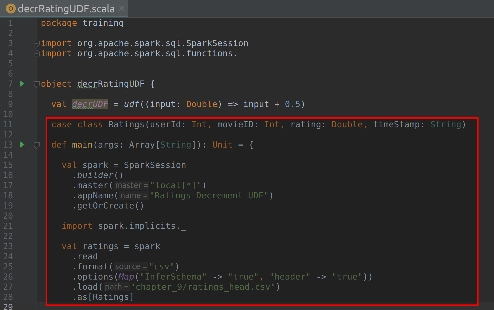
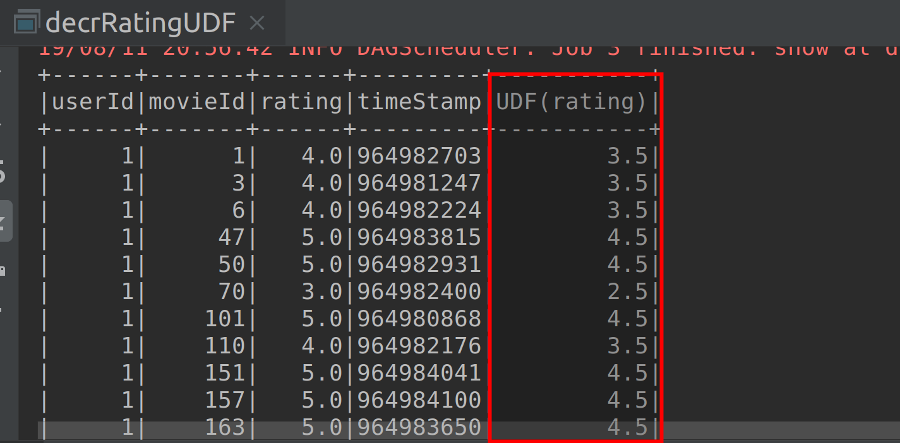

# Lab : Apache Spark Writing User Defined Function

#### Pre-reqs:
- Google Chrome (Recommended)

#### Lab Environment
All packages have been installed. There is no requirement for any setup.

**Note:** Labs will be accessible at the port given to you by your instructor. Password for jupyterLab : `1234`

Lab instructions and scala examples are present in `~/work/ernesto-spark` folder. To copy and paste: use **Control-C** and to paste inside of a terminal, use **Control-V**

There should be terminal(s) opened already. You can also open New terminal by Clicking `File` > `New` > `Terminal` from the top menu.

Now, move in the directory which contains the scala source code by running following command in the terminal.

`cd ~/work/ernesto-spark`

You can access jupyter lab at `<host-ip>:<port>/lab/workspaces/lab27`


**Note:**
- The supplied commands in the next steps MUST be run from your `~/work/ernesto-spark` directory. 
- Final code was already cloned from github for this scenario. You can just understand the application code in the next steps and run it using the instructions.
- Click **File Browser** tab on the top left and open `~/work/ernesto-spark/src/main/scala/training/decrRatingUDF.scala` to view scala file.


We will cover following topics in this scenario.
- Writing User Defined Function

## Prerequisites

We need following packages to perform the lab exercise: 
- Java Development Kit
- SBT


#### JAVA
Verify the installation with: `java -version` 

You'll see the following output:

```
java version "1.8.0_201"
Java(TM) SE Runtime Environment (build 1.8.0_201-b09)
Java HotSpot(TM) 64-Bit Server VM (build 25.201-b09, mixed mode)
```


#### SBT
Verify your sbt installation version by running the following command.	

`sbt sbtVersion`	

You will get following output. If you get an error first time, please run the command again.

```	
[info] Loading project definition from /home/jovyan/work/ernesto-spark/project	
[info] Loading settings for project apache-spark from build.sbt ...	
[info] Set current project to Spark (in build file:/home/jovyan/work/ernesto-spark/)	
[info] 1.3.2
```

## Why User-Defined Functions?

Spark SQL has tons of built-in functions available to process data. These functions include aggregations, date-time functions, Math functions, String functions, collection functions and window functions. These built-in functions come handy and can be applied most of the time. But there can be scenarios which do not get satisfied with the usage of built-in functions. For such scenarios we can write our own functions called User-Defined Functions. We simply have to write these custom functions and register them with Spark SQL to be able to use them in our code.

We can classify such custom written functions in two types.

- User-Defined Functions (UDFs)
- User-Defined Aggregate Functions (UADFs)

## UDF vs UADF

The difference between UDF and UADF is that, the UDF performs the user-defined operation on one row at a time and returns the result for each row, while UADF performs the user-defined operation on group of rows on a column. An example of aggregate function is sum, count, average etc. The aggregate functions are followed by groupBy function most of the time.
Steps to implement User Defined function
User defined functions (UDF & UDAF) can be implemented by following these three steps.

- Writing a User Defined Function.
- Registering the User Defined Function in Spark Application.
- Using the User Defined Function in Spark SQL or in the DataFrame API.

## Task: Writing User Defined Function


Let's have a look how to write a user defined function. We will be writing a user defined function to decrease the rating of each movie by 0.5. We will be calling the UDF by using both Spark SQL and Dataframe APIs.

**Step 1:** Download the ratings_head.csv file from the URL below. This file contains four columns: userId, movieID, rating and timestamp.

ratings_head.csv - http://bit.ly/2X3r2wb

**Note:** We already have cloned a github repository which contains a required file. Open `~/work/ernesto-spark/Files/chapter_9` to view file.


**Step 2:** Click **File Browser** tab on the top left and open `~/work/ernesto-spark/src/main/scala/training/decrRatingUDF.scala` to view scala file.

```
import org.apache.spark.sql.SparkSession
import org.apache.spark.sql.functions._
```

Next, let us define our user defined function using val keyword instead of using def keyword.

```
val decrUDF = udf((input: Double) => input - 0.5)
```

The syntax to define a function using val is a bit different than what we have been using so far with def function. Here we are simply assigning a function literal to an immutable variable. Also, we haven't specified the return type for the function as we can make use of Scala type inference to take care of the return type.


We are then passing the function literal inside the udf function. The udf  function takes a column as parameter and returns a column. Since we will be passing the entire column of our dataset Ratings as input to the decrUDF function in the application, we are using this udf function.

There are not many differences when it comes between val and def keyword to define functions. Please check the link in references section to learn more about val vs def.  

The program at this point of time should look like the screenshot as shown below.


**Step 3:** Let us now declare a case class for the dataset we are about to load as shown below.

case class Ratings(userId: Int, movieID: Int, rating: Double, timeStamp: String)

Next, define the main function, create a Spark Session and load the file as dataset as shown below.

```
def main(args: Array[String]): Unit = {

  val spark = SparkSession
    .builder()
    .master("local[*]")
    .appName("Ratings Decrement UDF")
    .getOrCreate()
```

Make sure to import the implicts before you load the file as datset.

```
import spark.implicits._

val ratings = spark
  .read
  .format("csv")
  .options(Map("InferSchema" -> "true", "header" -> "true"))
  .load("chapter_9/ratings_head.csv")
  .as[Ratings]
```

The program should now look something like the screenshot below.




**Step 4:** Let us call the UDF decrUDF using the DataFrame API using the select method, as shown below.

```
val ratingDecDf = ratings.select($"*", decrUDF($"rating").as("ratingDec"))
```

Here, we are selecting all the columns from our dataset and then adding one more column called ratingDec, which is obtained by applying our UDF on rating column.

Let us finally call the show method to check the output.

```
ratingDecDf.show()
```

 
#### Compile and Run
To run this program from the terminal, simply run the following command. The program will the then be compiled and executed.
`rm -rf ~/work/ernesto-spark/src/main/scala/training/.ipynb_checkpoints/ && sbt "runMain training.decrRatingUDF"` 

The output should be displayed as shown in the screenshot below, when you run the program.




Please see that we need not register the UDF using the `udf.register` method when we have declared a function literal within the udf function. However, we must register our UDF when he have not used the function literal and defined the UDF using the def keyword. We shall look at this in the next few steps.


**Step 5:** Let us now apply UDF inside the Spark SQL query. You may either choose to create a new Scala object to apply the UDF inside Spark SQL query or within this section. 

We have used the same Scala object to apply the UDF using Spark SQL.

**Step 6:** Let us now define a function to decrease the rating by 0.5 using the def keyword. Please define this function outside the main function as shown in the screenshot below
 
```
def decrUDF2(input: Double): Double = {

  input - 0.5
}
```


**Step 7:** Let us now register this new UDF by using the partially applied function as shown below. We have used the underscore placeholder to specify that this is a partially applied function for which the parameter will be passed later in the program.


```
spark.udf.register("decrUDF2", decrUDF2 _)

Let us also create a temporary table using createOrReplaceTempView function as shown below. We can then run our SQL queries over this table.

ratings.createOrReplaceTempView("ratings")

val ratingDecDf = spark.sql("select *, decrUDF2(rating) as ratingDec from ratings")
```

The program should look something like the screenshot shown below.


 

**Step 8:** Let us finally call the show method and check the output.

```
ratingDecDf.show()
```

**Important:** You need to uncomment above line in `decrRatingUDF.scala` using **vscode** editor before running program again.

#### Compile and Run
To run this program from the terminal, simply run the following command. The program will the then be compiled and executed.
`rm -rf ~/work/ernesto-spark/src/main/scala/training/.ipynb_checkpoints/ && sbt "runMain training.decrRatingUDF"` 


The following output is shown.


 
With this we have written, registered and use a UDF.

Task is complete!


 


