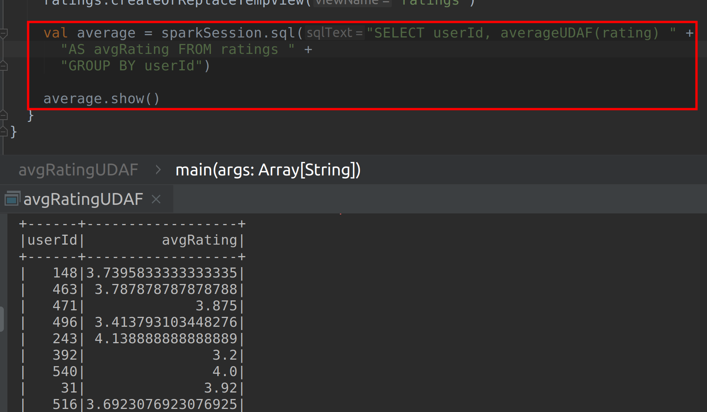

# Lab : Apache Spark Writing Untyped UDAF

#### Pre-reqs:
- Google Chrome (Recommended)

#### Lab Environment
All packages have been installed. There is no requirement for any setup.

**Note:** Labs will be accessible at the port given to you by your instructor. Password for jupyterLab : `1234`

Lab instructions and scala examples are present in `~/work/ernesto-spark` folder. To copy and paste: use **Control-C** and to paste inside of a terminal, use **Control-V**

There should be terminal(s) opened already. You can also open New terminal by Clicking `File` > `New` > `Terminal` from the top menu.

Now, move in the directory which contains the scala source code by running following command in the terminal.

`cd ~/work/ernesto-spark`

You can access jupyter lab at `<host-ip>:<port>/lab/workspaces/lab28`


**Note:**
- The supplied commands in the next steps MUST be run from your `~/work/ernesto-spark` directory. 
- Final code was already cloned from github for this scenario. You can just understand the application code in the next steps and run it using the instructions.
- Click **File Browser** tab on the top left and open `~/work/ernesto-spark/src/main/scala/training/averageUDAF.scala` to view scala file.


We will cover following topics in this scenario.
- Writing untyped UDAF
- Using Untyped UDAF

## Prerequisites

We need following packages to perform the lab exercise: 
- Java Development Kit
- SBT


#### JAVA
Verify the installation with: `java -version` 

You'll see the following output:

```
java version "1.8.0_201"
Java(TM) SE Runtime Environment (build 1.8.0_201-b09)
Java HotSpot(TM) 64-Bit Server VM (build 25.201-b09, mixed mode)
```


#### SBT
Verify your sbt installation version by running the following command.	

`sbt sbtVersion`	

You will get following output. If you get an error first time, please run the command again.

```	
[info] Loading project definition from /home/jovyan/work/ernesto-spark/project	
[info] Loading settings for project apache-spark from build.sbt ...	
[info] Set current project to Spark (in build file:/home/jovyan/work/ernesto-spark/)	
[info] 1.3.2
```

## Task: Writing Untyped UDAF

The user defined aggregate functions (UDAF) can be further classified into two types. 

- Typed user defined aggregate function
- Untyped user defined aggregate function


The Typed user defined aggregate function is applied to Datasets where we get the structure (schema) of rows using the case class, while the Untyped user defined aggregate function is applied to DataFrames.

Please use the built-in functions over UDFs whenever you can. The built-in functions are an efficient way to perform operations. UDFs should only be used when they are absolutely required.

## Writing Untyped UDAF...

In this task let us implement a untyped UDAF. The untyped UDAF is used with DataFrames. UDAFs are a kind of bit complex when compared to UDFs. Let us write a UADF function to calculate the average. The average function is a built-in function available in Spark but let us see this just to understand the process of writing a UADF.

**Step 1:** We shall be using the same file ratings_head.csv which we have used in the previous task. Let us use the average UDAF which we are about to implement to calculate the average rating per user.

ratings_head.csv - http://bit.ly/2X3r2wb

**Note:** We already have cloned a github repository which contains a required file. Open `~/work/ernesto-spark/Files/chapter_9` to view file.


**Step 2:** Create a new Scala object and name it averageUDAF. Next, we will need the following imports to implement a UADF. We haven't used some of these imports so far. We shall learn about them as we continue with our program.

```
import org.apache.spark.sql.expressions.{MutableAggregationBuffer, UserDefinedAggregateFunction}
import org.apache.spark.sql.types._
import org.apache.spark.sql.{Row, SparkSession}
```

Now, that we have the required imports, we need to extend our object to inherit UserDefinedAggregateFunction as shown below.

```
object averageUDAF extends UserDefinedAggregateFunction {
```

We have used the import org.apache.spark.sql.expressions. UserDefinedAggregateFunction so that we can inhert it's methods in our program.

The program at this point should now look like the screenshot below.


**Step 3:** The first method is to specify the inputSchema i.e., the data types of input parameters we will be passing for this UDAF.

```
def inputSchema: StructType = StructType(Array(StructField("inputColumn", DoubleType)))
```

The inputSchema method returns a StructType. The inputColumn is of DoubleType as the ratings column is of type Double is enclosed in an array of StructField, which is in turn enclosed in StructType. We are assigning schema to the input by using the StructType and StructField methods as this is a untyped UDAF.

**Step 4:** Next, we have to specify the bufferSchema method. The bufferSchema tells how the data is being aggregated when the tasks are working inside the executors.

To understand this better, consider we have ratings column with four rows as shown below.

**Ratings**
`2.5`
`5.0`
`3.5`
`4.5`

When we perform the average, we first have to compute the sum of all the rows in a column and their count. The sum divided by count gives the average. So, the task which processes the average of rows of the column has to store the intermediate sum and the count of records in a buffer.

The buffer is first initialized as (0, 0) implying the sum and count of ratings respectively. So, the task reads the first row and updates the buffer values as (2.5, 1) by adding the initial values where 2.5 is sum and 1 is the count. Next, when the task reads second row of ratings column, the buffer will update the values as (7.5, 2). The buffer will then be updated as (11.0, 3) for third row and (15.5, 4) for fourth row. Therefore, we need to provide the data type for the count and sum of buffer. We do this using the bufferSchema method as shown below.

```
def bufferSchema = StructType(Array(StructField("sum", DoubleType),StructField("count", LongType)))
```

We are specifying the bufferSchema as we did with the inputSchema using StructType and StructField. The sum is of DoubleType and count is of LongType.


**Step 5:** Let us now specify the data type of return value using the dataType method. Since the average which returns is of type Double, we specify the DoubleType as shown below.

```
def dataType: DataType = DoubleType
```

**Step 6:** Next, we need to specify if the function always returns the same output on identical input using deterministic method. This is true  by default.

```
def deterministic: Boolean = true
```

The program at this point should look like the screenshot shown below.


**Step 7:** Now that we have set our input, buffer and output schema, we have to initialize our buffer (0, 0) using the initialize method.
 
```
def initialize(buffer: MutableAggregationBuffer): Unit = {
  buffer(0) = 0.00
  buffer(1) = 0L
```

The initialize method takes buffer of type MutableAggregationBuffer and returns nothing. The MutableAggregationBuffer as the name suggests is mutable and is used for aggregation purposes. The two columns in the buffer sum and count are initialized to 0. The first buffer is of type Double and second is of type Long.

**Step 8:** At this point of time, we have specified schema for input, buffer and output. We have also initialized the buffer with zero. We now have to write the logic so that tasks know how to update the buffer.

We do this using the update method as shown below.

```
def update(buffer: MutableAggregationBuffer, input: Row): Unit = {
  if (!input.isNullAt(0)) {
    buffer(0) = buffer.getDouble(0) + input.getDouble(0)
    buffer(1) = buffer.getLong(1) + 1
  }
}
```

The update method takes two parameters. One is the buffer which we have initialized and the actual input (which is ratings in our case). The first buffer simply adds the ratings and the second buffer increments the count by 1 until all the records are processed. This update method is applied to every task processing this job. After the update method completes processing , there will be a final output buffer for each task. All we have to do is to merge the output of each task, which is what we are going to do in the next step.


**Step 9:** To merge the output of all the tasks, we use the merge method as shown below.

```
def merge(buffer1: MutableAggregationBuffer, buffer2: Row): Unit = {
  buffer1(0) = buffer1.getDouble(0) + buffer2.getDouble(0)

  buffer1(1) = buffer1.getLong(1) + buffer2.getLong(1)
}
```

The merge method takes two buffers i.e., two outputs from each task. It simply adds two outputs and stores it back in buffer1. This is performed for all the buffers.

**Step 10:** At this point of time, we have one single output from merge method. It contains the sum of all records and their count. All we have to do is write a logic to find out the average. The average is nothing but the sum divided by total count. This is implemented using the evaluate method.

```
def evaluate(buffer: Row): Double = buffer.getDouble(0) / buffer.getLong(1)
```

With this we have completed writing our UDAF. The error below the object name should be gone by now.  It should look like the screenshot below.


Task is complete!

## Task: Using Untyped UDAF

Now that we have successfully written our untyped UDAF, let us use it find the average rating per user.

**Step 1:** Let us create a new object `avgRatingUDAF` within the UDAF which we have written in the previous task. Next, write the main function and also create a Spark Session object as shown below.

```
object avgRatingUDAF {

  def main(args: Array[String]) {

    val sparkSession = SparkSession.builder
      .master("local[*]")
      .appName("Average Rating UDAF")
      .getOrCreate()
```

The program should now look like the screenshot as shown below.


 
## Using Untyped UDAF...


**Step 2:** Let us now register the UDAF with Spark.

```
sparkSession.udf.register("averageUDAF", averageUDAF)
```

**Step 3:** Let us now read the file and create a temporary view on the DataFrame to write SQL queries.
 
```
val ratings = sparkSession.read
	.format("csv")
	.options(Map("InferSchema" -> "true", "header" -> "true"))
  .load("chapter_9/ratings_head.csv")

ratings.createOrReplaceTempView("ratings")
```

**Step 4:** Let us finally use the UDAF in our SQL query as shown below.

```
val average = sparkSession.sql("SELECT userId,  averageUDAF(rating) AS avgRating FROM ratings GROUP BY userId")
```

Let us check the result using the show method as shown below

```
average.show()
```


#### Compile and Run
To run this program from the terminal, simply run the following command. The program will the then be compiled and executed.
`rm -rf ~/work/ernesto-spark/src/main/scala/training/.ipynb_checkpoints/ && sbt "runMain training.avgRatingUDAF"` 

The following output is shown.


 
We have successfully written a UDAF, registered and used it in the Spark application.

Task is complete!


