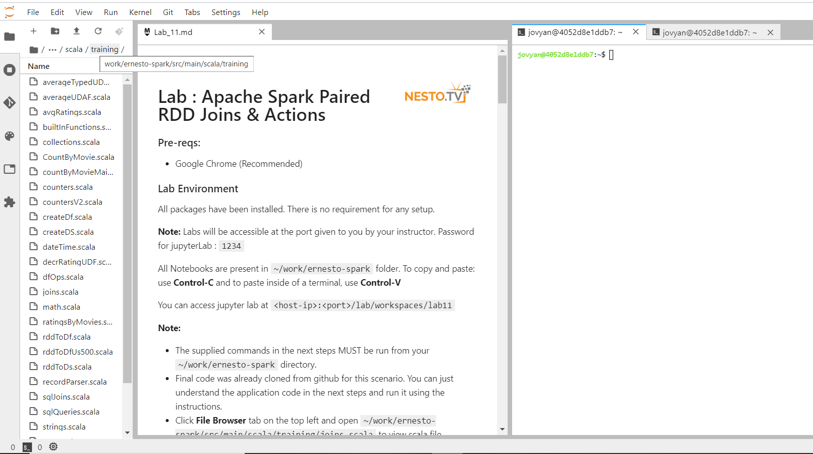

# Lab : Apache Spark Typed UDAF

#### Pre-reqs:
- Google Chrome (Recommended)

#### Lab Environment
All packages have been installed. There is no requirement for any setup.

**Note:** Labs will be accessible at the port given to you by your instructor. Password for jupyterLab : `1234`

Lab instructions and scala examples are present in `~/work/ernesto-spark` folder. To copy and paste: use **Control-C** and to paste inside of a terminal, use **Control-V**

There should be terminal(s) opened already. You can also open New terminal by Clicking `File` > `New` > `Terminal` from the top menu.

Now, move in the directory which contains the scala source code by running following command in the terminal.

`cd ~/work/ernesto-spark`

You can access jupyter lab at `<host-ip>:<port>/lab/workspaces/lab29`


**Note:**
- The supplied commands in the next steps MUST be run from your `~/work/ernesto-spark` directory. 
- Final code was already cloned from github for this scenario. You can just understand the application code in the next steps and run it using the instructions.
- Click **File Browser** tab on the top left and open `~/work/ernesto-spark/src/main/scala/training/averageTypedUDAF.scala` to view scala file.



We will cover following topics in this scenario.
- Typed UDAF

## Prerequisites

We need following packages to perform the lab exercise: 
- Java Development Kit
- SBT


#### JAVA
Verify the installation with: `java -version` 

You'll see the following output:

```
java version "1.8.0_201"
Java(TM) SE Runtime Environment (build 1.8.0_201-b09)
Java HotSpot(TM) 64-Bit Server VM (build 25.201-b09, mixed mode)
```


#### SBT
Verify your sbt installation version by running the following command.	

`sbt sbtVersion`	

You will get following output. If you get an error first time, please run the command again.

```	
[info] Loading project definition from /home/jovyan/work/ernesto-spark/project	
[info] Loading settings for project apache-spark from build.sbt ...	
[info] Set current project to Spark (in build file:/home/jovyan/work/ernesto-spark/)	
[info] 1.3.2
```

## UDAF types

The user defined aggregate functions (UDAF) can be classified into two types. 

- Typed user defined aggregate function
- Untyped user defined aggregate function


The Typed user defined aggregate function is applied to Datasets where we get the structure (schema) of rows using the case class, while the Untyped user defined aggregate function is applied to DataFrames.

Please use the built-in functions over UDFs whenever you can. The built-in functions are an efficient way to perform operations. UDFs should only be used when they are absolutely required.

## Task: Typed UDAF

Let us write and use a Typeds UDAF. The Typed UDAF is used on Datasets where we assign the schema using the case class making it type safe. Let us write a Typed UDAF which calculates the average of ratings as we did in the previous couple of tasks. The methods which we have used in the untyped UDAF are different than the methods in Typed UDAF.

**Step 1:** We shall be using the ratings_head.csv. Let us use the average UDAF which we are about to implement to calculate the average of all the ratings.
 
ratings_head.csv - http://bit.ly/2X3r2wb

**Note:** We already have cloned a github repository which contains a required file. Open `~/work/ernesto-spark/Files/chapter_9` to view file.


**Step 2:** Click **File Browser** tab on the top left and open `~/work/ernesto-spark/src/main/scala/training/averageTypedUDAF.scala` to view scala file.

```
import org.apache.spark.sql.expressions.Aggregator
import org.apache.spark.sql.{Encoder, Encoders, SparkSession}
```

Next we have to declare the case classes to specify schema for both input and buffer. However, we need not use StructType here as we did with Untyped UDAF. As we will be loading the input as Dataset and not DataFrame, the schema is associated with the case class.

```
case class Ratings(userId: Int, movieID: Int, rating: Double, timeStamp: String)
case class Average(var sum: Double, var count: Long)
```
The first case class Ratings specifies the input schema and the second case class Average specifies the buffer schema. Please not that we have used var keyword to define mutable fields in Average buffer as the buffer keeps on updated when task process each row as explained in previous tasks.


Now, that we have the required imports and case classes defined, we need to extend our object to inherit Aggregator abstract class as shown below.

```
object MyAverageAggregator extends Aggregator[Ratings, Average, Double] {
```

The Aggregator abstract class takes three parameters. They are the input, buffer and output type. The input is Ratings, the buffer is Average and the output type is Double.


**Step 3:** Let us now implement the methods from the Aggregator abstract class. The first method is the zero method which initializes the buffer to zero. This is similar to initialize method which we have used in the previous task.

```
def zero: Average = Average(0, 0L)
```

**Step 4:** Next, we have to implement the reduce method which is similar to update method used in the previous task. The reduce method provides the logic to specify how the tasks should process the rows and columns of dataset.

```
def reduce(buffer: Average, rat: Ratings): Average = {
  buffer.sum += rat.rating
  buffer.count += 1
  buffer
}
```

The reduce method takes the buffer which is of type Average and the input ratings. The buffer is then updated for each row in the rating column along with the count. Once all the records are processed, the final value of the buffer for each task is returned.

At this point, we have buffer outputs of each task. We now have to merge them to get the final sum and count of all the records.


**Step 5:** We now have to implement the merge function so that the buffer outputs from all the tasks are merged.

```
def merge(b1: Average, b2: Average): Average = {
  b1.sum += b2.sum
  b1.count += b2.count
  b1
}
```

This function simply adds the sum and counts of all the buffers and returns back the buffer.

The program at this point should look like in the screenshot below.


**Step 6:** Next, similar to the evaluate method in the previous task we have to implement the finish method. The finish method contains the logic to compute the average i.e., dividing the sum with count.

def finish(reduction: Average): Double = reduction.sum / reduction.count


**Step 7:** We now have to implement the encoders for buffer and output values using the bufferEncoder and outputEncoder. These encoders are required for serialization purposes to translate between the Scala and Spark types.


def bufferEncoder: Encoder[Average] = Encoders.product
def outputEncoder: Encoder[Double] = Encoders.scalaDouble


The error below the object name should have been gone by now as we have implemented all the methods required to create a typed UDAF.

The program should now look like the one shown in the screenshot.

 


**Step 8:** Let us now use this typed UDAF. Create a new object within the program as shown in the screenshot and name it avgTypedUDAF. Define the main function and also create the Spark Session.


```
object avgTypedUDAF {

  def main(args: Array[String]) {

    val sparkSession = SparkSession.builder
      .master("local[*]")
      .appName("Average ratings Typed UDAF")
      .getOrCreate()
```

next, load the file.

```
val ds = sparkSession.read
	.format("csv")
	.options(Map("InferSchema" -> "true", "header" -> "true"))
  	.load("chapter_9/ratings_head.csv")
	.as[Ratings]
```

The program should look like the screenshot below.
 
 

**Step 9:** Let us now use of UDAF we wrote in this task. We have to call the toColumn method on our UDAF and give it a name using the name method as shown below.

```
val averageRating = averageTypedUDAF.toColumn.name("averageRating")
```

Let us now use the select method for the UDAF as shown below.

```
val avg = ds.select(averageRating)
```

Finally, let us call the show method and run the program.

```
avg.show()
```

#### Compile and Run
To run this program from the terminal, simply run the following command. The program will the then be compiled and executed.
`rm -rf ~/work/ernesto-spark/src/main/scala/training/.ipynb_checkpoints/ && sbt "runMain training.avgTypedUADF"` 

The output which calculates average of all the ratings is as shown in the screenshot below.
 
 
 

This completes the Typed UADF task.

Task is complete!

 


