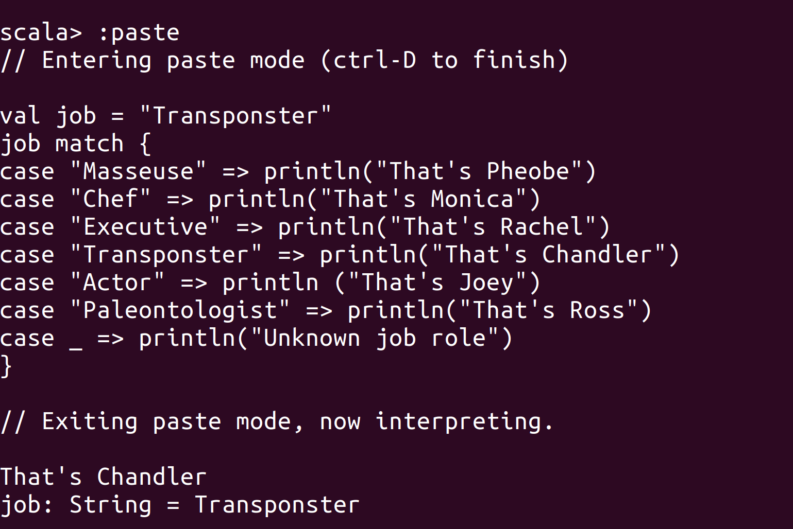
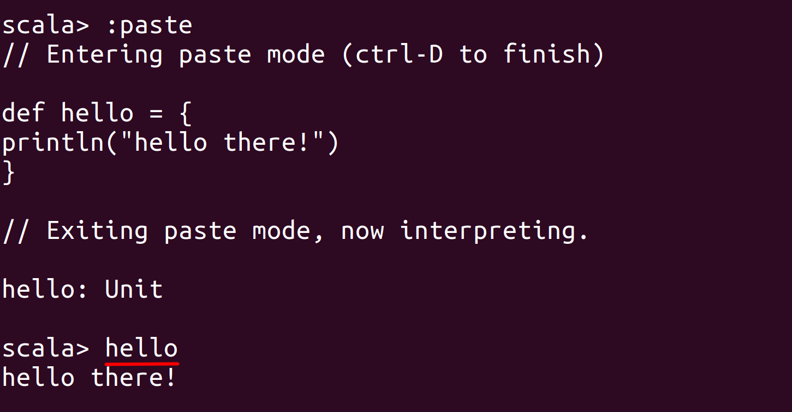
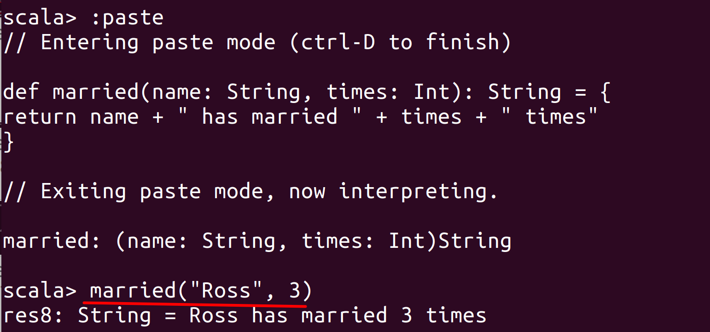
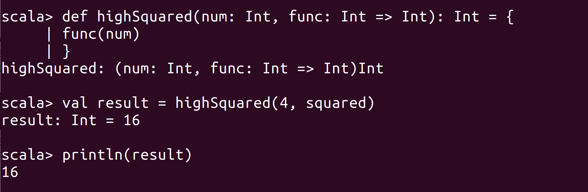
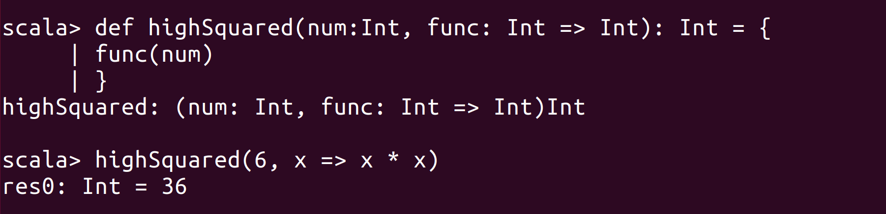
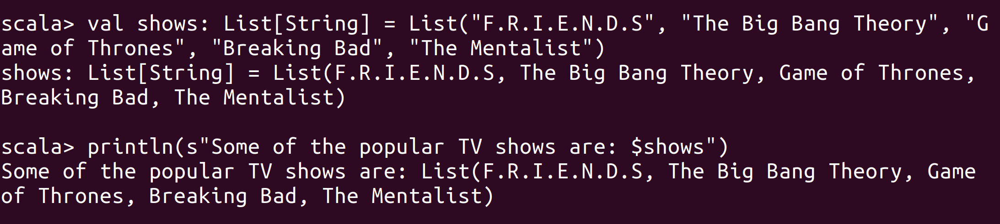
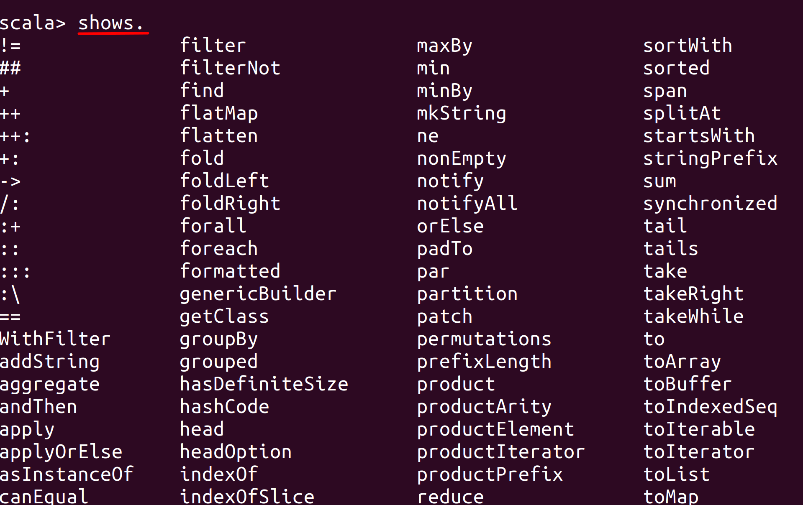
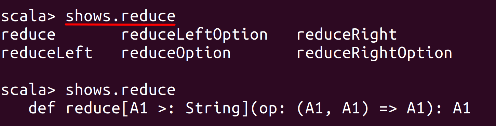
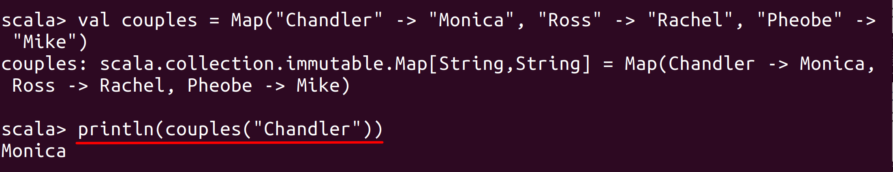
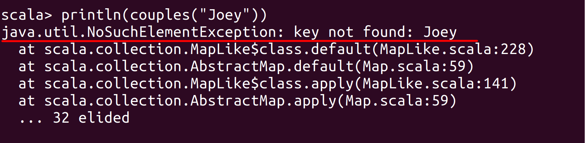

# Lab : Apache Spark Installation

#### Pre-reqs:
- Google Chrome (Recommended)

#### Lab Environment
All packages have been installed. There is no requirement for any setup.

**Note:** Labs will be accessible at the port given to you by your instructor. Password for jupyterLab : `1234`

Lab instructions and scala examples are present in `~/work/ernesto-spark` folder. To copy and paste: use **Control-C** and to paste inside of a terminal, use **Control-V**

There should be terminal(s) opened already. You can also open New terminal by Clicking `File` > `New` > `Terminal` from the top menu.

Now, move in the directory which contains the scala source code by running following command in the terminal.

`cd ~/work/ernesto-spark`

You can access jupyter lab at `<host-ip>:<port>/lab/workspaces/lab3`

## Why Scala?

Let us now briefly look at the advantages of Scala and know why it is a best fit with Spark.

- Functional
- Object-Oriented
- Immutability
- Type Inference
- Pattern Matching
- Interoperable

The aim of the following lab exercises is to install Scala, and perform various exercises by writing Scala code so that we can get our hands on Scala.
- Getting familiar with Functions
- Getting Familiar with Collections

## Install Prerequisites

We need following packages to perform the lab exercise: 
- Java Development Kit
- Scala

#### JAVA
Verify the installation with: `java -version` 

You'll see the following output:

```
java version "1.8.0_201"
Java(TM) SE Runtime Environment (build 1.8.0_201-b09)
Java HotSpot(TM) 64-Bit Server VM (build 25.201-b09, mixed mode)
```


#### Install Scala

**Step 1:** Run the following commands from the terminal to install Scala.

`wget www.scala-lang.org/files/archive/scala-2.12.8.deb`

`dpkg -i scala-2.12.8.deb`


**Step 2:** Verify your Scala installation version by running the following command.
 
`scala -version`

You will get following output.

```
Scala code runner version 2.12.8 -- Copyright 2002-2018, LAMP/EPFL and Lightbend, Inc.
```

## Pattern Matching

Type `scala` in your terminal and you will be prompted with a Scala prompt.

`scala`

**Step 1:** Let us now look at pattern matching. Pattern matching is, as said before, a core feature in Scala. Pattern matching is similar to that of switch in other languages.

Enter into the paste mode and execute the following code.
`:paste`

**Note:** After pasting following code in the scala terminal, Press  `Ctrl` + `D` to run code.

```
val  job = "Transponster"
job match {
case "Masseuse" => println("That's Phoebe")
case "Chef" => println("That's Monica")
case "Executive" => println("That's Rachel")
case "Transponster" => println("That's Chandler")
case "Actor" => println ("That's Joey")
case "Paleontologist" => println("That's Ross")
case _ => println("Unknown job role")
}
```

 

In the code above, we have created a new variable called job which has a value of Transponster. We then use the match keyword to match the job variable with a list of cases. As you can see from the screenshot, the value of job is correctly matched and the output is printed. The last case statement which has an underscore (_) is a wild card operator. It is used so that, if none of the cases match, the default case is executed in the loop. Also, notice that there are no break clauses in Scala, similar to that of Java. Scala has in-built fall through mechanisms and so there are no break statements required.

## Functions

Let us first create a function that does not have any parameters or a return type. Enter into the paste mode in Scala console and execute the following code.

`:paste`

**Note:** After pasting following code in the scala terminal, Press  `Ctrl` + `D` to run code.

```
def hello = {
println("Hello there!")
}
```

Now, simply call this function by its name.
`hello`

 

As you can see from the screenshot above, Scala has automatically inferred the return type as unit which means no return type. Unit is similar to that of Void in Java.

**Step 2:** Let us now create a function which takes parameters and has a return type.

`:paste`

**Note:** After pasting following code in the scala terminal, Press  `Ctrl` + `D` to run code.

```
def married(name: String, times: Int): String = {
return name + " has married " + times + " times"
}
```

Now, exit out of the paste mode and simply call this function by its name.

`married("Ross", 3)`

 

Please note that the return type (which is String, in this case) and also the keyword return are optional. Scala can determine the return type based on the last expression in the function body as shown below.

 
## Higher Order Functions

**Step 3:** Let us now look at Higher Order Functions. Higher Order functions are the functions which take other functions as parameters. Let us understand this with an example.

In the scala console, enter the following code.

```
def squared (num: Int) : Int = {
num * num
}
``` 

You can call the function square to see if it works. For example,
`squared(5)` 
 
 

Now, let us pass this function as a parameter to another function.

```
def highSquared(num: Int, func: Int => Int): Int = {
	func(num)
	}
``` 

Here, we are defining a function named highSquared which takes two parameters and returns an Int. One of them is an integer named num and the another one is function named func which takes a parameter of type Int and returns an Int. In the function body, The function func takes the value of num and returns its value. Let us call this function.

`val result = highSquared(4, squared)` 

`println(result)` 

 

## Functions

**Step 4:** We can also use the function literals in the parameters instead of using the name of the function as shown below.

`highSquared(6, x => x * x)` 

 
In the example above, we have used a function literal instead of referring name of another function. It basically does the same thing which we have seen in the previous step but in a different way. This is often used in Spark and it is very important that you understand what is going on here.

 

Task is complete!

## Collections

Let us now look at few collections in Scala.

**Step 1:** Let us create a list and apply various transformations or operations over it.

`val shows: List[String] = List("F.R.I.E.N.D.S", "The Big Bang Theory", "Game of Thrones", "Breaking Bad", "The Mentalist")` 

Mentioning the type of list is optional as Scala can infer the type automatically. We can simply type "val shows = " and continue with the list.

Let us now print the list.

`println(s"Some of the popular TV shows are: $shows")` 

 

We can also access the individual items in the list using their index.

`println(s"The TV show at position 0 is ${shows(0)}")` 

`println(s"The TV show at position 1 is ${shows(1)}")` 

`println(s"The TV show at position 4 is ${shows(4)}")` 
 


Let us now see how we can access the first and the rest of elements using head and tail.

`println(shows.head)` 

`println(shows.tail)` 

 

Let us now use foreach to print each element of the list.
`shows.foreach(println)` 


Let us now use the map function to convert each and every show to lower case.
`shows.map(show => show.toLowerCase)` 

 

These are a few transformations we can apply over a list. There are so many more transformations and operations you can apply on. From the Scala console, simply type the list of the name and the dot operator as shown below and press tab key on your keyboard. The console should display you a huge list of transformations you can apply on your list.

```
shows.<press tab key>
```

 

If you are not sure what a function does, you can type its name after the dot operator and press tab twice. The console will show you what the function expects you to pass in. For example,

```
shows.reduce<press tab key twice>
```

 

**Step 2:** Let us now look at map collection. Let us first create a map of elements.

`val couples = Map("Chandler" -> "Monica", "Ross" -> "Rachel", "Phoebe" -> "Mike")` 

Now that we have a map collection, let us try to access the value by the key.

`println(couples("Chandler"))` 

 

As you can see from the screenshot above, we were able to access the value based on it's key.

But if we try to access a value for a non existing key, an exception is thrown as shown in the screenshot. 

`println(couples("Joey"))` 

  

To overcome this problem, we use the getOrElse method and specify a default value when the key does not exist.

`val unknown = util.Try(couples("Joey")) getOrElse "Not Known"` 

`println(unknown)` 

**Step 3:** Let us now create a tuple and see how we can access its elements.

`val showInfo = (1994, "Friends", 8.8, 2011, "Game Of Thrones", 9.4, 2010, "Sherlock", 9.1)` 

As you can see from the screenshot above, a tuple can contain different types of elements. Also, you need not explicitly specify the data types for the elements. Scala can infer data types automatically.

Let us now access the elements of the tuple based on its index. Remember, the index of a tuple starts with 1 and NOT with 0.

`println(showInfo._1)` 

`println(showInfo._5)` 

We can also access the elements of a tuple and print it out to the console as shown below.

`println(s"${showInfo._5} is the highest rated show with ${showInfo._6} rating.")` 

Task is complete!
