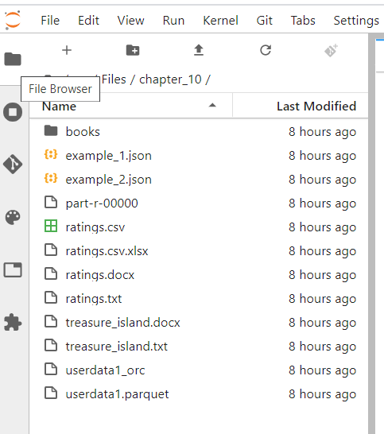
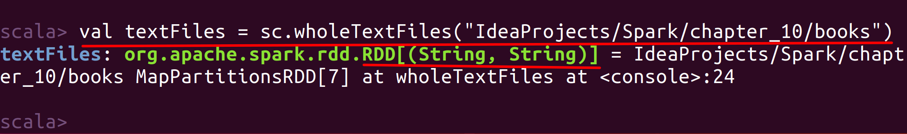
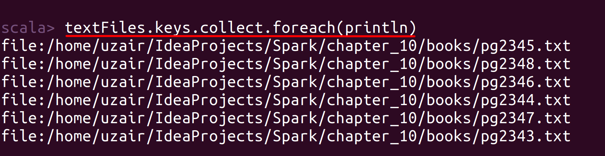
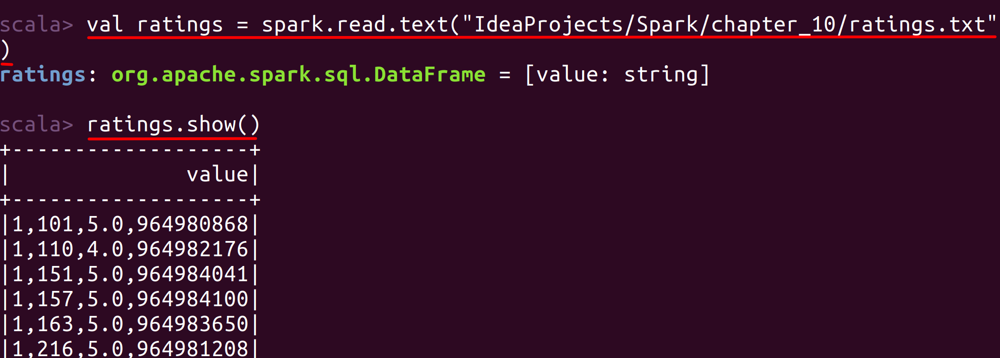
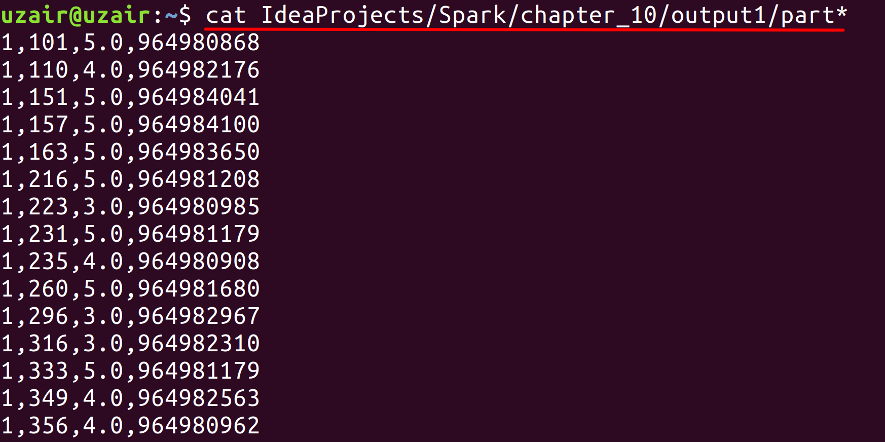

# Lab : Apache Spark File Formats - Text

#### Pre-reqs:
- Google Chrome (Recommended)

#### Lab Environment
All packages have been installed. There is no requirement for any setup.

**Note:** Labs will be accessible at the port given to you by your instructor. Password for jupyterLab : `1234`

Lab instructions and scala examples are present in `~/work/ernesto-spark` folder. To copy and paste: use **Control-C** and to paste inside of a terminal, use **Control-V**

There should be terminal(s) opened already. You can also open New terminal by Clicking `File` > `New` > `Terminal` from the top menu.

Now, move in the directory which contains the scala source code by running following command in the terminal.

`cd ~/work/ernesto-spark`

You can access jupyter lab at `<host-ip>:<port>/lab/workspaces/lab30`

- Click **File Browser** tab on the top left and open `~/work/ernesto-spark/Files/chapter_10` to view files.



The aim of the following lab exercises is to read and write various file formats in Spark applications.
We will cover following topics in this scenario.
- Text Files

## Prerequisites

We need following packages to perform the lab exercise: 
- Java Development Kit
- pyspark


#### JAVA
Verify the installation with: `java -version` 

You'll see the following output:

```
java version "1.8.0_201"
Java(TM) SE Runtime Environment (build 1.8.0_201-b09)
Java HotSpot(TM) 64-Bit Server VM (build 25.201-b09, mixed mode)
```


#### Install pyspark

**Note:** Spark is already installed. It is not required to run following command to install

PySpark is available in pypi. To install just run `pip install pyspark` 

## Task: Text Files

Let us begin this lab exercise by reading and writing text files in Spark using both DataSource API and RDD API. For ease and simplicity let us perform these tasks in Spark Shell.


#### RDD API
Let us first read and write text files to Spark using the RDD API.

**Step 1:** Download a text file from the URL below and save it in the path /home/jovyan/work/ernesto-spark/Files/chapter_10/. Please create new directories as required. 

treasure_island.txt - http://bit.ly/2LBFLtt

**Note:** We already have cloned a github repository which contains a required file. Open `~/work/ernesto-spark/Files/chapter_10` to view file.

## RDD API


**Step 2:** Open the terminal and fire up the Spark shell `spark-shell`.

Let us load the text file using the code below.

`val textData = sc.textFile("/home/jovyan/work/ernesto-spark/Files/chapter_10/treasure_island.txt")` 

This will read the data and create an RDD[String] as shown below. We can read data from any filesystem such as HDFS, AWS, Azure etc, this way just by providing the complete path or fully qualified URL of that purticular filesystem. We can then perform all the RDD operations or convert to a DataFrame or Dataset as required.

**Step 2:** Let us now write this back to the file system as shown below.

`textData.saveAsTextFile("/home/jovyan/work/ernesto-spark/Files/chapter_10/output")` 


#### Verify

**Important:** 
- Commands below will run in **terminal 2** (It will open automatically on executing command). You can also open it by clicking `+` icon and selecting `new terminal`
- Interface will keep switching back to terminal `1` after executing command, you can manually switch by clicking `terminal 2`.

Let us now check if the save was successful. For that open a new terminal and check the contents using the command below.

`ls ~/work/ernesto-spark/Files/chapter_10/output`

Run above command in **terminal 2**. You can also open New terminal by Clicking `File` > `New` > `Terminal` from the top menu.
 

`cat ~/ernesto-spark/Files/chapter_10/output/part-00000`

Run above command in **terminal 2**. You can also open New terminal by Clicking `File` > `New` > `Terminal` from the top menu.
 


 

**Step 3:** Now, let us see how we can load multiple files in a directory using the wholeTextFiles method. For this please download the files available in the URL below.

books - http://bit.ly/2kupo5v

**Note:** We already have cloned a github repository which contains a required files. Open `~/work/ernesto-spark/Files/chapter_10` to view file.

**Step 4:** Let us read these files using the wholeTextFiles method. This will read all the files present in books folder. Please switch back to Spark-shell and read the files using the code below.

`val textFiles = sc.wholeTextFiles("/home/jovyan/work/ernesto-spark/Files/chapter_10/books")` 

This will return you a RDD[String, String] which is a paired RDD as shown below.



This paired RDD contains the name of the files as keys and the entire content of files as values.


**Step 5:** Let us simply print the file names by using the keys method on textFiles RDD as shown below.

`textFiles.keys.collect.foreach(println)` 



We can also get the values by using the values method. We can also perform all the operations which you can apply on paired RDDs such as mapValues, reduceByKey, sortByKey etc.

This paired RDD can again be saved to filesystem using the saveAsTextFile method as usual.

Let us now use text files with the DataSource API.

## DataSource API

Let us now load and save text files using the DataSource API.

**Step 1:** Download a text file from the URL below and save it in the path /home/jovyan/work/ernesto-spark/Files/chapter_10/. Please create new directories as required. 

ratings.txt - http://bit.ly/2lJcCQF


**Step 2:** Let us now load this file to Spark using the Spark Shell with the following code.

Enter into the paste mode and execute the following code.
`:paste`

**Note:** After pasting following code in the scala terminal, Press  `Ctrl` + `D` to run code.

```
val ratings = spark
.read
.text("/home/jovyan/work/ernesto-spark/Files/chapter_10/ratings.txt")
``` 

Let us now check if the read was successful by calling the show method on the ratings dataframe.

`ratings.show()` 



We can also use the textFile method as shown below.

```
val ratings = spark
.read
.textFile("/home/jovyan/work/ernesto-spark/Files/chapter_10/ratings.txt")
``` 

Using textFile ignores the partition directory names.


**Step 3:** Let us write this back to the filesystem as shown below.

`ratings.write.text("/home/jovyan/work/ernesto-spark/Files/chapter_10/output1")` 

Please make sure that you only have one string column while you save the text file successfully. Also, make sure the output directory (in this case, output1) doesn't exist before you perform the write action.

**Step 4:** Use the following command to check if the save was successful. You will have to use the new terminal to run this command, as this won't be executed in Spark shell.


`cat /home/jovyan/work/ernesto-spark/Files/chapter_10/output1/part*`

Run above command in **terminal 2**. You can also open New terminal by Clicking `File` > `New` > `Terminal` from the top menu.


You should see the file saved as shown below.



Task is complete!


