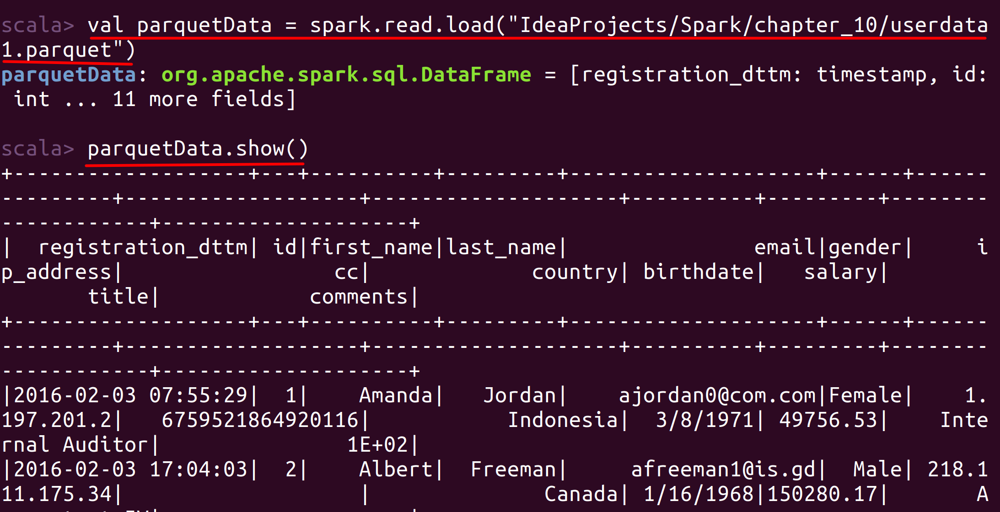
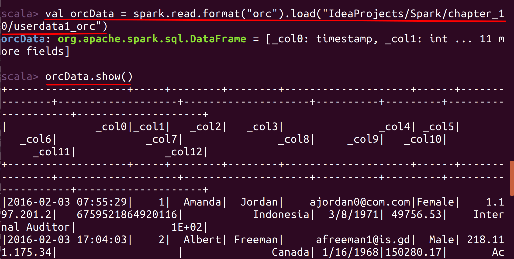

# Lab : Apache Spark File Formats - Parquet and ORC

#### Pre-reqs:
- Google Chrome (Recommended)

#### Lab Environment
All packages have been installed. There is no requirement for any setup.

**Note:** Labs will be accessible at the port given to you by your instructor. Password for jupyterLab : `1234`

Lab instructions and scala examples are present in `~/work/ernesto-spark` folder. To copy and paste: use **Control-C** and to paste inside of a terminal, use **Control-V**

There should be terminal(s) opened already. You can also open New terminal by Clicking `File` > `New` > `Terminal` from the top menu.

Now, move in the directory which contains the scala source code by running following command in the terminal.

`cd ~/work/ernesto-spark`

You can access jupyter lab at `<host-ip>:<port>/lab/workspaces/lab32`

- Click **File Browser** tab on the top left and open `~/work/ernesto-spark/Files/chapter_10` to view files.


The aim of the following lab exercises is to read and write various file formats in Spark applications.
We will cover following topics in this scenario.
- Parquet Files
- ORC Files

## Prerequisites

We need following packages to perform the lab exercise: 
- Java Development Kit
- pyspark


#### JAVA
Verify the installation with: `java -version` 

You'll see the following output:

```
java version "1.8.0_201"
Java(TM) SE Runtime Environment (build 1.8.0_201-b09)
Java HotSpot(TM) 64-Bit Server VM (build 25.201-b09, mixed mode)
```


#### Install pyspark

**Note:** Spark is already installed. It is not required to run following command to install

PySpark is available in pypi. To install just run `pip install pyspark` 

## Parquet Files

Parquet is a widely used file format in Spark because of the optimizations it provides for analytical processing and is considered as one of the most efficient file formats for Spark. Parquet is column-oriented data structure and is the default file format in Spark. When no format is specified, Spark automatically process them as Parquet. Parquet is compressable, splittable but is not human readable. Parquet supports complex data structures. It can be easily processed when columns are of struct, map or array type. This is not possible with JSON and CSV files.


Parquet has only a couple of options while reading and writing the data. The following is an example to read a Parquet file.

```
spark.read
.format("parquet")
.load("/usr/local/files/sample.parquet")
```

We can also read without specifying the schema as shown below.

```
spark.read
.load("/usr/local/files/sample.parquet")
```

## Task: Parquet Files

Parquet is Spark's default file format. Let us read and write Parquet files in Spark.

**Step 1:** Download the file userdata1.parquet from the URL below and save it to the /home/jovyan/work/ernesto-spark/Files/chapter_10 folder.

userdata1.parquet - http://bit.ly/2kfIhJ4

**Note:** We already have cloned a github repository which contains a required file. Open `~/work/ernesto-spark/Files/chapter_10` to view file.


**Step 2:** Let us no read this Parquet file to Spark using the code below.

Open the terminal and fire up the Spark shell `spark-shell`.

Enter into the paste mode and execute the following code.
`:paste`

**Note:** After pasting following code in the scala terminal, Press  `Ctrl` + `D` to run code.

 ```
val  parquetData = spark
.read
.load("/home/jovyan/work/ernesto-spark/Files/chapter_10/userdata1.parquet")
```

Please see that we need not mention the format here as Parquet is default file format in Spark. However, you may explicitly mention the format as we did in the previous tasks if you desire so.

`parquetData.show()` 

You should see the following output when you call the show method on the dataframe.




**Step 3:** Let us write this back to the filesystem in Parquet format.

`parquetData.write.save("/home/jovyan/work/ernesto-spark/Files/chapter_10/output4")`
 
#### Output
We can check if the save was successful by simply running the cat command from a new terminal as shown below. However, you will not be able to read the file correctly as it is not human readable.


`cat /home/jovyan/work/ernesto-spark/Files/chapter_10/output4/part*`

Run above command in **terminal 2**. You can also open New terminal by Clicking `File` > `New` > `Terminal` from the top menu.


**Step 4:** We can also save a parquet file using compression as shown below.

`parquetData.write.option("codec", "gzip").save("/home/jovyan/work/ernesto-spark/Files/chapter_10/output5")`

Task is complete!

## ORC Files
 
ORC is yet another columnar file format which stands for Optiimized Row columnar. There are no options for ORC files because Spark processes ORC file format very efficiently. Both ORC and Parquet are similar but Parquet is very much optimized for Spark and ORC is optimized for Hive. 

ORC supports complex data structures, is splittable and can be compressed. ORC is not human readable. The following shows an example of reading an ORC file.

```
spark.read
.format("orc")
.load("/usr/local/files/sample.orc")
```

## Task: ORC Files

**Step 1:** Download the file userdata1_orc from the URL below and save it to the /home/jovyan/work/ernesto-spark/Files/chapter_10 folder.

userdata1.orc - http://bit.ly/2kfQi0J

**Note:** We already have cloned a github repository which contains a required file. Open `~/work/ernesto-spark/Files/chapter_10` to view file.

**Step 2:** Reading an ORC file is similar to what we have been doing so far through out this exercise.

Enter into the paste mode and execute the following code.
`:paste`

**Note:** After pasting following code in the scala terminal, Press  `Ctrl` + `D` to run code.

```
val orcData = spark
.read
.format("orc")
.load("/home/jovyan/work/ernesto-spark/Files/chapter_10/userdata1_orc")
```


 `orcData.show()` 

You should see the following output when you call the show method on the dataframe.




**Step 3:** We can now simply write to an ORC format similar to what we have been doing with other file formats so far.

`orcData.write.format("orc").save("/home/jovyan/work/ernesto-spark/Files/chapter_10/output6")`


#### Output
Similar to Parquet, ORC is also not human readable and you will only see gibberish data when used the cat command as shown below.

`cat /home/jovyan/work/ernesto-spark/Files/chapter_10/output6/part*`

Run above command in **terminal 2**. You can also open New terminal by Clicking `File` > `New` > `Terminal` from the top menu.


Task is complete!


