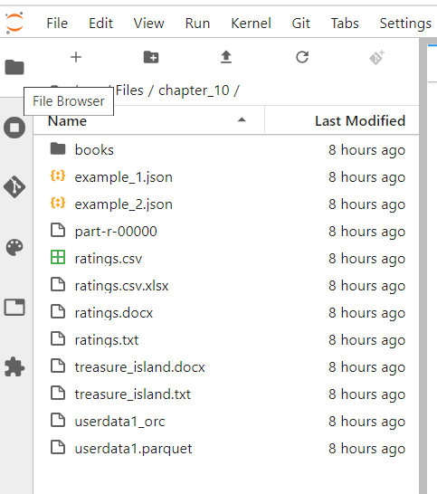

# Lab : Apache Spark File Formats - Hadoop and Sequence

#### Pre-reqs:
- Google Chrome (Recommended)

#### Lab Environment
All packages have been installed. There is no requirement for any setup.

**Note:** Labs will be accessible at the port given to you by your instructor. Password for jupyterLab : `1234`

Lab instructions and scala examples are present in `~/work/ernesto-spark` folder. To copy and paste: use **Control-C** and to paste inside of a terminal, use **Control-V**

There should be terminal(s) opened already. You can also open New terminal by Clicking `File` > `New` > `Terminal` from the top menu.

Now, move in the directory which contains the scala source code by running following command in the terminal.

`cd ~/work/ernesto-spark`

You can access jupyter lab at `<host-ip>:<port>/lab/workspaces/lab33`

- Click **File Browser** tab on the top left and open `~/work/ernesto-spark/Files/chapter_10` to view files.



The aim of the following lab exercises is to read and write various file formats in Spark applications.
We will cover following topics in this scenario.
- Hadoop and Sequence Files

## Prerequisites

We need following packages to perform the lab exercise: 
- Java Development Kit
- pyspark


#### JAVA
Verify the installation with: `java -version` 

You'll see the following output:

```
java version "1.8.0_201"
Java(TM) SE Runtime Environment (build 1.8.0_201-b09)
Java HotSpot(TM) 64-Bit Server VM (build 25.201-b09, mixed mode)
```


#### Install pyspark

**Note:** Spark is already installed. It is not required to run following command to install

PySpark is available in pypi. To install just run `pip install pyspark` 

## Sequence Files

Sequence file is the popular Hadoop file format which contains keys and values in binary form. We can read Sequence files using the sequenceFile method on the SparkContext object and, write them using the saveAsSequenceFile method on the RDD.

The syntax to read the file is

```
sparkContext.sequenceFile("/path/to/seq/file", classOf[keyDataType], classOf[valueDataType])
```

As you can see in the syntax above, we also have to specify the data types of keys and values of the Sequence file using classOf[] object.

The syntax to write the file is

```
rdd.saveAsSequenceFile("/path/to/seq/output")
```

Please note that we cannot directly read or save a Sequence file using the DataSource API. We can however, convert the RDD loaded from Sequence file to a DataFrame using the toDF method. To save a DataFrame to Sequence File, we must create a paired RDD from a DataFrame and then use the saveAsSequenceFile method.

## Hadoop and Sequence Files

Let us now work with Hadoop and Sequence Files. These files are popular file formats with Hadoop MapReduce framework. These files contains key value pairs in binary format. Let us first create and write a Sequence file and then read the same sequence file.

Open the terminal and fire up the Spark shell `spark-shell`

#### Sequence Files
**Step 1:** Let us first create an RDD using the parallelize method as shown below.

`val seqRDD = sc.parallelize(List(("Ernesto", 2000), ("Learning", 4500), ("Lee", 8000)))`

This will create and RDD[(String, Int)] as shown below.


 


**Step 2:** Let is now write the RDD to Sequence file format using the saveAsSequenceFile method as shown below.

`seqRDD.saveAsSequenceFile("/home/jovyan/work/ernesto-spark/Files/chapter_10/seqOut")`

You may run a cat command from another terminal to check if the save was successful, but the file will not be human readable.


`ls ~/work/ernesto-spark/Files/chapter_10/seqOut`

Run above command in **terminal 2**. You can also open New terminal by Clicking `File` > `New` > `Terminal` from the top menu.


`cat ~/ernesto-spark/Files/chapter_10/seqOut/part*`

Run above command in **terminal 2**. You can also open New terminal by Clicking `File` > `New` > `Terminal` from the top menu.


We know that the save was successful by looking at SEQ at the beginning of the file. We can also see that the key type is of Text and the value type is of IntWritable.

**Step 3:** Let us now read this Sequence file we just saved. Reading Sequence files is a bit different to what we have been doing so far. While reading the Sequence file, we need to specify the key and value data types also.

Enter into the paste mode and execute the following code.
`:paste`

**Note:** After pasting following code in the scala terminal, Press  `Ctrl` + `D` to run code.

```
val  seqData = sc.sequenceFile("/home/jovyan/work/ernesto-spark/Files/chapter_10/seqOut/part-00001"
,classOf[org.apache.hadoop.io.Text]
,classOf[org.apache.hadoop.io.IntWritable])
```
 

Since this is a Hadoop file format, we need to specify the data types in Hadoop. We have specified the Text and IntWritable types as the types for keys and values since our keys are of String and values are of Int.


**Step 4:** However, since these are Hadoop data types, we cannot access the keys directly. We need to convert them to Java data types as shown below. The job will fail if we do not convert the data types and collect.

Enter into the paste mode and execute the following code.
`:paste`

**Note:** After pasting following code in the scala terminal, Press  `Ctrl` + `D` to run code.

```
val  newRDD = seqData.map
{
	case (x, y) => (x.toString, y.get())
}
```


As you can see from the screenshot above, we now have the RDD[(String, Int)]. We can now simply perform all the operations we usually do on RDDs. We have to use the toString method when converting from Hadoop's Text type and the get method for other data types.

**Step 5:** Let us now collect the RDD and check out the results.

`newRDD.collect()`
 


With this we have successfully written and read the Sequence files.

## Hadoop Files

We can also read the output of Hadoop MapReduce jobs to Spark using the hadoopFile and newAPIHadoopFile methods. The hadoopFile method is the old Hadoop API while newAPIHadoopFile method is the new Hadoop API.

The syntax to read a Hadoop file using the old Hadoop API is as follows.

```
sparkContext.hadoopFile[keyDataType, valueDataType, inputFormatClass]("/path/to/file")
```

As you can see from the syntax above we have to specify the data types of both keys and values and also the Hadoop input format class for the input file.

An example of this is as follows.

```
sparkContext.hadoopFile[Text, LongWritable, TextInputFormat]("/usr/local/files/out/part-00000")
```
Please note that we should import the required classes for data types and input formats as required. 

The syntax to read a Hadoop file using the new Hadoop API is as follows.

```
sparkContext.newAPIHadoopFile("/path/to/file", classOf[inputFormatClass], classOf[keyDataType], classOf[valueDataType], conf)
```

## Task: Hadoop Files

Hadoop files are the output of Hadoop MapReduce jobs. We can read Hadoop files with Spark and do further processing using Spark. We shall now look at both the old Hadoop API to read the output from MapReduce jobs to Spark. 


**Step 1:** Download the file part-r-00000 from the URL below and save it to the /home/jovyan/work/ernesto-spark/Files/chapter_10 folder.

part-r-00000 - http://bit.ly/2lSqdFy

**Note:** We already have cloned a github repository which contains a required file. Open `~/work/ernesto-spark/Files/chapter_10` to view file.

This file is the output of a Word Count MapReduce job. It contains words as keys and values as the count separated by tab

**Step 2:** Before we read the file, we first need the following imports. We need to import the datatypes for both keys and values and also the input format. The keys are of type Text, values are Text and the input format is KeyValueTextInputFormat.

```
import org.apache.hadoop.io.Text
import org.apache.hadoop.mapred.KeyValueTextInputFormat
```
 
**Step 3:** Let us now read the file using the hadoopFile API as shown below. This is the old Hadoop API.

`val hadoopData = sc.hadoopFile[Text, Text, KeyValueTextInputFormat]("/home/jovyan/work/ernesto-spark/Files/chapter_10/part-r-00000")` 


We now have an RDD from Hadoop MapReduce output. However, in order to access the key value pairs, we have to first convert them to the Java datatypes as we did with the Sequence files.

**Step 4:** Convert the data types from Hadoop types as shown below.

Enter into the paste mode and execute the following code.
`:paste`

**Note:** After pasting following code in the scala terminal, Press  `Ctrl` + `D` to run code.

```
val  hadoopRDD = hadoopData.map
{
	case (x, y) => (x.toString, y.toString)
}
```

 
 

**Step 5:** Finally let us call the collect method and check the output from the RDD.

`hadoopRDD.collect()`


As you can see from the screenshot above, we were successfully able to read the key value pairs from the MapReduce output.

Task is complete!


