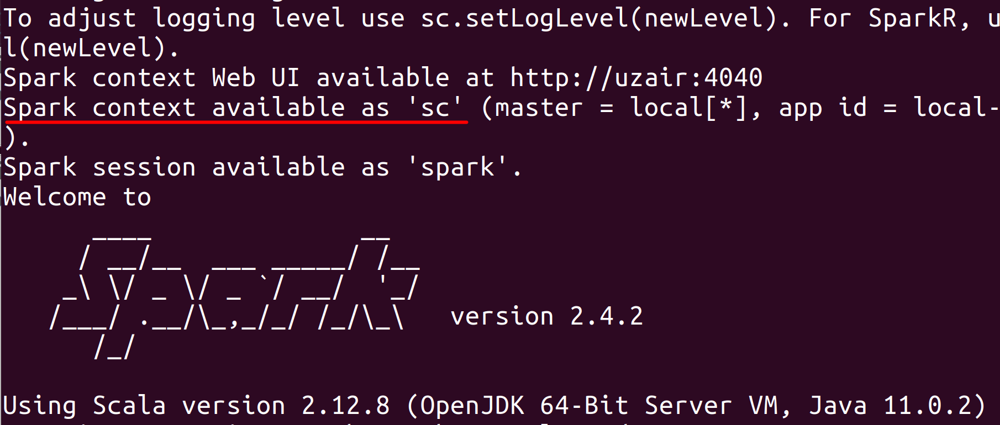
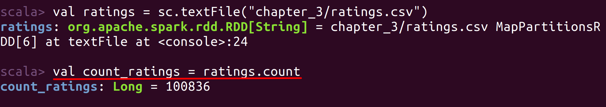
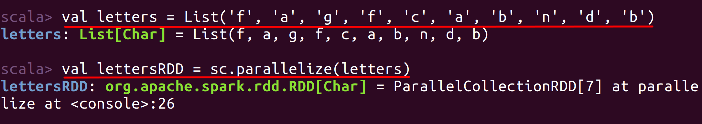
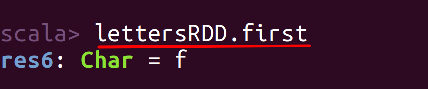
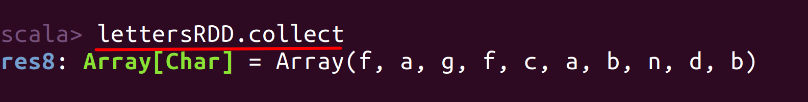
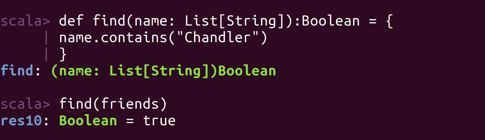
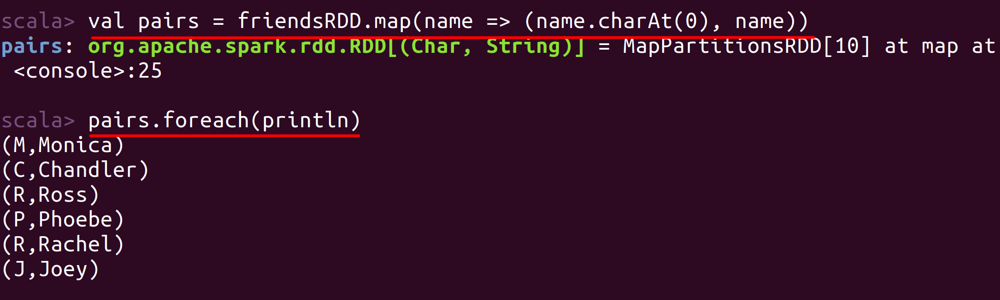
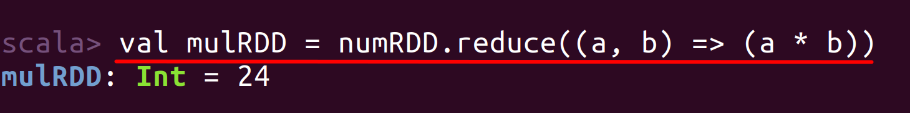

# Lab : Apache Spark Creating RDDs from Spark-Shell

#### Pre-reqs:
- Google Chrome (Recommended)

#### Lab Environment
All packages have been installed. There is no requirement for any setup.

**Note:** Labs will be accessible at the port given to you by your instructor. Password for jupyterLab : `1234`

Lab instructions and scala examples are present in `~/work/ernesto-spark` folder. To copy and paste: use **Control-C** and to paste inside of a terminal, use **Control-V**

There should be terminal(s) opened already. You can also open New terminal by Clicking `File` > `New` > `Terminal` from the top menu.

Now, move in the directory which contains the scala source code by running following command in the terminal.

`cd ~/work/ernesto-spark`

You can access jupyter lab at `<host-ip>:<port>/lab/workspaces/lab5`


## Introduction to RDD

Resilient Distributed Dataset also known as RDD is the basic data structure of Spark, which is immutable and fault tolerant collection of elements that can be computed and stored in parallel over a cluster of machines. Let us look at each word individually and try to understand it in detail.

**Resilient:** The RDDs are fault tolerant to any data loss. Any loss in data due to hardware failure or data corruption can be recovered using the RDD lineage graph or DAG. 

**Distributed:** The RDDs can be distributed over a cluster of machines in memory.

**Dataset:** The RDDs can be created with any of the datasets such as a text file, JSON, CSV, Database file via JDBC etc.

## Prerequisites

We need following packages to perform the lab exercise: 
- Java Development Kit
- pyspark


#### JAVA
Verify the installation with: `java -version` 

You'll see the following output:

```
java version "1.8.0_201"
Java(TM) SE Runtime Environment (build 1.8.0_201-b09)
Java HotSpot(TM) 64-Bit Server VM (build 25.201-b09, mixed mode)
```


## First RDD

**Step 1:** Let us create a RDD using the parallelize keyword. Fire up the spark-shell from the terminal and create a list as shown below.

`spark-shell`

`val friends = List("Chandler", "Rachel", "Phoebe", "Joey", "Ross")` 

Now, let us use the parallelize keyword and create an RDD for the list we have created above.

`val friendsRDD = sc.parallelize(friends)` 

You have created your first RDD successfully. Please note that we are using the sc which is the object of Spark Context. The sc object is automatically created when we launch the Spark Shell as shown in the screenshot below. This is the reason we are able to access sc and use Spark Context.



**Step 2:** Let us now create an RDD using a file from the file system. We shall be using the textFile API to create an RDD from the file system. First, download the file ratings.csv from the URL below and save it to the home/chapter_3 folder. (Please create a folder named chapter_3 in the home folder.)

Ratings.csv - http://bit.ly/2L8IEBS

Each line of this file represents one rating of one movie by one user, and has the following format: userId,movieId,rating,timestamp

`val ratings = sc.textFile("ernesto-spark/Files/chapter_3/ratings.csv")` 

**Step 3:** We can now create a new RDD from the existing RDD. For example, let us count the number of ratings in the ratings RDD we created in the previous step.
 
`val count_ratings = ratings.count` 


 
As you can see from the screenshot above, the count of the total records (ratings) present in the RDD has been returned as a new RDD called count_ratings.

## Hadoop Distributed File System

We can also create an RDD from data present in Hadoop Distributed File System (HDFS) using the same textFile API. But instead of local path, we have to provide a HDFS path.

```
val ratings = sc.textFile("hdfs://dev_server:9000/file.txt")
```

The RDD will be created using the data from HDFS and then you can continue to apply transformations and actions.

Task is complete!

## Basic RDD operations

**Step 1:** Let us start learning the basic RDD operations in Spark by creating an RDD from a collection as done in the previous task.

`val letters = List('f', 'a', 'g', 'f', 'c', 'a', 'b', 'n', 'd', 'b')` 

`val lettersRDD = sc.parallelize(letters)` 



**Step 2:** You can access the first element of the RDD using the first method as shown below.

`lettersRDD.first` 

 

As you can see from the screenshot above, the first element in the RDD has been returned.

You can use the take(n) method to read the n elements from your RDD. Where n is number of elements starting from the first element you want to read.

`lettersRDD.take(4)` 


But if you want to view all the elements in the RDD, you have to use collect method as shown below. Please note that using collect on a large dataset is not recommended, as collect will bring all the data of an RDD to the Driver program and load it in its memory. 

`lettersRDD.collect` 




## Filter Function 

**Step 3:** Let us now use filter function using the contains method and filter out an RDD which satisfies the filter criteria. Create a new list as shown below and then filter out a string.

`val friends = List("Monica", "Chandler", "Ross", "Phoebe", "Rachel", "Joey")` 

`val friendsRDD = sc.parallelize(friends)` 

`val chandler = friendsRDD.filter(name=> name.contains("Chandler"))` 

`chandler.collect` 


The filter function we used above is a higher order function which takes another function as parameter and returns an RDD of type String. The name => name.contains("chandler") is similar to a function in Scala as shown below.

```
def find(name: List[String]): Boolean = {
	name.contains("Chandler")
	}
``` 

Let's call the function with the parameter friends which is a List of type String.

`find(friends)` 




## Map Function

**Step 4:** Let's now use a map function on the friendsRDD and output a tuple with the first character in each element and the name itself.

`val pairs = friendsRDD.map(name => (name.charAt(0), name))` 

With the the pairs RDD gets created. Now let us use the foreach keyword to print each element of the pairs RDD.

`pairs.foreach(println)` 

 

As you can see from the screenshot above, we have used the map function to create a tuple with first character of the name of each element and name itself in the friendsRDD. The first character is obtained by the function called charAt which takes the number to access the position of a character from a String.

If you think this is a bit complicated to understand, let us look at an another example with a simple map function in the next step.

Create a List of few numbers and create an RDD from that list as shown below.

```
val  num = List(1, 2, 3, 4)
val numRDD = sc.parallelize(num)
```

Now let us write a map function which takes the numRDD and gives a squaredRDD as shown below.

`val squaredRDD = numRDD.map(x => x * x)` 

`squaredRDD.foreach(println)` 

 
`numRDD.map(x => x * x)` 

is same as

```
def square(x: Int): Int = {
	x * x
}
numRDD.map(square)
``` 

**Step 5:** For the numRDD we created in the previous step, let us use the reduce function to add all the numbers.
`val sumRDD = numRDD.reduce((a, b) => (a + b))` 
 
Similarly, we can also use the reduce function to multiply all the numbers in numRDD.

`val mulRDD = numRDD.reduce((a, b) => (a * b))` 



These are a few basic RDD operations. Task is complete!


#### SUMMARY

Resilient Distributed Dataset also known as `RDD` is the basic data structure of Spark which is immutable and fault tolerant collection of elements that can be computed in parallel over a cluster of machines.

Spark is a `master-slave` architecture. Spark consists of a Driver Program as the master and executors as slaves. A cluster manager is used to manage resources across the cluster.

In the lab, we have installed Spark and learned RDD basic operations.
