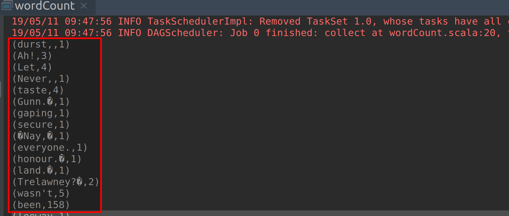
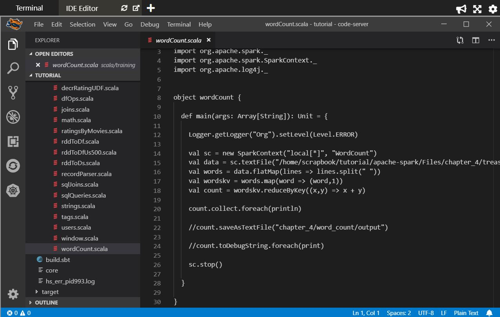
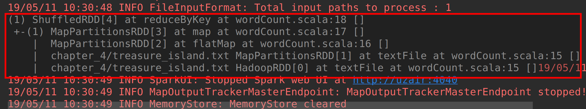

# Lab : Apache Spark WordCount

#### Pre-reqs:
- Google Chrome (Recommended)

#### Lab Environment
All packages have been installed. There is no requirement for any setup.

**Note:** Labs will be accessible at the port given to you by your instructor. Password for jupyterLab : `1234`

Lab instructions and scala examples are present in `~/work/ernesto-spark` folder. To copy and paste: use **Control-C** and to paste inside of a terminal, use **Control-V**

There should be terminal(s) opened already. You can also open New terminal by Clicking `File` > `New` > `Terminal` from the top menu.

Now, move in the directory which contains the scala source code by running following command in the terminal.

`cd ~/work/ernesto-spark`

You can access jupyter lab at `<host-ip>:<port>/lab/workspaces/lab6`


**Note:**
- The supplied commands in the next steps MUST be run from your `~/work/ernesto-spark` directory. 
- Final code was already cloned from github for this scenario. You can just understand the application code in the next steps and run it using the instructions.
- Click **File Browser** tab on the top left and open `~/work/ernesto-spark/src/main/scala/training/wordCount.scala` to view scala file.


## Prerequisites

We need following packages to perform the lab exercise: 
- Java Development Kit
- SBT


#### JAVA
Verify the installation with: `java -version` 

You'll see the following output:

```
java version "1.8.0_201"
Java(TM) SE Runtime Environment (build 1.8.0_201-b09)
Java HotSpot(TM) 64-Bit Server VM (build 25.201-b09, mixed mode)
```


#### Install SBT

**Step 1:** Run the following commands from the terminal to install sbt.

`echo "deb https://dl.bintray.com/sbt/debian /" | sudo tee -a /etc/apt/sources.list.d/sbt.list` 

`curl -sL "https://keyserver.ubuntu.com/pks/lookup?op=get&search=0x2EE0EA64E40A89B84B2DF73499E82A75642AC823" | sudo apt-key add` 

`sudo apt-get update` 

`sudo apt-get install sbt && sbt sbtVersion > /dev/null 2>&1` 

**Step 2:** Verify your sbt installation version by running the following command.	

`sbt sbtVersion`	

You will get following output.

```	
[info] Loading project definition from /home/jovyan/work/ernesto-spark/project	
[info] Loading settings for project apache-spark from build.sbt ...	
[info] Set current project to Spark (in build file:/home/jovyan/work/ernesto-spark/)	
[info] 1.3.2
```

**Note:** If you get an error first time, please run the command again.

## WordCount Example

**Step 1:** Now that we have editor to start writing the Spark code, the first thing we need to do is to include the import statements from Spark libraries. This program requires the following imports.

```
import org.apache.spark._
import org.apache.spark.SparkContext._
import org.apache.log4j._
```

The first two import statements are used to import the Spark packages and last import statement is used to set logging level for our Spark application.

**Step 5:** Once we have the required imports, we need to write the main function similar to that of Java. This is the starting point for the compiler to execute our program. 

```
def main(args: Array[String]): Unit = {
```

The main function takes an argument args which is an Array of String type and does not return anything. Unit represents no return value similar to void in Java. It is optional to mention the return type.


**Step 6:** Let us declare the level of logging to only log the error and fatal messages.

```
Logger.getLogger("Org").setLevel(Level.ERROR)
```

This step is not mandatory and you may skip this if you want all the logs.

**Step 7:** Let us now create a SparkContext object so that we can access all the spark functionality.

```
val sc = new SparkContext("local[*]", "WordCount")
```

We are creating an immutable variable called sc which cotains the SparkContext object. Inside the SparkContext object the first parameter tells Spark if we would want the program to be executed in local or distributed mode. In our case, since we are working locally, we will be using local[*]. The [*] tells Spark to use all the CPU cores available locally in our machine. The next parameter is just the name of our app which is WordCount.

**Step 8:** We now have a SparkContext object created. We can now use this object and load data using the textFile API as we have done in the Spark Shell. 
 

We already have cloned a github repository which contains a text file `treasure_island.txt`. Open `~/work/ernesto-spark/Files/chapter_4/treasure_island.txt` to view text file. Write the following line of code to load the file to create an RDD.

```
val data = sc.textFile("chapter_4/treasure_island.txt")
```

With this we have successfully created an RDD using the text file.

This completes the process of creating a SparkContext object and creating the first RDD by loading the data using the textFile API.

Task is complete!

## Spark Program – Performing Operations

In the previous task, we have successfully created an RDD. Now let us use the RDD and apply operations to achieve our goal of counting number of words in a file.

**Step 1:** We have an RDD which contains text in lines. Let us split the lines to words using the flatMap function. The flatMap function is used to remove a level of nesting. The flatMap function is basically a combination map function and flatten function where the map function is applied first and then flatten function is applied.

```
val words = data.flatMap(line => line.split(" "))
```

The above piece of code splits each line into a seperate word. The logic we apply to split the line is by a white space character. The flatMap function takes the data RDD and splits each line of word by a space character.

**Step 2:** At this point, we have each word in a row. In order to count the occurences of each word, we have to map each word to a key-value pair where the key is the word itself and the value will be number 1.

```
val wordskv = words.map(word => (word, 1))
```
 

Here we use a map function to create a key value pair for each word where the key is the word and value is the literal number 1. With this operation we will end up having a tuples of word and the literal number 1.

**Step 3:** Now that we have tuples, all we need to do is add the values (literal number 1) for the same key. To achieve this, we use the reduceByKey function. As the name suggests, the reduceByKey function takes a key and applies operations to the values of that key.

```
val count = wordskv.reduceByKey((x,y) => x + y)
```


The above line of code takes the wordskv RDD and applied reduceByKey function to perform a sum of all the values for a key. This way we will end up with tuple where the first element is the word and the second element is the number of occurences for that word.


The reduceByKey function is similar to reduce function which we have seen in the previous chapter. The difference is that the reduceByKey function performs reduce operation on values for a given key in a tuple while reduce function is applied for all the elements in the collection. 

 **Step 4:** With the previous step all the transformations have been completed. Let us now perform an action to print out the result to console.

```
count.collect.foreach(println)
```

We can now simply use collect to collect the final RDD which is count and use foreach with println to print out each record in the RDD to the console. This will actually trigger the program to evaluate. All the trasnformations before this action are only logged in the Lineage graph to achieve lazy evaluation.

 

This completes our first ever Spark program. All we need to do now is to run it.

## Run Program

**Step 5:** To run this program from the terminal, simply run the following command. The program will the then be compiled and executed.

`rm -rf ~/work/ernesto-spark/src/main/scala/training/.ipynb_checkpoints/ && sbt "runMain training.wordCount"` 

Once you click above command, `sbt` will start executing the program by first compiling and then display the result in the bottom. The execution might take some time based upon the hardware configuration of your machine.



To view the result, scroll up the console until you see text in white as shown in the screenshot. This is the output result showing each word in the text file with number of it occurences.

## Spark Program – Saving Data

The output displayed in the console is useful while developing but in the real time we would want the output to be saved. 

**Step 1:** We shall be using the saveAsTextFile API to save the output of our program to the disk. Simply replace the collect statement from the previous task with this line of code.

```
count.saveAsTextFile("chapter_4/word_count/output")
```

**Important:** You need to uncomment above line in `wordCount.scala` using **vscode** editor before running program again.

We shall be saving the output to the following path IdeaProjects/Spark/chapter_4/word_count/output. You need not create the directories word_count and output. They will be automatically created. In fact the compiler will throw an error if the output directory is already present.


**Step 2:** Now run the program as you did in the previous task and check the output directory. You should see two files: part-00000 and a _SUCCESS file. The output is saved in part-00000 file.
 
`rm -rf ~/work/ernesto-spark/src/main/scala/training/.ipynb_checkpoints/ && sbt "runMain training.wordCount"` 

Open the `part-00000` file and you should see the result as shown below.

`ls ~/work/ernesto-spark/chapter_4/word_count/output` 

`cat ~/ernesto-spark/chapter_4/word_count/output/part-00000` 

## Spark Program – Lineage Graph

Let us now check the Lineage Graph for our Word Count program.

**Step 1:** To check the Lineage Graph for our Word Count program, we should use the toDebugString method. To do so, simply replace the saveAsTextFile line from previous task with the code below.

```
count.toDebugString.foreach(print)
```

**Important:** 
- You need to add above line in `wordCount.scala` using file editor before running program again. 
- Also, comment line **22** which we added in the previous step as shown below.




Please note that we have used print inside foreach and not println.

**Step 2:** Run the program as you did before and you should see the output as shown below.

`rm -rf ~/work/ernesto-spark/src/main/scala/training/.ipynb_checkpoints/ && sbt "runMain training.wordCount"` 



As you can see from the screenshot above, the `toDebugString` method displays the Lineage Graph. The indentations in the last four lines specify the shuffle boundary. Meaning, there was no shuffle of data for these opeartions: map, flatmap, teftFile. While the reduceByKey operation involves shuffling of data.


The number inside the paranthesis is to denote the number of parallel tasks. In our case it is only 1. The higher number denotes a high level of parallelism.

Task is complete!

