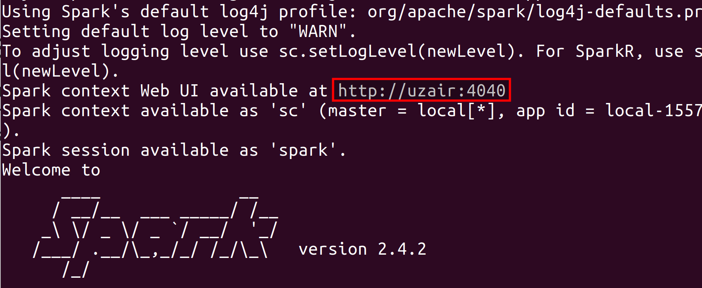
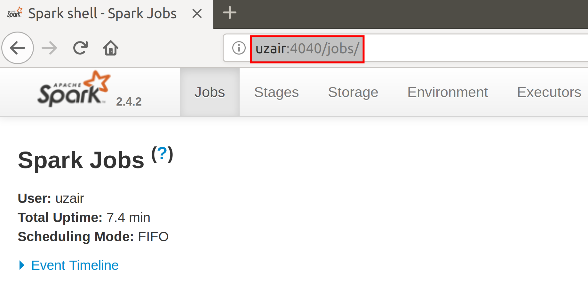
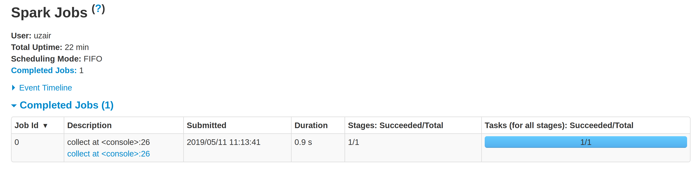
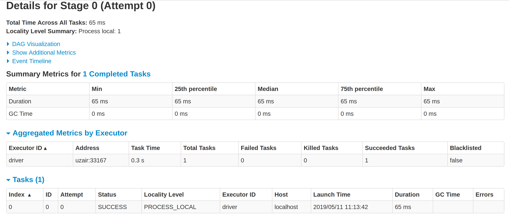
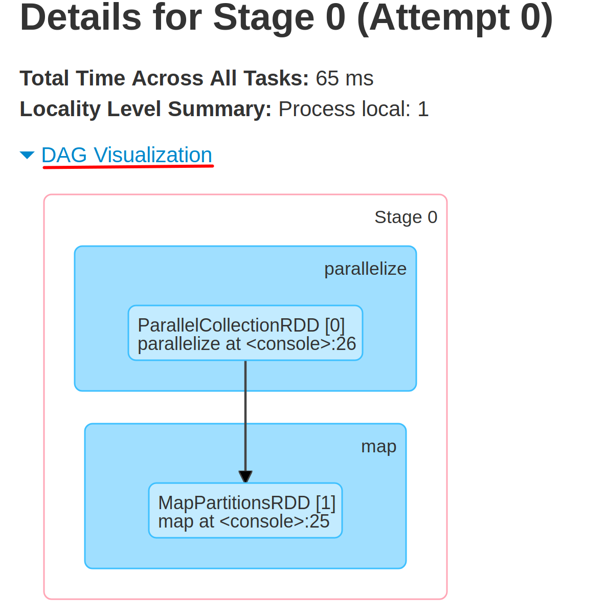
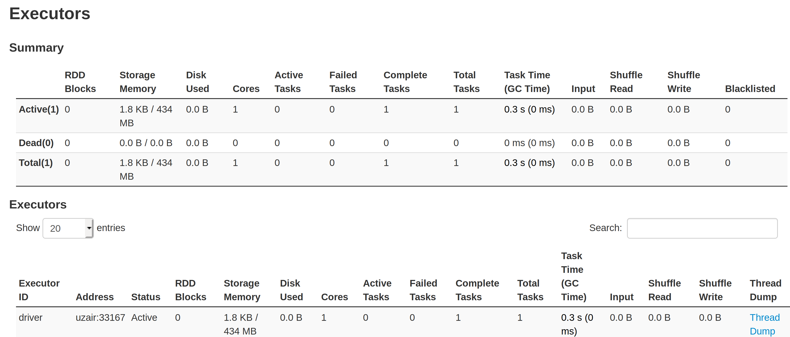

# Lab : Apache Spark WebUI

#### Pre-reqs:
- Google Chrome (Recommended)

#### Lab Environment
All packages have been installed. There is no requirement for any setup.

**Note:** Labs will be accessible at the port given to you by your instructor. Password for jupyterLab : `1234`

Lab instructions and scala examples are present in `~/work/ernesto-spark` folder. To copy and paste: use **Control-C** and to paste inside of a terminal, use **Control-V**

There should be terminal(s) opened already. You can also open New terminal by Clicking `File` > `New` > `Terminal` from the top menu.

Now, move in the directory which contains the scala source code by running following command in the terminal.

`cd ~/work/ernesto-spark`

You can access jupyter lab at `<host-ip>:<port>/lab/workspaces/lab7`

## Prerequisites

We need following packages to perform the lab exercise: 
- Java Development Kit
- pyspark


#### JAVA
Verify the installation with: `java -version` 

You'll see the following output:

```
java version "1.8.0_201"
Java(TM) SE Runtime Environment (build 1.8.0_201-b09)
Java HotSpot(TM) 64-Bit Server VM (build 25.201-b09, mixed mode)
```


## Task: Spark Web Interface

**Step 1:** Open a terminal and start the spark-shell by entering the following command.

`spark-shell`

The Spark shell should show you that the web interface is available `locally` at the following URL as shown below.




Your driverHostname might be different. If a port is being used by another application, Spark will increase the port by 1 until an open port is found. For example, if 4040 is already taken, it will increase the port number to 4041.

## Spark Web Interface

We can access the Spark web interface to monitor the execution of Spark applications through a web browser. The web interface can by accessed by navigating to the following URL. First, update host-ip with ip address of the host machine where **jupyterLab** container is running:

Spark UI: `http://<host-ip>:4040`

The driverhostname is usually an IP address in the realtime environment and 4040 is the Spark's port by default. 

**Step 2:** Once you navigate to the web interface URL. You should see the Spark web interface as shown in the screenshot below.



Since there is no job running, you won't be able to see any metrics.

## Run Job

**Step 3:** Let us run a job. Create a List of few numbers and create an RDD from that list as shown below.

**Note:** You might need to get back to prompt by pressing `Enter`.

```
19/10/05 16:25:21 WARN HttpParser: bad HTTP parsed: 400 Illegal character 0x16 for HttpChannelOverHttp@3006dd4d{r=0,c=false,a=IDLE,uri=null}

scala>
```
`val num = List(1, 2, 3, 4)` 

`val numRDD = sc.parallelize(num)` 

Now let us write a map function which takes the numRDD and gives a squaredRDD as shown below.

`val squaredRDD = numRDD.map(x => x * x)` 

`squaredRDD.foreach(println)` 

After you see the output in the console, navigate back to the browser and refresh the Spark web interface. You should see a completed job as shown in the screenshot below.




## DAG Visualization

**Step 4:** You can click on the collect link below the Description column and you will be taken to stages. Click on the collect link again to check more information as shown in the screenshot below.



**Step 5:** Click on the DAG Visualization link to view the DAG.



## Executors

Click on the `Executors` link in the navigation bar to monitor the executors.



Task is complete. We have seen the Spark architecture in detail by discussing the Lineage Graph and DAG.


