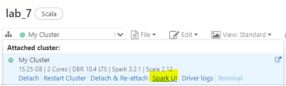
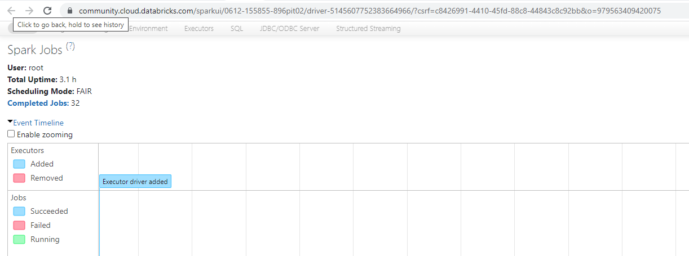

# Lab : Apache Spark WebUI

#### Pre-reqs:
- Google Chrome (Recommended)

#### Lab Environment
All packages have been installed. There is no requirement for any setup.

## Task: Spark Web Interface

**Step 1:** Open databricks notebook and click `Spark UI` to launch GUI.

## Spark Web Interface

We can access the Spark web interface to monitor the execution of Spark applications through a web browser. 

**Step 2:** Once you navigate to the web interface URL. You should see the Spark web interface as shown in the screenshot below.

Since there is no job running, you won't be able to see any metrics.

## Run Job

**Step 3:** Let us run a job. Create a List of few numbers and create an RDD from that list as shown below.

`val num = List(1, 2, 3, 4)` 

`val numRDD = sc.parallelize(num)` 

Now let us write a map function which takes the numRDD and gives a squaredRDD as shown below.

`val squaredRDD = numRDD.map(x => x * x)` 

`squaredRDD.foreach(println)` 

After you see the output in the console, navigate back to the browser and refresh the Spark web interface. You should see a completed job as shown in the screenshot below.

## DAG Visualization

**Step 4:** You can click on the collect link below the Description column and you will be taken to stages. Click on the collect link again to check more information as shown in the screenshot below.

**Step 5:** Click on the DAG Visualization link to view the DAG.

## Executors

Click on the `Executors` link in the navigation bar to monitor the executors.

Task is complete. We have seen the Spark architecture in detail by discussing the Lineage Graph and DAG.

