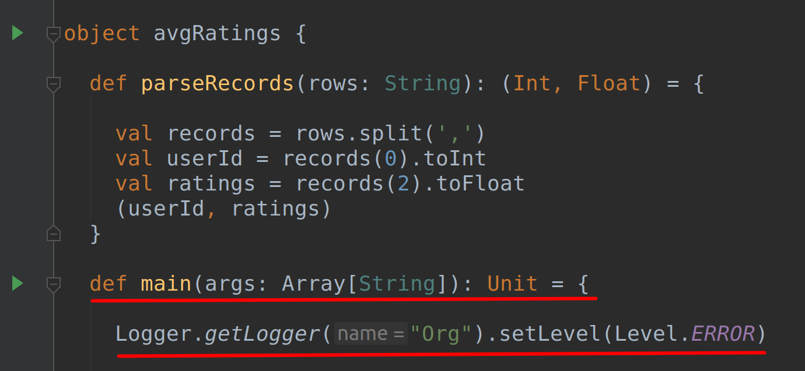
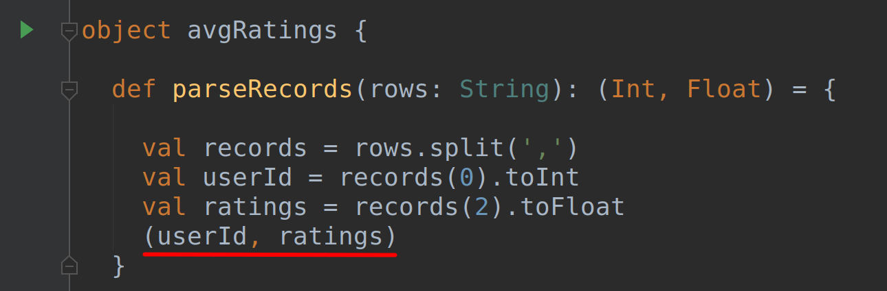
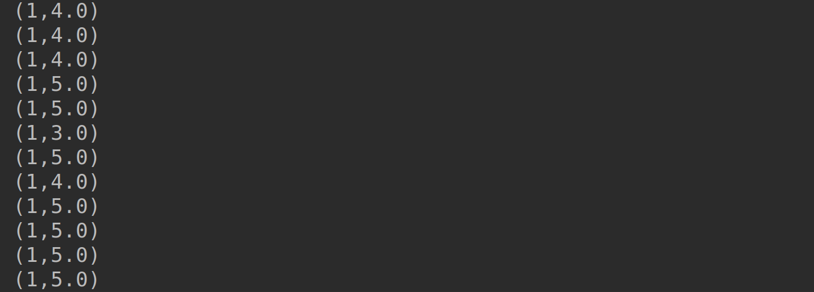
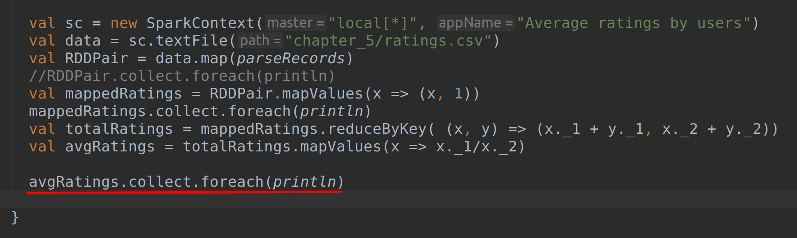
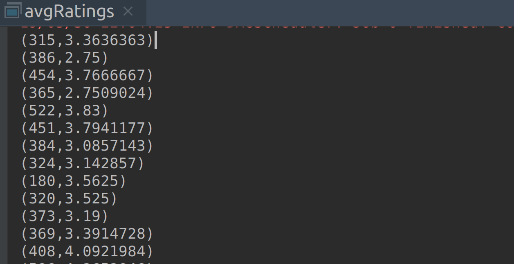

# Lab : Apache Spark Paired RDD

#### Pre-reqs:
- Google Chrome (Recommended)

#### Lab Environment
All packages have been installed. There is no requirement for any setup.

**Note:** Labs will be accessible at the port given to you by your instructor. Password for jupyterLab : `1234`

Lab instructions and scala examples are present in `~/work/ernesto-spark` folder. To copy and paste: use **Control-C** and to paste inside of a terminal, use **Control-V**

There should be terminal(s) opened already. You can also open New terminal by Clicking `File` > `New` > `Terminal` from the top menu.

Now, move in the directory which contains the scala source code by running following command in the terminal.

`cd ~/work/ernesto-spark`

You can access jupyter lab at `<host-ip>:<port>/lab/workspaces/lab9`


**Note:**
- The supplied commands in the next steps MUST be run from your `~/work/ernesto-spark` directory. 
- Final code was already cloned from github for this scenario. You can just understand the application code in the next steps and run it using the instructions.
- Click **File Browser** tab on the top left and open `~/work/ernesto-spark/src/main/scala/training/avgRatings.scala` to view scala file.


The aim of the following lab exercises is to start writing Spark code in **vscode** editor to learn about Paired RDDs.
We will cover following topics in this scenario.
- Creating a Tuple
- Creating a Paired RDD
- Performing Operations on Paired RDD

## Prerequisites

We need following packages to perform the lab exercise: 
- Java Development Kit
- SBT


#### JAVA
Verify the installation with: `java -version` 

You'll see the following output:

```
java version "1.8.0_201"
Java(TM) SE Runtime Environment (build 1.8.0_201-b09)
Java HotSpot(TM) 64-Bit Server VM (build 25.201-b09, mixed mode)
```


#### SBT
Verify your sbt installation version by running the following command.	

`sbt sbtVersion`	

You will get following output. If you get an error first time, please run the command again.

```	
[info] Loading project definition from /home/jovyan/work/ernesto-spark/project	
[info] Loading settings for project apache-spark from build.sbt ...	
[info] Set current project to Spark (in build file:/home/jovyan/work/ernesto-spark/)	
[info] 1.3.2
```

## Task: Creating a Tuple

Let us start this exercise by executing a program which computes the average rating given by the user for a list of movies.

**Step 1:** Download the ratings.csv file from the URL below. This file contains four columns: userId, movieID, rating and timestamp.

ratings.csv - http://bit.ly/2QmnAH9

**Note:** We already have cloned a github repository which contains a required file. Open `~/work/ernesto-spark/Files/chapter_5` to view file.

**Step 2:** Click **File Browser** tab on the top left and open `~/work/ernesto-spark/src/main/scala/training/avgRatings.scala` to view scala file.

```
import org.apache.spark._
import org.apache.spark.SparkContext._
import org.apache.log4j._
```

**Step 3:** Let us now write a function to parse the records and extract the fields we are interested in. For our program, we are only interested in userId and ratings fields. The function will split a line of input into a tuple of (userId, ratings).

Let us name the function parseRecords.

```
def parseRecords (rows: String): (Int, Float)={
```

This function takes each line of input as an argument and returns a tuple of an integer and a float.

**Step 4:** Now, using the split function, we split each field in the record by a comma as we know that each field in our record is separated by comma.

```
val records = rows.split(",")
```

**Step 5:** Now that we have splitted the records, all we have to do is extract the required fields and convert the userId to integer and ratings to float types.

```
val userId = records(0).toInt
val ratings = records(2).toFloat
```



The records variable contains of 4 fields. We can simply access them based on the index starting from 0. So, we simply extract the userId which is the first field to the variable userId and ratings which is the third field to the variable ratings.

Finally, we simply have to return the userId and ratings to complete our function.

```
(userId, ratings)
```



This creates a tuple of userId and ratings. We can use this tuple to create our paired RDD in the next task.

Task is complete!

## Task: Creating a Paired RDD

Let us now write the main function for our program where we create our paired RDD and perform operations over the paired RDD.

**Step 1:** Write the following main function and error log level as shown below.

```
def main(args: Array[String]): Unit = {

  Logger.getLogger("Org").setLevel(Level.ERROR)
```


**Step 2:** Create a SparkContext object as seen in the previous exercise. The master  as local using all the cores and the name of the app as Average ratings by users.

```
val sc = new SparkContext("local[*]", "Friends By First Name")
```

Now that we have the SparkContext object created, let us load our file using the textFile API.

```
val data = sc.textFile("chapter_5/ratings.csv")
```

We now have an RDD loaded.

**Step 3:** Finally let us create our pairedRDD. To do this, we have to pass the parseRecords function as an argument to the map higher order function so that all the records in the data RDD are parsed as per the logic in our parseRecords function. The following line of code does that work.

```
val RDDPair = data.map(parseRecords)
```

That's it. We now have our paired RDD. You can optionally take a look at the RDDPair by simply printing it out to the console using the code below.

```
 RDDPair.collect.foreach(println)
```

PS: Using collect is not recommended if your data is very big. When collect is used, all the data is shuffled to the driver node and if there is not enough memory available in the driver node, the job will throw an memory exception error.

#### Compile and Run
To run this program from the terminal, simply run the following command. The program will the then be compiled and executed.

`rm -rf ~/work/ernesto-spark/src/main/scala/training/.ipynb_checkpoints/ && sbt "runMain training.avgRatings"` 

You should have the output in the console with the key-value pairs as shown in the screenshot below.



The first element in the tuple is the key (userId) and the second element in the tuple is a value (ratings).

Task is complete!

## Performing Operations on Paired RDD

**Important:** Before proceeding with this task, please comment out the following statement from the previous task as shown below.

```
RDDPair.collect.foreach(println)
```



You can use comments in Scala using the characters '//' preceding the comment as shown below. These kind of comments are called single line comments.


**Step 1:** At this point, we have a paired RDD with userId as key and ratings as value. We now have to compute the sum of user ratings and divide them by the number of ratings so that we can get the average rating by an user.

To achieve this, we must first compute the number of ratings by an user using the mapValues function. 

```
val mappedRatings = RDDPair.mapValues(x => (x,1))
```

This transformation converts each rating value to a tuple of (ratings, 1). So we will be having our Paired RDD as (userId, (ratings, 1)).

You may optionally print out the mappedRatings to the console, to check how the result is displayed.

**Step 1:** At this point, we have a paired RDD with userId as key and ratings as value. We now have to compute the sum of user ratings and divide them by the number of ratings so that we can get the average rating by an user.

To achieve this, we must first compute the number of ratings by an user using the mapValues function. 

```
val mappedRatings = RDDPair.mapValues(x => (x,1))
```

This transformation converts each rating value to a tuple of (ratings, 1). So we will be having our Paired RDD as (userId, (ratings, 1)).

You may optionally print out the mappedRatings to the console, to check how the result is displayed.


**Step 4:** We can now use the collect function to collect the final result from the RDD and display it on the console using the following line of code. This action triggers DAG and the job is executed.

```
avgRatings.collect.foreach(println)
```
 
**Important:** You need to uncomment above line in `avgRatings.scala` using **vscode** editor before running program again.

**Step 5:** To run this program from the terminal, simply run the following command. The program will the then be compiled and executed.

`rm -rf ~/work/ernesto-spark/src/main/scala/training/.ipynb_checkpoints/ && sbt "runMain training.avgRatings"` 

Once the job is finished, check the output in the console as shown in the screenshot below.



You can also sort the result by the key by referring the first element in the sortBy function or simply using the sortByKey function key as shown below.

```
val sorted = avgRatings.sortByKey()
```


**Step 6:** We can also sort the result on either column using the sortBy function as shown below.

```
val sorted = avgRatings.sortBy(x => x._2)
```


The above line is used to sort the second field which is the value (Average rating) in the ascending order by default. The sorted result is as shown below.


However, if you want to sort it in descending order, you can simply use the dash (-) symbol as shown below.

```
val sorted = avgRatings.sortBy(x => -x._2)
```

You will have the results sorted in descending order when you run the program as shown below.


However, if you want to sort it in descending order, you can simply use the dash (-) symbol as shown below.

```
val sorted = avgRatings.sortBy(x => -x._2)
```

You can also sort the result by the key by referring the first element in the sortBy function or simply using the sortByKey function key as shown below.

```
val sorted = avgRatings.sortByKey()
```

Finally, you can sort the results in descending order when sortByKey is used by passing argument as false for the function.

```
val sorted = avgRatings.sortByKey(false)
```

Task is complete!


**Important:** You can run all of above one by one be editing `avgRatings.scala` using **vscode** editor before running program.

To run the program from the terminal, simply run the following command. The program will the then be compiled and executed.

`rm -rf ~/work/ernesto-spark/src/main/scala/training/.ipynb_checkpoints/ && sbt "runMain training.avgRatings"` 

